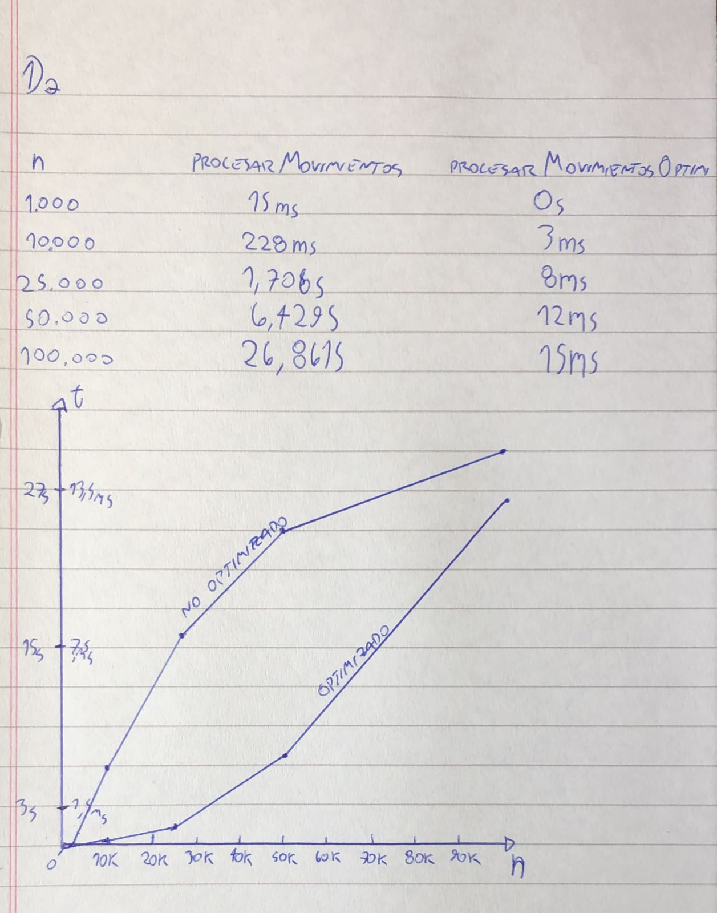

## 1A:

## 1B: 
Porque recorre por cada consulta, todas las cuentas de dicha consulta.
Si el numero de cuentas por consulta es igual a la cantidad de consultas,
T(n) = O(n^2)

## 1C:
procesarMovimientosOptimizado recorre solo una vez las consultas y otra vez
las cuentas. T(n) = O(n)