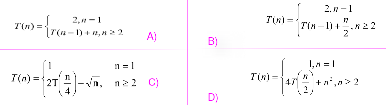
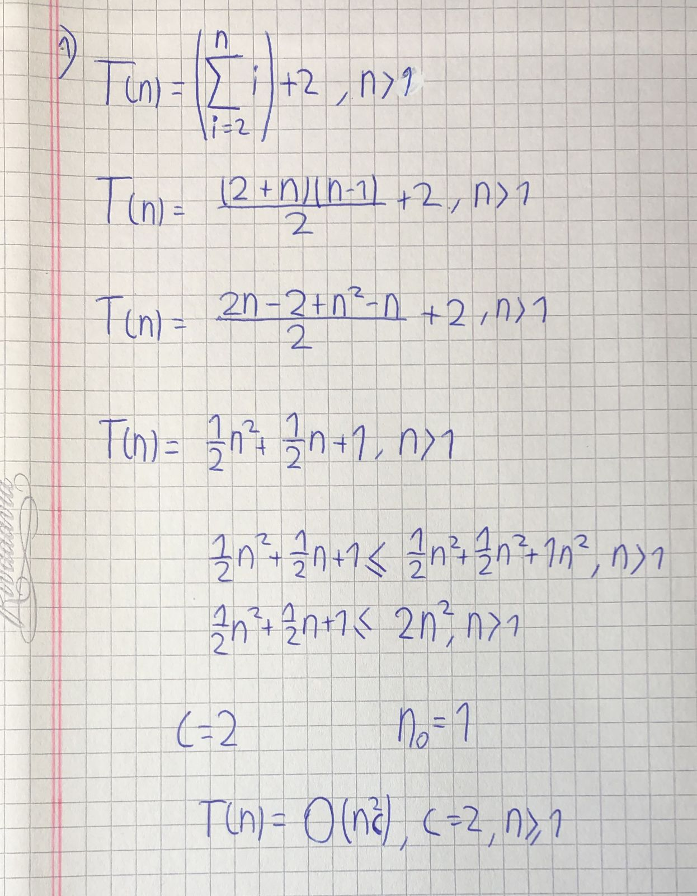
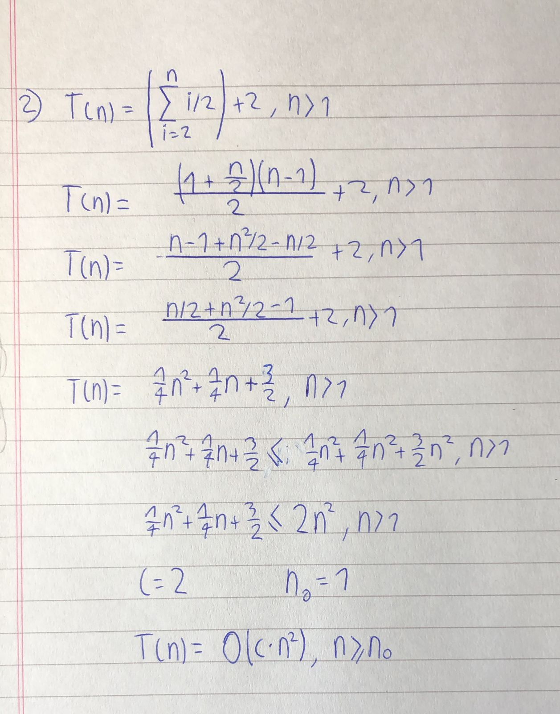

# Resolver las siguientes recurrencias:

## A:

## B:

## C:
Esta sucesion es invalida ya que su segundo y tercer elemento se
encuentran indefinidos (n=2 o n=3)

## D:
Esta sucesion es invalida ya que su tercer elemento se encuentra indefinido (n=3)