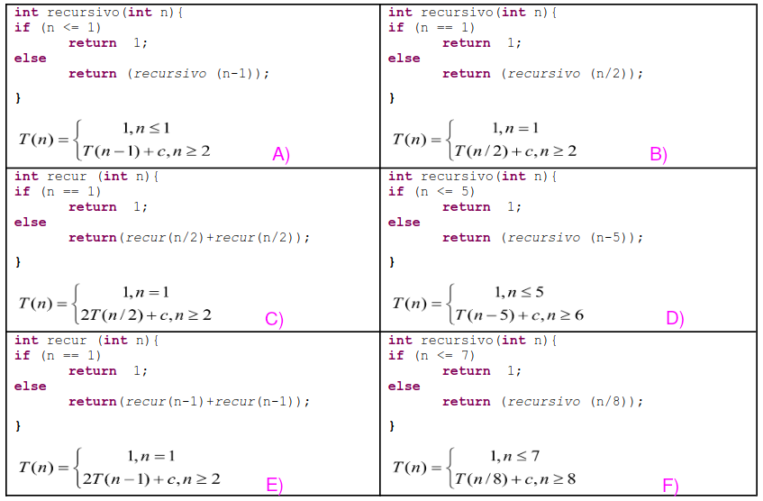

>## Resuelva las recurrencias y calcule el orden. Para cada recurrencia se muestra a modo de ejemplo el código correspondiente.

## A:
T(n) = n*cte,n>0

T(n) = O(n)

## B:
T(n) = (log2(n)+1)*cte

T(n) = O(log2(n))

## C:
T(n) = (2n - 1)*cte

T(n) = O(n)

## D:
T(n) = (floor((n-1)/5)+1)*cte

T(n) = O(n)

## E:
T(n) = ((2^n) - 1)*cte

T(n) = O(2^n)

## F:
T(n) = (log8(n)+1)*cte

T(n) = O(log8(n))
