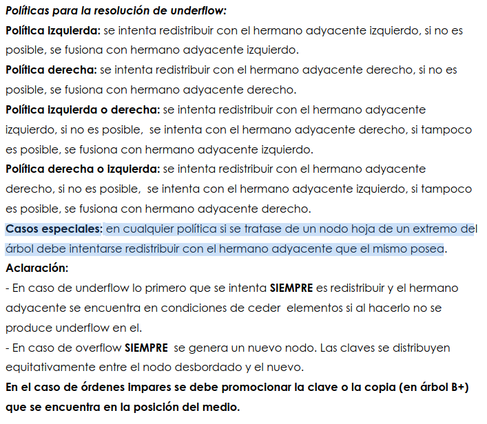

## Inicial:
                                          2:0(10)1(60)3(115)4(145)5(179)6
    0:(1)(5)1 1:(34)(44)3 3:(60)(113)4 4:(120)(125)(131)(139)5 5:(145)(153)(158)(160)(177)6 6:(179)(190)-1

# +159
Lectura N2, Lectura N5, Escritura N5

Overflow N5, Divido y promuevo copia del 159

Escritura N7, Escritura N2

Overflow N2, Divido y promuevo el 145

Escritura N8, Escritura N9

                                                            9:2(145)8
                                                2:0(10)1(60)3(115)4 8:5(159)7(179)6
    0:(1)(5)1 1:(34)(44)3 3:(60)(113)4 4:(120)(125)(131)(139)5 5:(145)(153)(158)7 7:(159)(160)(177)6 6:(179)(190)-1

## -5
Lectura N9, Lectura N2, Lectura N0

Underflow N0, Concatenacion N0-N1

Lectura N1, Escritura N1, Escritura N2, Escritura N0

                                                            9:2(145)8
                                                2:0(60)3(115)4 8:5(159)7(179)6
    0:(1)(34)(44)3 3:(60)(113)4 4:(120)(125)(131)(139)5 5:(145)(153)(158)7 7:(159)(160)(177)6 6:(179)(190)-1

## -190
Lectura N9, Lectura N8, Lectura N6

Underflow N6, segun el PDF de la practica 4, por mas de que haya politica derecha si me encuentro en extremo derecho 
debo intentar redistribuir con el unico nodo adyacente

Lectura N7, Escritura N7, Escritura N8, Escritura N6

                                                            9:2(145)8
                                                2:0(60)3(115)4 8:5(159)7(177)6
    0:(1)(34)(44)3 3:(60)(113)4 4:(120)(125)(131)(139)5 5:(145)(153)(158)7 7:(159)(160)6 6:(177)(179)-1