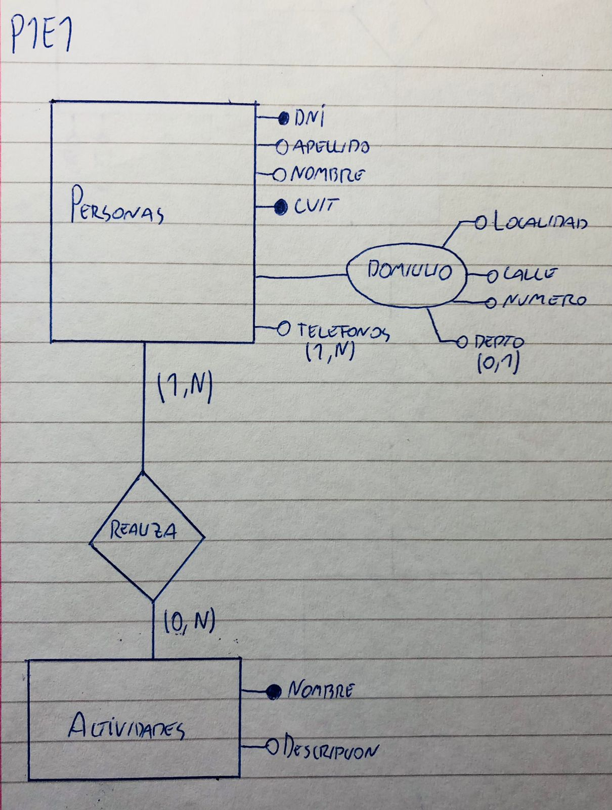
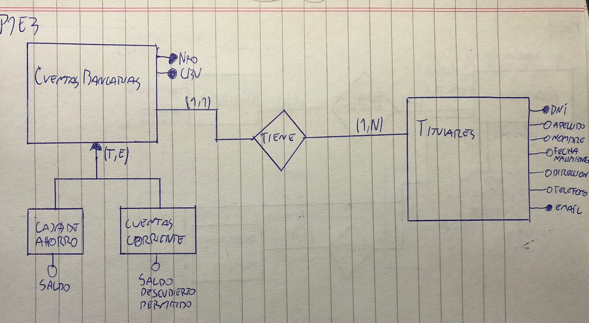
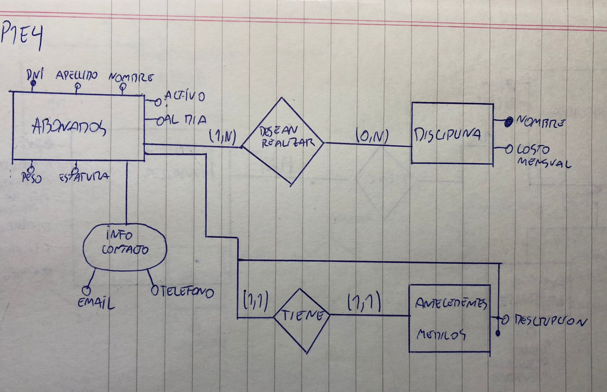

## Práctica 1
### Introducción al Modelado Conceptual.

#### Resolver los siguientes ejercicios, representando entidades, relaciones, jerarquías (en caso deque existan) y atributos involucrados.
1. Crear la entidad Persona con los siguientes atributos: D.N.I, apellido, nombre, C.U.I.T, domicilio detallado y teléfonos. Además, de cada persona se conoce que actividades realiza durante el día. De cada actividad se registra su nombre único y una descripción asociada.

2. Crear entidades y las relaciones correspondientes. Socio, Libro, Copia de Libro, Préstamo con sus atributos correspondientes, siguiendo la especificación a continuación. El socio se caracteriza por su información personal: DNI, apellido, nombre, fecha de nacimiento, dirección. El libro en cambio, cuenta con una descripción, un número de ISBN único, género y
año de edición. Las copias poseen un número de copia único y cada copia corresponde a un
único libro. El préstamo tendrá fecha y hora, el socio involucrado y el/las copias que el socio se
lleva.

3. Crear la entidad Cuenta Bancaria con los siguientes atributos: nro único de cuenta,
CBU (codigo único), titular de la cuenta, tipo de cuenta (si corresponde a una cuenta corriente
o caja de ahorro). Si es una cuenta cuyo tipo es caja de ahorro, se necesita conocer el saldo.
En cambio si es una cuenta corriente, se necesita el saldo en descubierto permitido. Del titular
de la cuenta se registran sus datos personales: DNI, apellido, nombre, fecha de nacimiento,
dirección, teléfono de contacto y email.

4. Se debe modelar la información necesaria para un gimnasio. Se necesita registrar los
datos correspondientes a los abonados. De cada abonado se registra: DNI, apellido, nombre,
peso, estatura, información de contacto, las disciplinas que desea realizar (libre, pilates,
spinning, etc.), antecedentes médicos (alergia, operaciones, etc.), si está activo o no y si está
al día con la cuota mensual. De cada disciplina se registra un nombre único y el costo mensual
de la misma. De los antecedentes médicos se solicita una descripción de los mismos.

5. Se debe modelar la información necesaria para el área de recursos humanos de la
facultad de informática. Interesa registrar la información sobre los empleados de la facultad y el
lugar y función de trabajo dentro de la misma. La facultad se divide en áreas. De cada área se
conoce su nombre, no se repite para otras áreas, y una descripción asociada. De los
empleados se conocen sus datos personales: DNI, apellido, nombre, fecha de nacimiento,
dirección, teléfono de contacto, email, fecha de ingreso y cantidad de hijos. Un empleado a lo
largo del tiempo puede ir cambiando de área, debe quedar registro de cada área por la que
pasa un empleado indicando una breve descripción de las funciones en esa área. Además se
debe poder determinar el orden en que fue rotando de área. Discuta al menos tres
soluciones diferentes para resolver el ejercicio.

