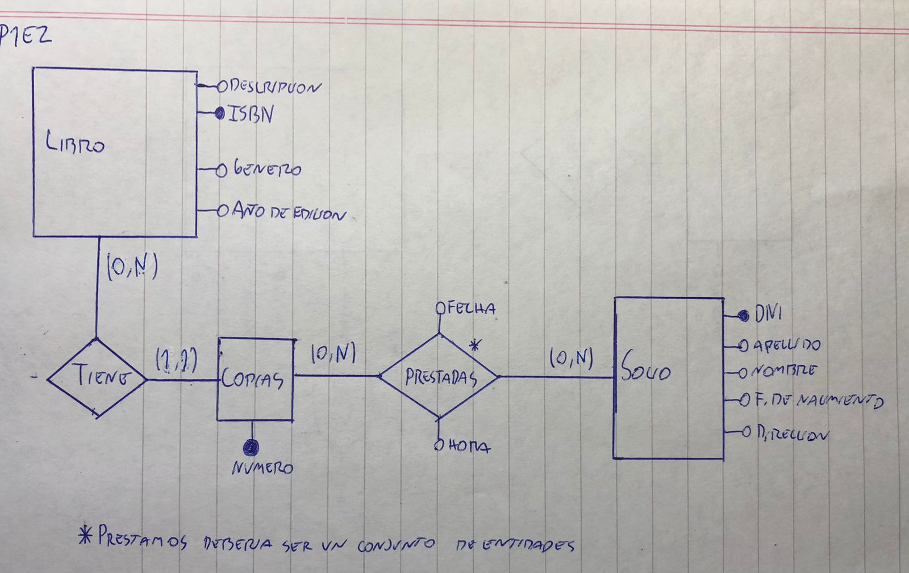
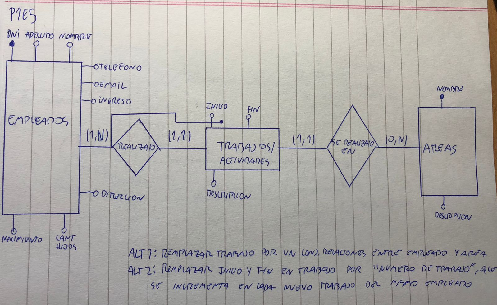

## Práctica 1
### Introducción al Modelado Conceptual.

#### Resolver los siguientes ejercicios, representando entidades, relaciones, jerarquías (en caso deque existan) y atributos involucrados.
1. Crear la entidad Persona con los siguientes atributos: D.N.I, apellido, nombre, C.U.I.T, domicilio detallado y teléfonos. Además, de cada persona se conoce que actividades realiza durante el día. De cada actividad se registra su nombre único y una descripción asociada.

2. Crear entidades y las relaciones correspondientes. Socio, Libro, Copia de Libro, Préstamo con sus atributos correspondientes, siguiendo la especificación a continuación. El socio se caracteriza por su información personal: DNI, apellido, nombre, fecha de nacimiento, dirección. El libro en cambio, cuenta con una descripción, un número de ISBN único, género y
año de edición. Las copias poseen un número de copia único y cada copia corresponde a un
único libro. El préstamo tendrá fecha y hora, el socio involucrado y el/las copias que el socio se
lleva.

3. Crear la entidad Cuenta Bancaria con los siguientes atributos: nro único de cuenta,
CBU (codigo único), titular de la cuenta, tipo de cuenta (si corresponde a una cuenta corriente
o caja de ahorro). Si es una cuenta cuyo tipo es caja de ahorro, se necesita conocer el saldo.
En cambio si es una cuenta corriente, se necesita el saldo en descubierto permitido. Del titular
de la cuenta se registran sus datos personales: DNI, apellido, nombre, fecha de nacimiento,
dirección, teléfono de contacto y email.

4. Se debe modelar la información necesaria para un gimnasio. Se necesita registrar los
datos correspondientes a los abonados. De cada abonado se registra: DNI, apellido, nombre,
peso, estatura, información de contacto, las disciplinas que desea realizar (libre, pilates,
spinning, etc.), antecedentes médicos (alergia, operaciones, etc.), si está activo o no y si está
al día con la cuota mensual. De cada disciplina se registra un nombre único y el costo mensual
de la misma. De los antecedentes médicos se solicita una descripción de los mismos.

5. Se debe modelar la información necesaria para el área de recursos humanos de la
facultad de informática. Interesa registrar la información sobre los empleados de la facultad y el
lugar y función de trabajo dentro de la misma. La facultad se divide en áreas. De cada área se
conoce su nombre, no se repite para otras áreas, y una descripción asociada. De los
empleados se conocen sus datos personales: DNI, apellido, nombre, fecha de nacimiento,
dirección, teléfono de contacto, email, fecha de ingreso y cantidad de hijos. Un empleado a lo
largo del tiempo puede ir cambiando de área, debe quedar registro de cada área por la que
pasa un empleado indicando una breve descripción de las funciones en esa área. Además se
debe poder determinar el orden en que fue rotando de área. Discuta al menos tres
soluciones diferentes para resolver el ejercicio.

6. Se debe modelar la información para un club donde se realizan diversos deportes. De
cada deportista se registra: DNI, apellido, nombre, fecha de nacimiento,mail, teléfonos, fecha
de ingreso al club, deportes que desea realizar (un deportista puede desarrollar varios
deportes). De los deportes se registra un nombre único y descripción asociada. Información del
representante (en caso de que tuviera, sólo interesa DNI, el nombre, apellido y mail).
Además resulta necesario almacenar información sobre las lesiones que ha tenido en toda su
carrera como deportista (en caso que tuviera interesa conocer: tipo de lesión, fecha en que
sucedió la lesión y tiempo de rehabilitación). Nota: se podrían pedir estadísticas de tipos de
lesiones más comunes en determinado deporte, discuta la mejor solución

7. Modelar la información necesaria para una bicicletería que brinda servicio de alquiler de
bicicletas. Existen clientes que pueden alquilar bicicletas de forma temporal. De los clientes se
registra número único de cliente, nombre, apellido, fecha de nacimiento y domicilio. Existen
diferentes tipos de bicicletas para alquiler. Del alquiler se debe registrar: la bicicleta alquilada,
el cliente y la fecha de comienzo y finalización del alquiler. Cada bicicleta tiene un número
único asociado, el tipo de bicicleta y una descripción. De los tipos de bicicletas se registra el
nombre correspondiente (el nombre del tipo de bicicletas no se repite) y una descripción.

8. Se debe modelar la información necesaria para una agencia de turismo que vende
pasajes aéreos. De los clientes se registran: código único de cliente, D.N.I, nombre, apellido,
nacionalidad y fecha de nacimiento. Los clientes compran los pasajes aéreos para vuelos a
diferentes destinos. De cada vuelo se registra ciudad origen, ciudad destino, fecha y hora de
salida y fecha y hora de llegada, aerolínea y un número de vuelo asociado. El número de vuelo
se puede reutilizar en diferentes días de salida (es decir se repite en diferentes fechas).
Cada pasaje se caracteriza por número de fila y butaca y el vuelo al que corresponde.
Cuando se vende un pasaje se debe dejar registro del cliente que realizó la compra
correspondiente.

9. Se debe modelar la información de una casa de electrodomésticos. La misma registra
información sobre sus empleados y clientes. De cada empleado se registra D.N.I, C.U.I.L,
nombre, apellido, fecha de nacimiento, fecha de ingreso, fecha de egreso, email/s y sueldo
básico. De los clientes se registra: D.N.I, nombre, apellido y, opcionalmente, teléfono y
dirección de mail. También se dispone de información sobre los electrodomésticos a la venta.
De cada uno se registra un código interno único, nombre, modelo, stock, precio regular y
precio online (si está disponible). Cada electrodoméstico pertenece a una categoría
(climatización, lavado, cocina, etc. El nombre de la categoría es único). Es importante registrar
las ventas realizadas. De cada venta se registra: código de venta (único), fecha, cliente,
electrodomésticos incluidos, precio total y el empleado que realizó dicha venta. Nota: tenga en
cuenta que se podrían pedir estadísticas sobre mejor o peor cliente, tipos de
electrodomésticos más vendidos, promedios de ventas por clientes entre otros, discuta
la mejor solución

