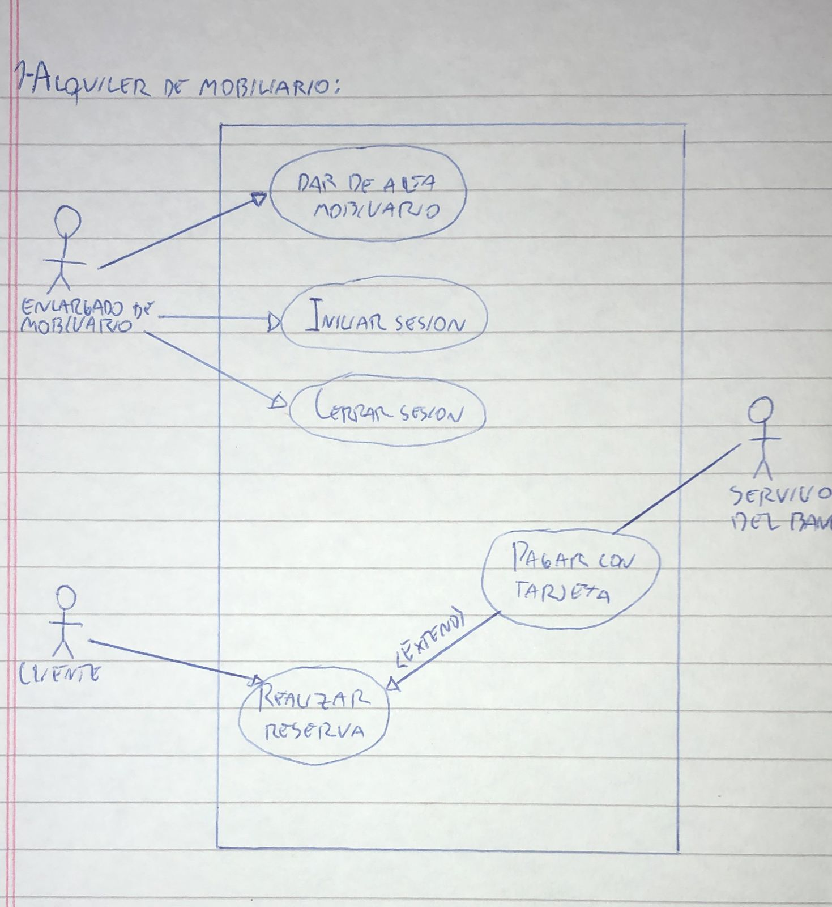

# 1) Alquiler de mobiliario
# Diagrama:

# Escenarios:
## Escenario 1:
#### Nombre del caso de uso:
`Dar de alta mobiliario.`
#### Descripcion:
`El caso de uso describe el evento en el que un encargado de mobiliario da de alta un mobiliario.`
#### Actores:
`Encargado de mobiliario.`
#### Precondiciones:
`El encargado debe autenticarse en el sistema.`
#### Curso normal:
1. (Actor): El encargado autenticado selecciona la opcion de *Dar de alta mobiliario*.
2. (Sistema): El sistema solicita los datos necesarios.
3. (Actor): El actor confirma los datos ingresados.
4. (Sistema): El sistema verifica que no exista un mobiliario con el mismo codigo.
5. (Sistema): Se da de alta el mobiliario.

#### Curso alterno:
Paso alternativo 4: Ya existe un mobiliario con el mismo codigo. Se notifica. Volver al paso 2.
#### Postcondicion:
Se registro el nuevo mobiliario.

## Escenario 2:
#### Nombre del caso de uso:
`Realizar reserva.`
#### Descripcion:
`El caso de uso describe el evento en el que un cliente realiza una reserva de mobiliario.`
#### Actores:
`Cliente.`
#### Precondiciones:
`---`
#### Curso normal:
- 1 (Actor): El cliente selecciona la opcion de *Realizar Reserva*.
- 2 (Sistema): El sistema solicita los datos necesarios.
- 3 (Actor): El cliente ingresa y confirma los datos ingresados.
- 4 (Sistema): El sistema verifica que la reserva incluya por lo menos 3 mobiliarios.
- 4.1 (Sistema): El sistema ejecuta el caso de uso pagar con tarjeta.
- 5 (Sistema): Se realiza la reserva y se emite un numero de reserva unico.

#### Curso alterno:
Paso alternativo 4: La reserva incluye menos de 3 muebles. Se notifica. Volver al paso 2.

Paso alternativo 4.1: El pago no se realiza. Se notifica al cliente. Fin de CU.
#### Postcondicion:
Se realizo una reserva y el sistema emitio un numero de reserva unico.

## Escenario 3:
#### Nombre del caso de uso:
`Pagar con tarjeta.`
#### Descripcion:
`El caso de uso describe el cobro de una reserva mediante una tarjeta.`
#### Actores:
`Cliente, Sevicio del banco.`
#### Precondiciones:
`Se debe haber ejecutado el CU "Realizar Reserva".`
#### Curso normal:
1. (Sistema): El sistema solicita el numero de tarjeta y codigo de seguridad.
2. (Actor): El cliente ingresa los datos.
3. (Sistema): El sistema solicita conexion con el servidor externo.
4. (Actor): El servidor externo acepta la conexion y solicita numero de tarjeta y codigo de seguridad.
5. (Sistema): El sistema envia los datos de la tarjeta al servidor externo.
6. (Actor): El servidor externo valida los datos y fondos suficientes.
7. (Actor): El servidor externo retorna el resultado.
8. (Sistema): El sistema recibe que los datos de la tarjeta son correctos.
9. (Sistema): El sistema recibe que los fondos son suficientes.
10. (Sistema): El sistema registra el pago y cierra la conexion con el servidor externo.

#### Curso alterno:
Paso alternativo 3: Falla la conexion con el servidor externo. Se informa el error. Fin del CU.

Paso alternativo 8: La validacion de datos es incorrecta. Se informa error en los datos de la tarjeta. Fin del CU.

Paso alternativo 9: Fondos insuficientes. Se informa fondos insuficientes. Fin de CU.
#### Postcondicion:
Se efectuo y registro el pago a travez de tarjeta.

## Escenario 4:
#### Nombre del caso de uso:
`Iniciar sesion.`
#### Descripcion:
`El caso de uso describe el modo en el que un encargado de mobiliario inicia sesion.`
#### Actores:
`Encargado de mobiliario.`
#### Precondiciones:
`---`
#### Curso normal:
1. (Actor): El encargado de mobiliario selecciona la opcion de iniciar sesion.
2. (Sistema): El sistema solicita nombre de usuario y contraseña.
3. (Actor): El encargado ingresa el nombre de usuario y contraseña.
4. (Sistema): El sistema verifica los datos ingresados.
5. (Sistema): El sistema registra la sesion iniciada y habilita las acciones del encargado.

#### Curso alterno:
Paso alternativo 4: Las credenciales ingresadas son invalidas. Se notifica. Volver al paso 2.
#### Postcondicion:
La sesion ha sido iniciada y las opciones para encargados autenticados aparecen habilitadas.

## Escenario 5:
#### Nombre del caso de uso:
`Cerrar sesion.`
#### Descripcion:
`El caso de uso describe el evento en el que un encargado cierra la sesion.`
#### Actores:
`Encargado de mobiliario.`
#### Precondiciones:
`El encargado debe tener una sesion iniciada.`
#### Curso normal:
1. (Actor): El encargado de mobiliario selecciona la opcion de cerrar sesion.
2. (Sistema): El sistema solicita la confirmacion del usuario.
3. (Actor): El encargado confirma la operacion.
4. (Sistema): El sistema cierra la sesion y deshabilita las acciones del encargado.

#### Curso alterno:
Paso alternativo 3: El encargado cancela la operacion. Fin del CU.
#### Postcondicion:
La sesion ha sido cerrada, las opciones para encargados autenticados son deshabilitadas y se eliminan los datos de sesion.

