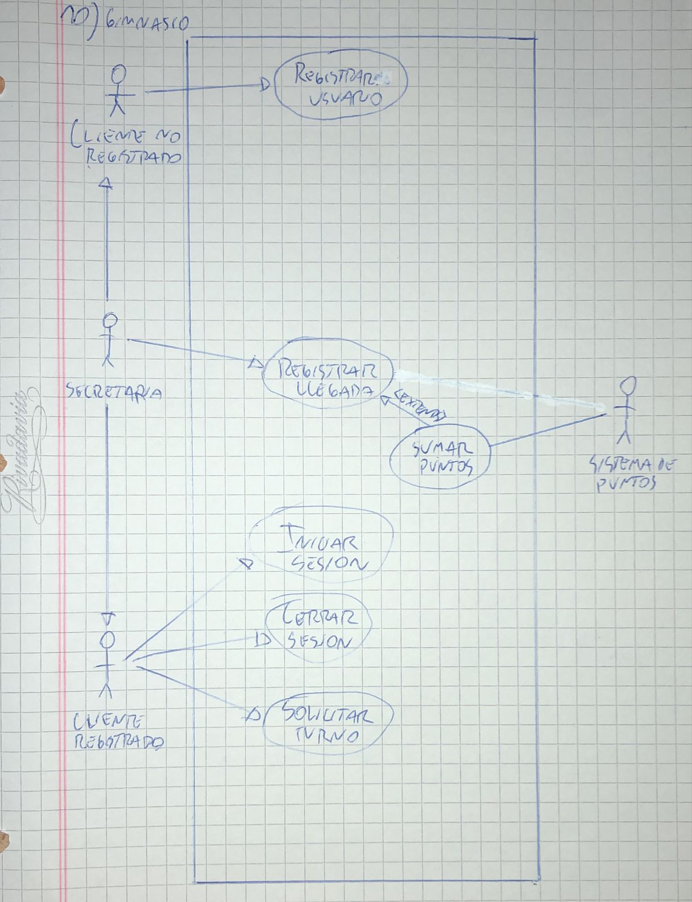

# 10) Gimnasio.
# Diagrama:

# Escenarios:
## Escenario 1:
#### Nombre del caso de uso:
`Registrar usuario.`
#### Descripcion:
`El caso de uso describe el evento en el que un cliente se registra en el sistema.`
#### Actores:
`Cliente no registrado.`
#### Precondiciones:
`---`
#### Curso normal:
1. (Actor): El cliente selecciona la opcion "Registrar Usuario".
2. (Sistema): El sistema solicita DNI, nombre, apellido y mail.
3. (Actor): La persona ingresa los datos requeridos.
4. (Sistema): El sistema verifica que no exista un cliente registrado con el mismo mail.
5. (Sistema): El sistema registra al cliente y le envia la contraseña generada a el mail ingresado.

#### Curso alterno:
Paso alternativo 4: Ya existe un usuario con el mismo email. Se informa. Vuelve al paso 2.
#### Postcondicion:
Se creo una cuenta de usuario nueva.

## Escenario 2:
#### Nombre del caso de uso:
`Registrar llegada.`
#### Descripcion:
`El caso de uso describe como la secretaria registra la llegada de un cliente.`
#### Actores:
`Secretaria.`
#### Precondiciones:
`---`
#### Curso normal:
1. (Actor): La secretaria selecciona la opcion de "Registrar Llegada".
2. (Sistema): El sistema solicita el DNI del cliente.
3. (Actor): La secretaria ingresa el DNI del cliente.
4. (Sistema): El sistema verifica el DNI del cliente.
5. (Sistema): El sistema ejecuta el caso de uso "Sumar Puntos".
6. (Sistema): El registra la asistencia del cliente.

#### Curso alterno:
Paso alternativo 4: El DNI ingresado no corresponde a un cliente. Se notifica. Volver al paso 2.

Paso alternativo 5: No se suman los puntos. Se notifica el problema. Fin del caso de uso.
#### Postcondicion:
Se registro la asistencia del cliente.

## Escenario 3:
#### Nombre del caso de uso:
`Sumar puntos.`
#### Descripcion:
`El caso de uso describe como se le suman puntos a un cliente al asistir al gimnasio.`
#### Actores:
`Sistema de puntos.`
#### Precondiciones:
`Se debe haber ejecutado el caso de uso "Registrar Llegada".`
#### Curso normal:
1. (Sistema): El sistema solicita conexion con el servidor del sistema de puntos.
2. (Actor): El servidor acepta la conexion y solicita el DNI del cliente, junto con la actividad a realizar.
3. (Sistema): El sistema envia el DNI del cliente y la actividad a realizar.
4. (Actor): El servidor suma los puntos al cliente y retorna el exito de la operacion.
5. (Sistema): El sistema cierra la conexion con el servidor.

#### Curso alterno:
Paso alternativo 1: Falla la conexion con el servidor externo. Se informa el error. Fin del CU.
#### Postcondicion:
Se sumaron los puntos al cliente.

## Escenario 4:
#### Nombre del caso de uso:
`Iniciar sesion.`
#### Descripcion:
`El caso de uso describe el modo en el que un cliente registrado inicia sesion.`
#### Actores:
`Cliente registrado.`
#### Precondiciones:
`---`
#### Curso normal:
1. (Actor): El cliente selecciona la opcion de iniciar sesion.
2. (Sistema): El sistema solicita mail y contraseña.
3. (Actor): El usuario ingresa el mail y contraseña.
4. (Sistema): El sistema verifica los datos ingresados.
5. (Sistema): El sistema registra la sesion iniciada y habilita las acciones del usuario.

#### Curso alterno:
Paso alternativo 4: Las credenciales ingresadas son invalidas. Se notifica. Volver al paso 2.
#### Postcondicion:
La sesion ha sido iniciada y las opciones para clientes registrados aparecen habilitadas.

## Escenario 5:
#### Nombre del caso de uso:
`Cerrar sesion.`
#### Descripcion:
`El caso de uso describe el evento en el que un cliente registrado cierra la sesion.`
#### Actores:
`Cliente registrado.`
#### Precondiciones:
`El cliente debe tener una sesion iniciada.`
#### Curso normal:
1. (Actor): El cliente registrado selecciona la opcion de cerrar sesion.
2. (Sistema): El sistema solicita la confirmacion del usuario.
3. (Actor): El cliente confirma la operacion.
4. (Sistema): El sistema cierra la sesion y deshabilita las acciones del usuario.

#### Curso alterno:
Paso alternativo 3: El cliente cancela la operacion. Fin del CU.
#### Postcondicion:
La sesion ha sido cerrada, las opciones para clientes registrados son deshabilitadas y se eliminan los datos de sesion.

## Escenario 6:
#### Nombre del caso de uso:
`Solicitar turno.`
#### Descripcion:
`Especifica el modo en el que un cliente registrado solicita un turno.`
#### Actores:
`Cliente registrado.`
#### Precondiciones:
`El cliente debe tener una sesion iniciada.`
#### Curso normal:
1. (Actor): El cliente selecciona la opcion de "Solicitar turno".
2. (Sistema): El sistema solicita fecha, hora y actividad.
3. (Actor): El cliente ingresa los datos requeridos.
4. (Sistema): El sistema verifica que haya cupo para la actividad en esa fecha y hora.
5. (Sistema): El sistema registra el turno.

#### Curso alterno:
Paso alternativo 4: No hay cupo para la actividad en la fecha y hora seleccionada. Se informa que no hay cupo. Volver al paso 2.
#### Postcondicion:
Se registro el turno del usuario.
