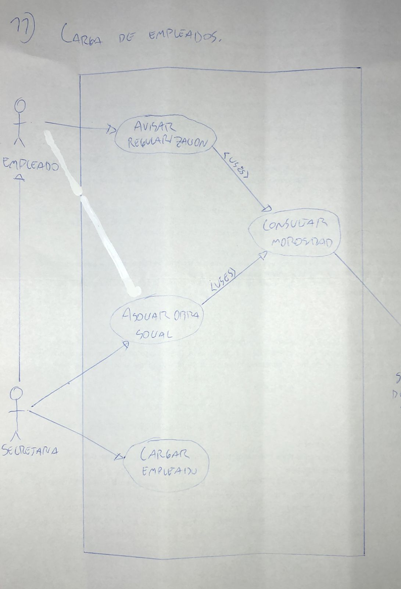

# 11) Carga de empleados.
# Diagrama:

# Escenarios:

## Escenario 1:
#### Nombre del caso de uso:
`Avisar regularizacion.`
#### Descripcion:
`Especifica el modo en el que un empleado avisa la regularizacion de su deuda.`
#### Actores:
`Empleado.`
#### Precondiciones:
`---`
#### Curso normal:
1. (Actor): El empleado selecciona la opcion de "Avisar Regularizacion".
2. (Sistema): El sistema solicita DNI y codigo de inicio de tramite.
3. (Actor): El empleado ingresa los datos solicitados.
4. (Sistema): El sistema verifica el DNI y el codigo de inicio de tramite.
6. (Sistema): El sistema ejecuta el caso de uso "Consultar morosidad".
7. (Sistema): El sistema le asigna la obra social al empleado y imprime su carnet.

#### Curso alterno:
Paso alternativo 4: El DNI y el codigo de inicio de tramite ingresados no se corresponden. Se informa el error. Volver al paso 2.

Paso alternativo 6: No se verifica que el empleado no es moroso. Se informa. Fin del caso de uso.
#### Postcondicion:
Se le asigno la obra social al empleado y se imprimio un carnet.

## Escenario 2:
#### Nombre del caso de uso:
`Consultar morosidad.`
#### Descripcion:
`Especifica el modo en el que el sistema consulta si un empleado es moroso.`
#### Actores:
`Servidor de la obra social.`
#### Precondiciones:
`Se debe haber ejecutado el caso de uso "Avisar regularizacion" o "Asociar obra social".`
#### Curso normal:
1. (Sistema): El sistema solicita la conexion con el servidor de la obra social.
2. (Actor): El servidor acepta la conexion y solicita el DNI del empleado.
3. (Sistema): El sistema envia el DNI del empleado.
4. (Actor): El servidor de la obra social verifica el DNI recibido y si es moroso.
5. (Actor): El servidor retorna el resultado.
6. (Sistema): El sistema recibe que el DNI enviado es valido.
7. (Sistema): El sistema recibe que el empleado no es moroso.
8. (Sistema): El sistema retorna que el empleado no es moroso.

#### Curso alterno:
Paso alternativo 1: No se puede dar la conexion. Se informa el error. Fin del caso de uso.

Paso alternativo 6: El DNI enviado no existe en la base de datos de la obra social. Se informa. Fin del caso de uso.

Paso alternativo 7: El empleado es moroso. El sistema retorna que el empleado es moroso. Fin del caso de uso.
#### Postcondicion:
Se retorna que el empleado no es moroso.

## Escenario 3:
#### Nombre del caso de uso:
`Asociar obra social.`
#### Descripcion:
`Especifica el modo en el que la secretaria asocia una obra social a un empleado.`
#### Actores:
`Secretaria.`
#### Precondiciones:
`---`
#### Curso normal:
1. (Actor): La secretaria selecciona la opcion de "Asociar obra social".
2. (Sistema): El sistema solicita el DNI del empleado.
3. (Actor): La secretaria ingresa el DNI del empleado.
4. (Sistema): El sistema verifica el DNI del empleado.
5. (Sistema): El sistema ejecuta el caso de uso "Consultar morosidad".
6. (Sistema): El sistema obtiene que el empleado no es moroso.
7. (Sistema): El sistema asocia la obra social al empleado y imprime el carnet.

#### Curso alterno:
Paso alternativo 4: El DNI no corresponde a un empleado. Se informa el error. Volver al paso 2.

Paso alternativo 5: No se puede llevar a cabo la verificacion. Se informa el error. Fin del caso de uso.

Paso alternativo 6: El empleado es moroso. El sistema imprime un codigo de inicio de tramite. Fin del caso de uso.
#### Postcondicion:
Se asocio una obra social al empleado y se le imprimio un carnet.

## Escenario 4:
#### Nombre del caso de uso:
`Cargar empleado.`
#### Descripcion:
`Especifica el modo en el que la secretaria carga un nuevo empleado.`
#### Actores:
`Secretaria.`
#### Precondiciones:
`---`
#### Curso normal:
1. (Actor): La secretaria selecciona la opcion de "Cargar empleado".
2. (Sistema): El sistema solicita DNI, apellido, nombre, edad y domicilio del empleado.
3. (Actor): El usuario ingresa los datos solicitados.
4. (Sistema): El sistema verifica que el nuevo empleado no figure en la base de sumariados.
5. (Sistema): El sistema da de alta al empleado y registra sus datos.

#### Curso alterno:
Paso alternativo 4: El empleado se encuentra en la base de sumariados. Se informa el problema. Fin del caso de uso.
#### Postcondicion:
Se dio de alta al empleado y se registraron sus datos.
