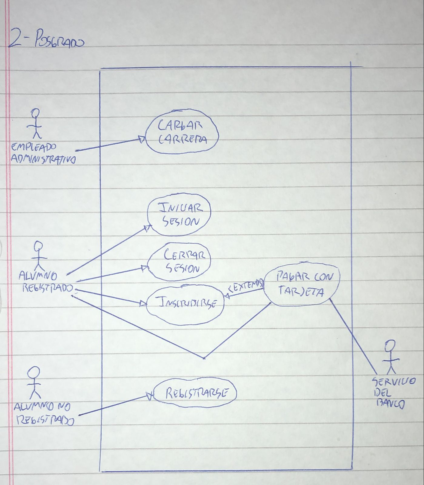

# 3) Posgrado
# Diagrama:

# Escenarios:
## Escenario 1:
#### Nombre del caso de uso:
`Cargar carrera.`
#### Descripcion:
`El caso de uso describe el evento en el que un empleado administrativo realiza la carga de una carrera.`
#### Actores:
`Empleado administrativo.`
#### Precondiciones:
`---`
#### Curso normal:
1. (Actor): El empleado administrativo selecciona la opcion de *Cargar Carrera*.
2. (Sistema): El sistema solicita los datos necesarios.
3. (Actor): El actor ingresa y confirma los datos solicitados.
4. (Sistema): El sistema verifica que la duracion de la carrera no sea mayor a 5 años.
5. (Sistema): El sistema verifica que el nombre de la carrera no se repita.
6. (Sistema): El sistema registra la nueva carrera, e informa el exito.

#### Curso alterno:
Paso alternativo 4: La duracion de la carrera es mayor a 5 años. Se notifica. Volver al paso 2.

Paso alternativo 5: Ya existe una carrera con el mismo nombre. Se notifica. Volver al paso 2.
#### Postcondicion:
Se registro la nueva carrera.

## Escenario 2:
#### Nombre del caso de uso:
`Registrarse.`
#### Descripcion:
`El caso de uso describe el evento en el que un alumno no registrado se registra en el sistema.`
#### Actores:
`Alumno no registrado.`
#### Precondiciones:
`---`
#### Curso normal:
1. (Actor): El alumno no registrado selecciona la opcion *Registrar Usuario*.
2. (Sistema): El sistema solicita nombre de usuario, contraseña, y datos personales.
3. (Actor): El alumno ingresa los datos requeridos.
4. (Sistema): El sistema verifica que no exista un usuario con el mismo nombre de usuario.
5. (Sistema): El sistema verifica que la contraseña ingresada tenga mas de 6 digitos.
6. (Sistema): El sistema registra el nuevo usuario.

#### Curso alterno:
Paso alternativo 4: Ya existe un alumno con el mismo nombre de usuario. Se informa. Vuelve al paso 2.

Paso alternativo 5. La contraseña ingresada tiene menos de 7 digitos. Se notifica. Vuelve al paso 2.

#### Postcondicion:
Se creo una cuenta de alumno nueva.

## Escenario 3:
#### Nombre del caso de uso:
`Inscribirse.`
#### Descripcion:
`El caso de uso describe el evento en el que un alumno registrado se inscribe a una carrera.`
#### Actores:
`Alumno registrado.`
#### Precondiciones:
`El alumno debe tener una sesion iniciada.`
#### Curso normal:
1. (Actor): El alumno registrado selecciona una carrera.
2. (Sistema): El sistema solicita la cantidad de cuotas a pagar.
3. (Actor): El alumno ingresa la cantidad de cuotas a pagar.
4. (Sistema): El sistema ejecuta el caso de uso "Pagar con tarjeta".
6. (Sistema): El sistema registra la inscripcion e imprime un comprobante del pago y otro de la inscripcion.

#### Curso alterno:
Paso alternativo 4: El pago no se realiza. Se notifica al alumno. Fin de CU.
#### Postcondicion:
Se realizo la incripcion del alumno a la carrera seleccionada. Se imprimio un comprobante de la incripcion y otro del pago de las cuotas seleccionadas.

## Escenario 4:
#### Nombre del caso de uso:
`Pagar con tarjeta.`
#### Descripcion:
`El caso de uso describe el cobro de las cuotas de una carrera mediante una tarjeta.`
#### Actores:
`Alumno registrado, Sevicio del banco.`
#### Precondiciones:
`Se debe haber ejecutado el CU "Inscribirse".`
#### Curso normal:
1. (Sistema): El sistema solicita el numero de tarjeta y codigo de seguridad.
2. (Actor): El alumno ingresa los datos.
3. (Sistema): El sistema solicita conexion con el servidor externo.
4. (Actor): El servidor externo acepta la conexion y solicita numero de tarjeta y codigo de seguridad.
5. (Sistema): El sistema envia los datos de la tarjeta al servidor externo.
6. (Actor): El servidor externo valida los datos y fondos suficientes.
7. (Actor): El servidor externo retorna el resultado.
8. (Sistema): El sistema recibe que los datos de la tarjeta son correctos.
9. (Sistema): El sistema recibe que los fondos son suficientes.
10. (Sistema): El sistema registra el pago y cierra la conexion con el servidor externo.

#### Curso alterno:
Paso alternativo 3: Falla la conexion con el servidor externo. Se informa el error. Fin del CU.

Paso alternativo 8: La validacion de datos es incorrecta. Se informa error en los datos de la tarjeta. Fin del CU.

Paso alternativo 9: Fondos insuficientes. Se informa fondos insuficientes. Fin de CU.
#### Postcondicion:
Se efectuo y registro el pago a travez de tarjeta.

## Escenario 5:
#### Nombre del caso de uso:
`Iniciar sesion.`
#### Descripcion:
`El caso de uso describe el modo en el que un alumno registrado inicia sesion.`
#### Actores:
`Alumno registrado.`
#### Precondiciones:
`---`
#### Curso normal:
1. (Actor): El alumno selecciona la opcion de iniciar sesion.
2. (Sistema): El sistema solicita nombre de usuario y contraseña.
3. (Actor): El alumno ingresa el nombre de usuario y contraseña.
4. (Sistema): El sistema verifica los datos ingresados.
5. (Sistema): El sistema registra la sesion iniciada y habilita las acciones del alumno.

#### Curso alterno:
Paso alternativo 4: Las credenciales ingresadas son invalidas. Se notifica. Volver al paso 2.
#### Postcondicion:
La sesion ha sido iniciada y las opciones para alumnos registrados aparecen habilitadas.

## Escenario 6:
#### Nombre del caso de uso:
`Cerrar sesion.`
#### Descripcion:
`El caso de uso describe el evento en el que un alumno registrado cierra la sesion.`
#### Actores:
`Alumno registrado..`
#### Precondiciones:
`El alumno deebe tener una sesion iniciada.`
#### Curso normal:
1. (Actor): El alumno registrado selecciona la opcion de cerrar sesion.
2. (Sistema): El sistema solicita la confirmacion del alumno.
3. (Actor): El alumno confirma la operacion.
4. (Sistema): El sistema cierra la sesion y deshabilita las acciones del alumno.

#### Curso alterno:
Paso alternativo 3: El alumno cancela la operacion. Fin del CU.
#### Postcondicion:
La sesion ha sido cerrada, las opciones para alumnos registrados son deshabilitadas y se eliminan los datos de sesion.
