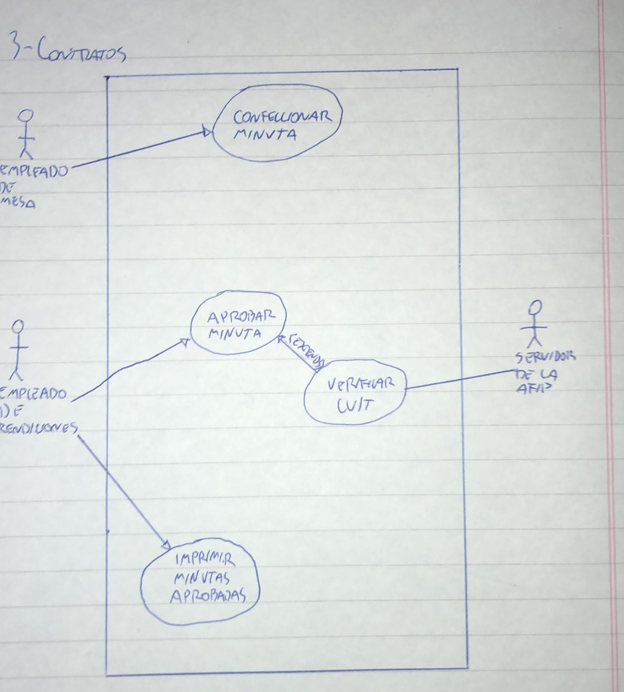

# 3) Contratos
# Diagrama:

# Escenarios:
## Escenario 1:
#### Nombre del caso de uso:
`Confeccionar minuta.`
#### Descripcion:
`El caso de uso describe el evento en el que un empleado de mesa confecciona una minuta.`
#### Actores:
`Empleado de mesa.`
#### Precondiciones:
`---`
#### Curso normal:
1. (Actor): El empleado de mesa selecciona la opcion de *Confeccionar Minuta*.
2. (Sistema): El sistema solicita nombre y numero de CUIT de la persona a contratar, tipo de contrato, fecha de comienzo, duracion y monto.
3. (Actor): El empleado ingresa y confirma los datos solicitados.
4. (Sistema): El sistema verifica que la duracion del contrato no sea mayor a 6 meses.
5. (Sistema): El sistema verifica que el monto del contrato no sea mayor a $25.000.
6. (Sistema): El sistema registra la minuta y le asocia un numero de minuta.

#### Curso alterno:
Paso alternativo 4: La duracion de la carrera es mayor a 6 meses. Se notifica. Volver al paso 2.

Paso alternativo 5: El monto del contrato es mayor a $25.000. Se notifica. Volver al paso 2.
#### Postcondicion:
Se registro la nueva minuta y se le asocio un numero de minuta automaticamente.

## Escenario 2:
#### Nombre del caso de uso:
`Aprobar minuta.`
#### Descripcion:
`El caso de uso describe el evento en el que un empleado de rendiciones aprueba una minuta.`
#### Actores:
`Empleado de rendiciones.`
#### Precondiciones:
`Se confeccionaron minutas y estan pendientes de aprobacion.`
#### Curso normal:
1. (Actor): El empleado de rendiciones selecciona la opcion *Aprobar una Minuta*.
2. (Sistema): El sistema solicita numero de minuta.
3. (Actor): El empleado ingresa el numero de minuta.
4. (Sistema): El sistema verifica que el numero de minuta corresponda a una minuta pendiente de aprobacion.
5. (Sistema): El sistema muestra los datos de la minuta con el numero ingresado.
6. (Actor): El revisa los datos de la minuta y selecciona "Aprobar".
7. (Sistema): El sistema solicita la confirmacion del usuario.
8. (Actor): El empleado confirma la operacion.
9. (Sistema): El sistema verifica que la persona a contratar no tenga ya 3 minutas aprobadas.
10. (Sistema): El sistema ejecuta el caso de uso Verificar CUIT.
11. (Sistema): El sistema aprueba la minuta.

#### Curso alterno:
Paso alternativo 4: El numero de minuta ingresado no corresponde a una minuta pendiente de aprobacion. Se informa. Vuelve al paso 2.

Paso alternativo 9. La persona a contratar ya tiene 3 minutas aprobadas. Se notifica. Termina el caso de uso.

Paso alternativo 10. El CUIT de la persona a contratar se encuentra inhabilitado por la AFIP. Se informa. Termina el caso de uso.
#### Postcondicion:
Se aprobo una minuta.

## Escenario 3:
#### Nombre del caso de uso:
`Verificar CUIT.`
#### Descripcion:
`El caso de uso describe el evento en el que se verifica el CUIT de una persona a contratar.`
#### Actores:
`Servidor de la AFIP.`
#### Precondiciones:
`Se debe haber ejecutado el CU "Aprobar Minuta".`
#### Curso normal:
1. (Sistema): El sistema envia un token y el CUIT de la persona a contratar al servidor de la AFIP.
2. (Actor): El servidor de la AFIP verifica el token recibido.
3. (Actor): El servidor de la AFIP verifica el si el CUIT recibido se encuentra inhabilitado o no.
4. (Actor): El servidor de la AFIP retorna el resultado.
5. (Sistema): El sistema recibe el resultado y lo retorna.

#### Curso alterno:
Paso alternativo 2: El token es invalido. Se notifica. Fin de CU.
#### Postcondicion:
El sistema retorna si el CUIT de la persona a contratar esta habilitado o no.

## Escenario 4:
#### Nombre del caso de uso:
`Imprimir minutas aprobadas.`
#### Descripcion:
`El caso de uso describe el evento en el que se imprimen las minutas aprobadas.`
#### Actores:
`Empleado de rendiciones.`
#### Precondiciones:
`---`
#### Curso normal:
1. (Actor): El empleado de rendiciones selecciona la opcion de imprimir minutas aprobadas.
2. (Sistema): El sistema muestra un listado con las minutas aprobadas y solicita confirmacion.
3. (Actor): El empleado confirma la operacion.
4. (Sistema): El sistema imprime los listados con las minutas aprobadas.

#### Curso alterno:
Paso alternativo 3: El empleado de rendiciones calcela la operacion. Fin del CU.
#### Postcondicion:
Se imprimieron los listados con las minutas aprobadas.
