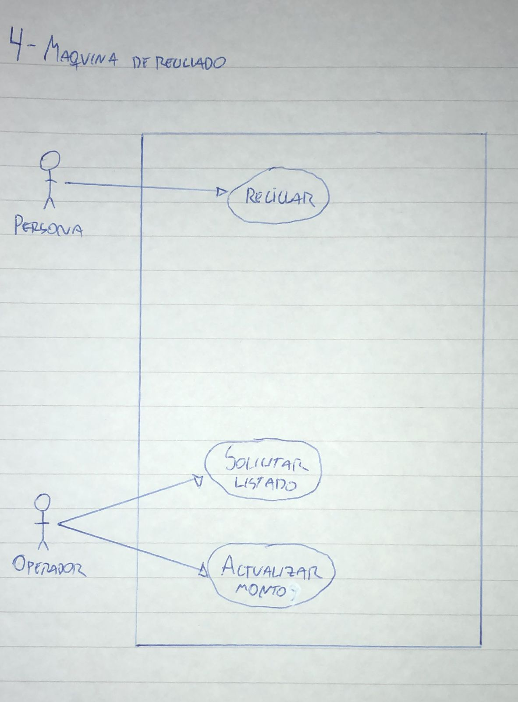

# 4) Maquina de Reciclado
# Diagrama:

# Escenarios:
## Escenario 1:
#### Nombre del caso de uso:
`Reciclar.`
#### Descripcion:
`El caso de uso describe el evento en el que una persona usa la maquina para reciclar mateteriales.`
#### Actores:
`Persona.`
#### Precondiciones:
`---`
#### Curso normal:
1. (Actor): La persona coloca el material a reciclar en el recipiende de la maquina y presiona la opcion "Reciclar".
2. (Sistema): El sistema detecta el tipo del material depositado.
3. (Sistema): El sistema pesa el material y registra la medicion.
4. (Sistema): El sistema imprime un recibo con el monto total que se le debe pagar a la persona.

#### Curso alterno:
Paso alternativo 2: El sistema no detecta el tipo de material ingresado. Se notifica y se retorna el producto. Finaliza el CU.
#### Postcondicion:
El material se ingreso correctamente, se registro la operacion y se emitio un recibo.

## Escenario 2:
#### Nombre del caso de uso:
`Solicitar listado.`
#### Descripcion:
`El caso de uso describe el evento en el que un operador solicita un listado con los tipos de materiales registrados.`
#### Actores:
`Operador.`
#### Precondiciones:
`---`
#### Curso normal:
1. (Actor): El operador selecciona la operacion de "Solicitar Listado".
2. (Sistema): El sistema solicita un periodo de fechas.
3. (Actor): El operador ingresa los datos solicitados.
4. (Sistema): El sistema informa los tipos de materiales reciclados en el periodo ingresado y el total abonado por cada material.

#### Curso alterno:
`---`
#### Postcondicion:
Se informan los tipos de materiales reciclados en un periodo determinado junto con el total abonado por cada material.

## Escenario 3:
#### Nombre del caso de uso:
`Actualizar monto.`
#### Descripcion:
`El caso de uso describe el evento en el que se el operador actualiza los montos a pagar.`
#### Actores:
`Operador.`
#### Precondiciones:
`---`
#### Curso normal:
1. (Actor): El operador selecciona la opcion de "Actualizar monto".
2. (Sistema): El sistema muestra los tipos de material y solicita que se seleccione uno.
3. (Actor): El operador selecciona el tipo de material a actualizar.
4. (Sistema): El sistema solicita el nuevo monto a pagar por kilo del material seleccionado.
5. (Actor): El operador ingresa el nuevo monto.
6. (Sistema): El sistema solicita que se confirme la operacion.
7. (Actor): El operador confirma la operacion.
8. (Sistema): El sistema actualiza el monto e informa el exito de la operacion.

#### Curso alterno:
Paso alternativo 7: El operador cancela la operacion. Fin de CU.
#### Postcondicion:
El sistema actualiza el monto a abonar por kilo del tipo de material seleccionado con el nuevo monto ingresado.
