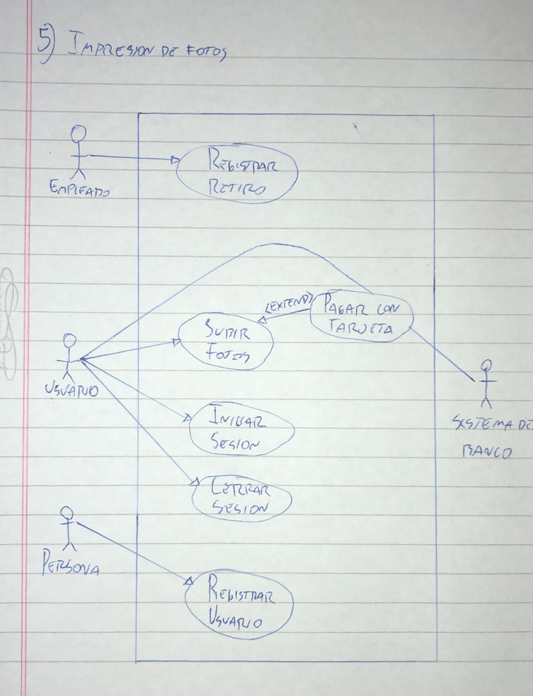

# 5) Impresion de Fotos
# Diagrama:

# Escenarios:
## Escenario 1:
#### Nombre del caso de uso:
`Registrar retiro.`
#### Descripcion:
`El caso de uso describe el evento en el que un empleado registra el retiro de un pedido.`
#### Actores:
`Empleado.`
#### Precondiciones:
`---`
#### Curso normal:
1. (Actor): El empleado ingresa el codigo unico de pedido.
2. (Sistema): El sistema verifica que el codigo corresponda a un pedido pendiente de retiro.
3. (Sistema): El sistema muestra los datos del pedido, y le pregunta al empleado si efectuar el retiro.
4. (Actor): El empleado confirma el retiro.
5. (Sistema): El sistema registra el retiro del pedido con la fecha actual.

#### Curso alterno:
Paso alternativo 2: El codigo unico de pedido no corresponde a un pedido pendiente de retiro. Se notifica. Fin del caso de uso.

Paso alternativo 4: El empleado cancela la operacion. Fin del caso de uso.
#### Postcondicion:
Se registro el retiro del pedido con la fecha actual.

## Escenario 2:
#### Nombre del caso de uso:
`Pagar con tarjeta.`
#### Descripcion:
`El caso de uso describe el cobro de un pedido mediante una tarjeta.`
#### Actores:
`Usuario, sistema del banco.`
#### Precondiciones:
`Se debe haber ejecutado el CU "Subir fotos".`
#### Curso normal:
1. (Sistema): El sistema solicita el numero de tarjeta y codigo de seguridad.
2. (Actor): El usuario ingresa los datos.
3. (Sistema): El sistema solicita conexion con el sistema del banco.
4. (Actor): El sistema del banco acepta la conexion y solicita numero de tarjeta y codigo de seguridad.
5. (Sistema): El sistema envia los datos de la tarjeta al sistema del banco.
6. (Actor): El sistema del banco valida los datos y fondos suficientes.
7. (Actor): El sistema del banco retorna el resultado.
8. (Sistema): El sistema recibe que los datos de la tarjeta son correctos.
9. (Sistema): El sistema recibe que los fondos son suficientes.
10. (Sistema): El sistema registra el pago y cierra la conexion con el sistema del banco.

#### Curso alterno:
Paso alternativo 3: Falla la conexion con el sistema del banco. Se informa el error. Fin del CU.

Paso alternativo 8: La validacion de datos es incorrecta. Se informa error en los datos de la tarjeta. Fin del CU.

Paso alternativo 9: Fondos insuficientes. Se informa fondos insuficientes. Fin de CU.
#### Postcondicion:
Se efectuo y registro el pago a travez de tarjeta.

## Escenario 3:
#### Nombre del caso de uso:
`Subir fotos.`
#### Descripcion:
`El caso de uso describe el evento en el que un usuario sube fotos.`
#### Actores:
`Usuario.`
#### Precondiciones:
`El usuario debe tener una sesion iniciada.`
#### Curso normal:
1. (Actor): El usuario selecciona la opcion de "Subir Fotos".
2. (Sistema): El sistema solicita que se ingresen las fotos de a una.
3. (Actor): El usuario ingresa las fotos.
4. (Sistema): El sistema verifica que no se hayan ingresado mas de 50 fotos.
5. (Sistema): El sistema ejecuta el caso de uso "Pagar con tarjeta".
6. (Sistema): El sistema registra el pedido y le informa al usuario el codigo unico del pedido.

#### Curso alterno:
Paso alternativo 4: Se ingresaron mas de 50 fotos. Se notifica al usuario. Vuelve al paso 2.

Paso alternativo 5: El pago no se realiza. Se notifica al usuario. Fin de CU.
#### Postcondicion:
Se registro el pedido y se informo su numero unico para realizar el retiro.

## Escenario 4:
#### Nombre del caso de uso:
`Iniciar sesion.`
#### Descripcion:
`El caso de uso describe el modo en el que un usuario registrado inicia sesion.`
#### Actores:
`Usuario registrado.`
#### Precondiciones:
`---`
#### Curso normal:
1. (Actor): El usuario selecciona la opcion de iniciar sesion.
2. (Sistema): El sistema solicita nombre de usuario y contraseña.
3. (Actor): El usuario ingresa el nombre de usuario y contraseña.
4. (Sistema): El sistema verifica los datos ingresados.
5. (Sistema): El sistema registra la sesion iniciada y habilita las acciones del usuario.

#### Curso alterno:
Paso alternativo 4: Las credenciales ingresadas son invalidas. Se notifica. Volver al paso 2.
#### Postcondicion:
La sesion ha sido iniciada y las opciones para usuarios registrados aparecen habilitadas.

## Escenario 5:
#### Nombre del caso de uso:
`Cerrar sesion.`
#### Descripcion:
`El caso de uso describe el evento en el que un usuario registrado cierra la sesion.`
#### Actores:
`Usuario registrado.`
#### Precondiciones:
`El usuario debe tener una sesion iniciada.`
#### Curso normal:
1. (Actor): El usuario registrado selecciona la opcion de cerrar sesion.
2. (Sistema): El sistema solicita la confirmacion del usuario.
3. (Actor): El usuario confirma la operacion.
4. (Sistema): El sistema cierra la sesion y deshabilita las acciones del usuario.

#### Curso alterno:
Paso alternativo 3: El usuario cancela la operacion. Fin del CU.
#### Postcondicion:
La sesion ha sido cerrada, las opciones para usuarios registrados son deshabilitadas y se eliminan los datos de sesion.

## Escenario 2:
#### Nombre del caso de uso:
`Registrar usuario.`
#### Descripcion:
`El caso de uso describe el evento en el que una persona se registra en el sistema.`
#### Actores:
`Persona.`
#### Precondiciones:
`---`
#### Curso normal:
1. (Actor): La persona selecciona la opcion *Registrar Usuario*.
2. (Sistema): El sistema solicita nombre de usuario, contraseña, email, y datos personales.
3. (Actor): La persona ingresa los datos requeridos.
4. (Sistema): El sistema verifica que no exista un usuario con el mismo nombre de usuario.
6. (Sistema): El sistema registra el nuevo usuario.

#### Curso alterno:
Paso alternativo 4: Ya existe un usuario con el mismo nombre de usuario. Se informa. Vuelve al paso 2.
#### Postcondicion:
Se creo una cuenta de usuario nueva.
