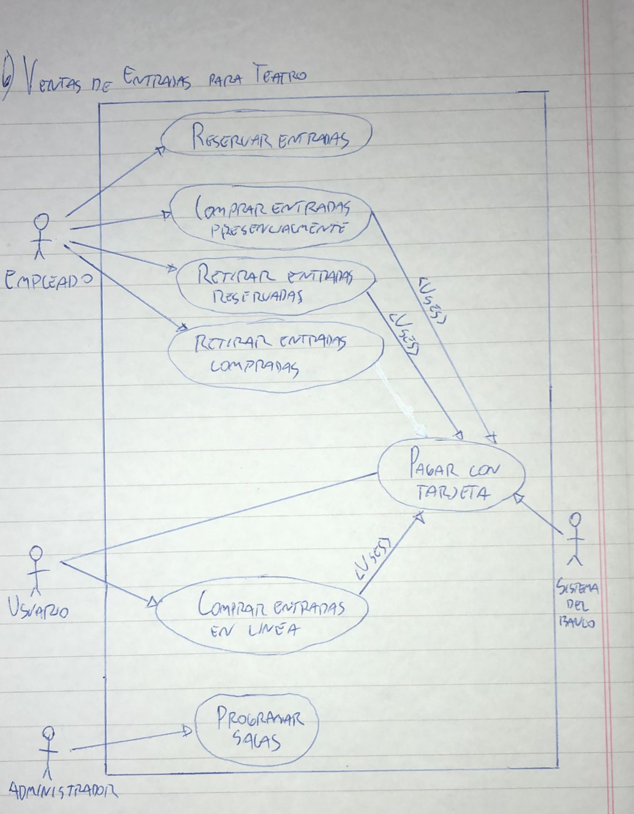

# 6) Venta de Entradas para Teatro
# Diagrama:

# Escenarios:
## Escenario 1:
#### Nombre del caso de uso:
`Reservar entradas.`
#### Descripcion:
`El caso de uso describe el evento en el que un empleado reserva entradas.`
#### Actores:
`Empleado.`
#### Precondiciones:
`---`
#### Curso normal:
1. (Actor): El empleado selecciona la opcion de "Reservar Entradas".
2. (Sistema): El sistema solicita los datos de la obra, cantidad de entradas a reservar, nombre y DNI del cliente.
3. (Actor): El empleado ingresa los datos solicitados.
4. (Sistema): El sistema verifica que existan entradas disponibles.
5. (Sistema): El sistema efectua la reserva de las entradas.

#### Curso alterno:
Paso alternativo 4: No hay entradas disponibles. Se notifica. Fin del caso de uso.
#### Postcondicion:
Se reservaron las entradas para la obra seleccionada.

## Escenario 2:
#### Nombre del caso de uso:
`Comprar entradas presencialmente.`
#### Descripcion:
`El caso de uso describe el evento en el que un empleado realiza la venta de entradas de forma presencial.`
#### Actores:
`Empleado.`
#### Precondiciones:
`---`
#### Curso normal:
1. (Actor): El empleado selecciona la opcion de "Comprar Entradas".
2. (Sistema): El sistema solicita los datos de la obra, cantidad de entradas a comprar y DNI del cliente.
3. (Actor): El empleado ingresa los datos solicitados.
4. (Sistema): El sistema verifica que existan entradas disponibles.
5. (Sistema): El sistema ejecuta el caso de uso "Pagar con tarjeta".
6. (Sistema): El sistema imprime las entradas.

#### Curso alterno:
Paso alternativo 4: No hay entradas disponibles. Se notifica. Fin del caso de uso.

Paso alternativo 5: El pago no se realiza. Se notifica. Fin de CU.
#### Postcondicion:
Se imprimieron las entradas para la obra seleccionada.

## Escenario 3:
#### Nombre del caso de uso:
`Retirar entradas reservadas.`
#### Descripcion:
`El caso de uso describe el evento en el que un empleado realiza el retiro de entradas reservadas.`
#### Actores:
`Empleado.`
#### Precondiciones:
`---`
#### Curso normal:
1. (Actor): El empleado selecciona la opcion de "Retirar Entradas Reservadas".
2. (Sistema): El sistema solicita nombre y DNI del cliente.
3. (Actor): El empleado ingresa los datos solicitados.
4. (Sistema): El sistema verifica que la persona posea entradas reservadas.
5. (Sistema): El sistema verifica que las reservas de la persona no se hayan vencido.
6. (Sistema): El sistema ejecuta el caso de uso "Pagar con tarjeta".
7. (Sistema): El sistema imprime las entradas.

#### Curso alterno:
Paso alternativo 4: La persona no tiene entradas reservadas. Se notifica. Fin del caso de uso.

Paso alternativo 5: Las reservas de las personan estan vencidas. Se notifica. Fin del caso de uso.

Paso alternativo 6: El pago no se realiza. Se notifica al empleado. Fin de CU.
#### Postcondicion:
Se imprimieron las entradas para la obra seleccionada.

## Escenario 4:
#### Nombre del caso de uso:
`Retirar entradas compradas.`
#### Descripcion:
`El caso de uso describe el evento en el que un empleado realiza el retiro de entradas previamente compradas.`
#### Actores:
`Empleado.`
#### Precondiciones:
`---`
#### Curso normal:
1. (Actor): El empleado selecciona la opcion de "Retirar Entradas Compradas".
2. (Sistema): El sistema solicita codigo de compra.
3. (Actor): El empleado ingresa el codigo de compra provisto por el cliente.
4. (Sistema): El sistema verifica el codigo de compra.
5. (Sistema): El sistema imprime las entradas.

#### Curso alterno:
Paso alternativo 4: El codigo de compra no existe. Se notifica. Fin del caso de uso.
#### Postcondicion:
Se imprimieron las entradas correspondientes al codigo de compra.

## Escenario 5:
#### Nombre del caso de uso:
`Pagar con tarjeta.`
#### Descripcion:
`El caso de uso describe el cobro de un entradas mediante una tarjeta.`
#### Actores:
`Usuario, sistema del banco.`
#### Precondiciones:
`Se debe haber ejecutado uno de los siguientes casos de uso:`
- Comprar entradas presencialmente.
- Retirar entradas reservadas.
- Comprar entradas en linea.
#### Curso normal:
1. (Sistema): El sistema solicita el numero de tarjeta, vencimiento y codigo de seguridad.
2. (Actor): El usuario ingresa los datos.
3. (Sistema): El sistema solicita conexion con el sistema del banco.
4. (Actor): El sistema del banco acepta la conexion y solicita numero de tarjeta, vencimiento y codigo de seguridad.
5. (Sistema): El sistema envia los datos de la tarjeta al sistema del banco.
6. (Actor): El sistema del banco valida los datos y fondos suficientes.
7. (Actor): El sistema del banco retorna el resultado.
8. (Sistema): El sistema recibe que los datos de la tarjeta son correctos.
9. (Sistema): El sistema recibe que los fondos son suficientes.
10. (Sistema): El sistema registra el pago y cierra la conexion con el sistema del banco.

#### Curso alterno:
Paso alternativo 3: Falla la conexion con el sistema del banco. Se informa el error. Fin del CU.

Paso alternativo 8: La validacion de datos es incorrecta. Se informa error en los datos de la tarjeta. Fin del CU.

Paso alternativo 9: Fondos insuficientes. Se informa fondos insuficientes. Fin de CU.
#### Postcondicion:
Se efectuo y registro el pago a travez de tarjeta.

## Escenario 6:
#### Nombre del caso de uso:
`Comprar entradas en linea.`
#### Descripcion:
`El caso de uso describe el evento en el que un usuario realiza la compra de entradas en linea.`
#### Actores:
`Usuario.`
#### Precondiciones:
`---`
#### Curso normal:
1. (Actor): El usuario selecciona la opcion de "Comprar Entradas".
2. (Sistema): El sistema muestra la grilla de funciones disponibles.
3. (Sistema): El sistema solicita que se seleccione una funcion y que se ingrese la cantidad de entradas a comprar y el DNI del cliente.
4. (Actor): El usuario selecciona una funcion, ingresa los datos solicitados y selecciona la opcion "Pagar".
5. (Sistema): El sistema ejecuta el caso de uso "Pagar con tarjeta".
6. (Sistema): El sistema informa el un codigo de compra correspondiente a la operacion.

#### Curso alterno:
Paso alternativo 5: El pago no se realiza. Se notifica. Fin de CU.
#### Postcondicion:
Se realizo la compra y se emitio el codigo de compra correspondiente.

## Escenario 7:
#### Nombre del caso de uso:
`Programar salas.`
#### Descripcion:
`El caso de uso describe el evento en el que el administrador programa la distribucion semanal de las obras.`
#### Actores:
`Administrador.`
#### Precondiciones:
`---`
#### Curso normal:
1. (Actor): El administrador selecciona la opcion de "Programar Salas".
2. (Sistema): El sistema pide que se ingrese la distribucion semanal de las obras en las salas.
3. (Actor): El administrador ingresa los datos solicitados.
4. (Sistema): El sistema pide que se confirme la operacion.
5. (Actor): El administrador confirma la operacion.
6. (Sistema): El sistema hace efectiva la nueva distribucion para la venta de entradas.
#### Curso alterno:
Paso alternativo 5: El administrador cancela la operacion. Fin del caso de uso.
#### Postcondicion:
El sistema registro la nueva distribucion para la venta de entradas.
