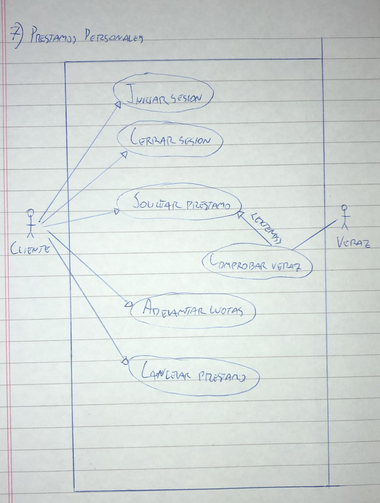

# 7) Prestamos Personales
# Diagrama:

# Escenarios:
## Escenario 1:
#### Nombre del caso de uso:
`Iniciar sesion.`
#### Descripcion:
`El caso de uso describe el modo en el que un cliente inicia sesion.`
#### Actores:
`Cliente.`
#### Precondiciones:
`---`
#### Curso normal:
1. (Actor): El cliente selecciona la opcion de iniciar sesion.
2. (Sistema): El sistema solicita nombre de cliente y contraseña.
3. (Actor): El cliente ingresa el nombre de usuario y la contraseña.
4. (Sistema): El sistema verifica los datos ingresados.
5. (Sistema): El sistema registra la sesion iniciada y habilita las acciones del cliente.

#### Curso alterno:
Paso alternativo 4: Las credenciales ingresadas no corresponden a un usuario registrado. Se notifica. Volver al paso 2.
#### Postcondicion:
La sesion ha sido iniciada y las opciones para clientes aparecen habilitadas.

## Escenario 2:
#### Nombre del caso de uso:
`Cerrar sesion.`
#### Descripcion:
`El caso de uso describe el evento en el que un cliente cierra la sesion.`
#### Actores:
`Cliente.`
#### Precondiciones:
`El cliente debe tener una sesion iniciada.`
#### Curso normal:
1. (Actor): El cliente selecciona la opcion de cerrar sesion.
2. (Sistema): El sistema solicita la confirmacion del cliente.
3. (Actor): El cliente confirma la operacion.
4. (Sistema): El sistema cierra la sesion y deshabilita las acciones del cliente.

#### Curso alterno:
Paso alternativo 3: El cliente cancela la operacion. Fin del CU.
#### Postcondicion:
La sesion ha sido cerrada, las opciones para clientes registrados son deshabilitadas y se eliminan los datos de sesion.

## Escenario 3:
#### Nombre del caso de uso:
`Solicitar prestamo.`
#### Descripcion:
`El caso de uso describe el evento en el que un cliente solicita un prestamo.`
#### Actores:
`Cliente.`
#### Precondiciones:
`El cliente debe tener una sesion iniciada.`
#### Curso normal:
1. (Actor): El cliente selecciona la opcion de "Solicitar Prestamo".
2. (Sistema): El sistema solicita motivo del prestamo, cuenta de la que descontaran las cuotas y monto del prestamo.
3. (Actor): El cliente ingresa los datos solicitados.
4. (Sistema): El sistema verifica que el cliente no tenga mas de dos prestamos en curso.
4. (Sistema): El sistema verifica que el monto total no exceda los $30.000.
4. (Sistema): El sistema ejecuta el caso de uso "Comprobar Veraz".
5. (Sistema): El sistema registra registra el prestamo, genera un indentificador del prestamo, un codigo de verificacion, y un comprobante con los datos del prestamo.

#### Curso alterno:
Paso alternativo 4: El cliente ya tiene 3 prestamos en curso. Se notifica. Fin del caso de uso.

Paso alternativo 5: El monto total del prestamo excede los $30.000. Se notifica. Vuelve al paso 2.

Paso alternativo 6: El cliente figura en el Veraz. Se notifica. Fin del caso de uso.
#### Postcondicion:
El sistema registro el prestamo correspondiente, genero un identificador del prestamo, un codigo de verificacion y un comprobante con los datos del prestamo.

## Escenario 4:
#### Nombre del caso de uso:
`Comprobar Veraz.`
#### Descripcion:
`El caso de uso describe el evento en el que un se comprueba si un cliente figura en el Veraz`
#### Actores:
`Veraz.`
#### Precondiciones:
`Se debe haber ejecutado el caso de uso "Solicitar Prestamo".`
#### Curso normal:
1. (Sistema): El sistema solicita conexion con el servidor del Veraz.
2. (Actor): El servidor del Veraz acepta la conexion y solicita que se envie el codigo de seguridad del banco.
3. (Sistema): El sistema envia el codigo de seguridad.
4. (Actor): El servidor del Veraz verifica el codigo de seguridad.
5. (Actor): El servidor del Veraz solicita nombre, apellido y CUIT de la persona a consultar.
6. (Sistema): El sistema envia los datos solicitados.
7. (Actor): El servidor del Veraz retorna el resultado de la consulta.
8. (Sistema): El sistema retorna el resultado de la consulta.

#### Curso alterno:
Paso alternativo 1: Falla la conexion con el servidor externo. Se informa. Fin del caso de uso.

Paso alternativo 4: El codigo de seguridad es invalido. Fin del caso de uso.
#### Postcondicion:
El sistema retorno el resultado de la consulta, es decir, si la persona se encuentra o no en el veraz.

## Escenario 5:
#### Nombre del caso de uso:
`Adelantar cuotas.`
#### Descripcion:
`El caso de uso describe el evento en el que el cliente adelanta cuotas de un prestamo.`
#### Actores:
`Cliente.`
#### Precondiciones:
`El cliente debe tener una sesion iniciada.`
#### Curso normal:
1. (Actor): El cliente selecciona la opcion de "Adelantar Cuotas".
2. (Sistema): El sistema muestra un listado de prestamos vigentes iniciados hace mas de 6 meses.
3. (Actor): El cliente selecciona un prestamo.
4. (Sistema): El sistema solicita la cantidad de cuotas a pagar y muestra un listado de las cuentas del cliente.
5. (Actor): El cliente ingresa las cuotas a abonar y selecciona una cuenta.
6. (Sistema): El sistema verifica que existan fondos suficientes en la cuenta.
7. (Sistema): El sistema informa el exito de la operacion, registra el pago, y descuenta el monto correspondiente de la cuenta seleccionada.

#### Curso alterno:
Paso alternativo 6: La cuenta no posee fondos suficientes. Se notifica. Volver al paso 4.
#### Postcondicion:
El sistema informa el exito de la operacion, registra el pago, y descuenta el monto correspondiente de la cuenta seleccionada.

## Escenario 6:
#### Nombre del caso de uso:
`Cancelar prestamo.`
#### Descripcion:
`El caso de uso describe el evento en el que el cliente cancela la totalidad de un prestamo.`
#### Actores:
`Cliente.`
#### Precondiciones:
`El cliente debe tener una sesion iniciada.`
#### Curso normal:
1. (Actor): El cliente selecciona la opcion de "Cancelar Prestamo".
2. (Sistema): El sistema solicita el numero de DNI del cliente.
3. (Actor): El cliente ingresa su numero de DNI.
4. (Sistema): El sistema verifica el DNI.
5. (Sistema): El sistema lista los prestamos para que se seleccione cual de desea pagar.
6. (Actor): El cliente selecciona un prestamo.
7. (Sistema): El sistema verifica que existan fondos suficientes en la cuenta asociada originalmente.
8. (Sistema): El sistema informa el exito de la operacion, registra la cancelacion, descuenta el monto correspondiente de la cuenta seleccionada y emite un comprobante.

#### Curso alterno:
Paso alternativo 7: La cuenta no posee fondos suficientes. Se notifica. Volver al paso 4.
#### Postcondicion:
El sistema informa el exito de la operacion, registra la cancelacion, descuenta el monto correspondiente de la cuenta seleccionada y emite un comprobante.
