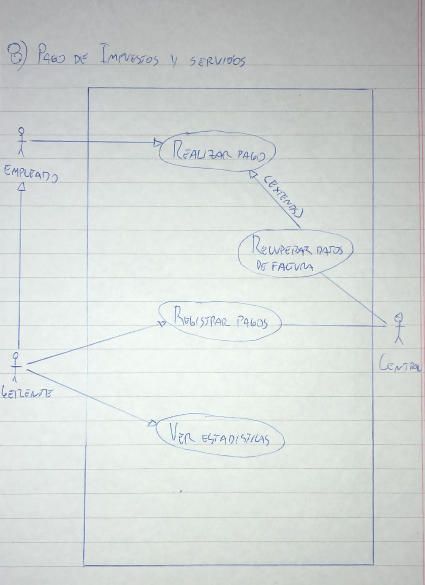

# 8) Pago de Impuestos y Servicios
# Diagrama:

# Escenarios:
## Escenario 1:
#### Nombre del caso de uso:
`Realizar pago.`
#### Descripcion:
`El caso de uso describe el evento en el que un empleado realiza un pago.`
#### Actores:
`Empleado.`
#### Precondiciones:
`---`
#### Curso normal:
1. (Actor): El empleado selecciona la opcion de "Realizar Pago".
2. (Sistema): El sistema solicita codigo de pago electronico.
3. (Actor): El empleado ingresa el codigo.
4. (Sistema): El sistema ejecuta el caso de uso "Recuperar datos de factura".
5. (Sistema): El sistema verifica si la factura se vencio el segundo vencimiento.
6. (Sistema): El sistema verifica si la factura se vencio el primer vencimiento.
7. (Sistema): El sistema muestra los datos de la factura y espera confirmacion de la operacion.
8. (Actor): El empleado confirma la operacion.
9. (Sistema): El sistema registra la operacion e imprime un comprobante.

#### Curso alterno:
Paso alternativo 4: El codigo de pago electronico es invalido. Se notifica. Fin del caso de uso.

Paso alternativo 5: Se vencio el segundo vencimiento. Se notifica. Fin del caso de uso.

Paso alternativo 6: Se vencio el primer vencimiento. Se notifica y se aplica el recargo al monto original. Continuar al paso 7.
#### Postcondicion:
Se registro el pago y se imprimio un comprobante.

## Escenario 2:
#### Nombre del caso de uso:
`Recuperar datos de factura.`
#### Descripcion:
`El caso de uso describe el evento en el que se recupera de la central los datos de una factura.`
#### Actores:
`Central.`
#### Precondiciones:
`Se debe haber ejecutado el caso de uso "Realizar Pago".`
#### Curso normal:
1. (Sistema): El sistema solicita la conexion con la central de cobro.
2. (Actor): La central acepta la conexion y solicita el token de identificacion.
3. (Sistema): El sistema envia el token.
4. (Actor): La central verifica el token.
5. (Actor): La central solicita el codigo de pago electronico.
6. (Sistema): El sistema envia el codigo de pago electronico.
7. (Actor): La central busca los datos relacionados a el codigo recibido.
8. (Actor): La central retorna los datos de la factura.
9. (Sistema): El sistema recibe y retorna los datos de la factura.

#### Curso alterno:
Paso alternativo 1: Falla la conexion con la central. Se notifica. Fin del caso de uso.

Paso alternativo 4: El token es invalido. Se notifica. Fin del caso de uso.

Paso alternativo 8: El codigo de pago electronico es invalido. Se notifica. Fin del caso de uso.
#### Postcondicion:
El sistema recupero los datos de la factura.

## Escenario 3:
#### Nombre del caso de uso:
`Registrar pagos.`
#### Descripcion:
`El caso de uso describe el evento en el que el gerente registra en la central los cobros de los pagos que hicieron los clientes.`
#### Actores:
`Gerente, central.`
#### Precondiciones:
`---`
#### Curso normal:
1. (Actor): El gerente selecciona la opcion de "Registrar Pagos".
2. (Sistema): El sistema solicita la clave maestra.
3. (Actor): El gerente ingresa la clave.
4. (Sistema): El sistema verifica la clave.
5. (Sistema): El sistema verifica que la operacion no se haya realizado previamente en el dia actual.
6. (Sistema): El sistema solicita la conexion con la central de cobro.
7. (Actor): La central acepta la conexion y solicita el token de identificacion.
8. (Sistema): El sistema envia el token y la informacion de las transacciones de los cobros del dia.
9. (Actor): La central verifica el token.
10. (Actor): La central confirma la recepcion exitosa de los datos.
11. (Sistema): El sistema registra que se enviaron los cobros del dia de la fecha.

#### Curso alterno:
Paso alternativo 4: La clave es invalida. Se informa. Volver al paso 2.

Paso alternativo 5: Los datos ya se enviaron previamente en el dia. Se informa. Fin del caso de uso.

Paso alternativo 6: Falla la conexion con la central. Se notifica. Fin del caso de uso.

Paso alternativo 9: El token es invalido. Se notifica. Fin del caso de uso.
#### Postcondicion:
El sistema envio los datos de los cobros del dia.

## Escenario 4:
#### Nombre del caso de uso:
`Ver estadisticas.`
#### Descripcion:
`El caso de uso describe el evento en el que el gerente inspecciona las estadisticas de los impuestos y servicios cobrados.`
#### Actores:
`Gerente.`
#### Precondiciones:
`---`
#### Curso normal:
1. (Actor): El gerente selecciona la opcion de "Ver Estadisticas".
2. (Sistema): El sistema solicita la clave maestra.
3. (Actor): El gerente ingresa la clave.
4. (Sistema): El sistema verifica la clave.
5. (Sistema): El sistema solicita un rango de fechas.
6. (Actor): El gerente ingresa el rango de fechas.
7. (Sistema): El sistema muestra los montos y la cantidad de cobros realizados, agrupados por empresa.

#### Curso alterno:
Paso alternativo 4: La clave es invalida. Se informa. Volver al paso 2.
#### Postcondicion:
El sistema muestra las estadisticas solicitadas.
