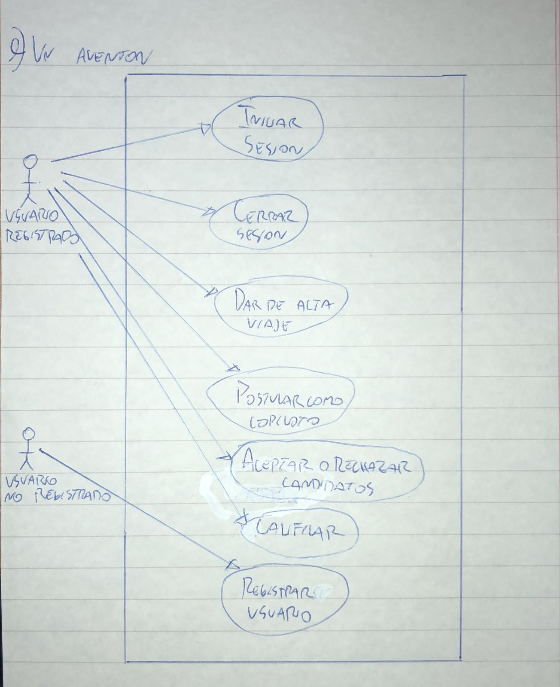

# 9) Un Aventon.
# Diagrama:

# Escenarios:
## Escenario 1:
#### Nombre del caso de uso:
`Iniciar sesion.`
#### Descripcion:
`El caso de uso describe el modo en el que un usuario registrado inicia sesion.`
#### Actores:
`Usuario registrado.`
#### Precondiciones:
`---`
#### Curso normal:
1. (Actor): El usuario selecciona la opcion de iniciar sesion.
2. (Sistema): El sistema solicita nombre de usuario y contraseña.
3. (Actor): El usuario ingresa el nombre de usuario y contraseña.
4. (Sistema): El sistema verifica los datos ingresados.
5. (Sistema): El sistema registra la sesion iniciada y habilita las acciones del usuario.

#### Curso alterno:
Paso alternativo 4: Las credenciales ingresadas son invalidas. Se notifica. Volver al paso 2.
#### Postcondicion:
La sesion ha sido iniciada y las opciones para usuarios registrados aparecen habilitadas.

## Escenario 2:
#### Nombre del caso de uso:
`Cerrar sesion.`
#### Descripcion:
`El caso de uso describe el evento en el que un usuario registrado cierra la sesion.`
#### Actores:
`Usuario registrado.`
#### Precondiciones:
`El usuario debe tener una sesion iniciada.`
#### Curso normal:
1. (Actor): El usuario registrado selecciona la opcion de cerrar sesion.
2. (Sistema): El sistema solicita la confirmacion del usuario.
3. (Actor): El usuario confirma la operacion.
4. (Sistema): El sistema cierra la sesion y deshabilita las acciones del usuario.

#### Curso alterno:
Paso alternativo 3: El usuario cancela la operacion. Fin del CU.
#### Postcondicion:
La sesion ha sido cerrada, las opciones para usuarios registrados son deshabilitadas y se eliminan los datos de sesion.

## Escenario 3:
#### Nombre del caso de uso:
`Dar de alta viaje.`
#### Descripcion:
`El caso de uso describe el evento en el que un usuario da de alta un viaje.`
#### Actores:
`Usuario registrado.`
#### Precondiciones:
`El usuario debe tener una sesion activa.`
#### Curso normal:
1. (Actor): El usuario seleccion la opcion de "Nuevo Viaje".
2. (Sistema): El sistema solicita la fecha y hora del viaje, junto con el automovil a usar.
3. (Actor): El usuario ingresa los datos solicitados.
4. (Sistema): El sistema verifica que el viaje no se superponga con otros ya dados de alta.
5. (Sistema): El sistema verifica que el usuario no adeude calificaciones.
6. (Sistema): El sistema registra el nuevo viaje.

#### Curso alterno:
Paso alternativo 4: El viaje se superpone con otro viaje ya dado de alta. Se notifica. Volver al paso 2.

Paso alternativo 5: El usuario tiene calificaciones pendientes. Se notifica. Fin del caso de uso.

#### Postcondicion:
Se registro el nuevo viaje.

## Escenario 4:
#### Nombre del caso de uso:
`Postular como copiloto.`
#### Descripcion:
`El caso de uso describe como un usuario se postula como copiloto para un viaje.`
#### Actores:
`Usuario registrado.`
#### Precondiciones:
`El usuario debe tener una sesion activa.`
#### Curso normal:
1. (Actor): El usuario selecciona la opcion de "Ver viajes".
2. (Sistema): El sistema muestra los viajes disponibles.
3. (Actor): El usuario selecciona un viaje y luego presiona "Postularme como Copiloto".
4. (Sistema): El sistema registra al usuario como candidato a ser copiloto del viaje seleccionado.

#### Curso alterno:
Paso alternativo 2: No existen viajes disponibles. Se informa. Fin del caso de uso.
#### Postcondicion:
Se registro al usuario como candidato a copiloto del viaje seleccionado.

## Escenario 5:
#### Nombre del caso de uso:
`Aceptar o rechazar candidatos.`
#### Descripcion:
`El caso de uso describe el evento en el que un piloto acepta o rechaza a un candidato a acompañarlo en su viaje.`
#### Actores:
`Usuario registrado.`
#### Precondiciones:
`El usuario debe tener una sesion iniciada.`
#### Curso normal:
1. (Actor): El usuario selecciona la opcion de "Aceptar o Rechazar Candidatos".
2. (Sistema): El sistema solicita que el usuario seleccione uno de sus proximos viajes.
3. (Actor): El usuario selecciona un viaje.
4. (Sistema): El sistema solicita que el usuario seleccione uno de los candidatos, y si lo acepta o lo rechaza.
5. (Actor): El usuario selecciona un candidato y elige si lo acepta o no.
6. (Sistema): El sistema registra la eleccion del usuario.

#### Curso alterno:
Paso alternativo 2: El usuario no tiene viajes proximos. Se informa. Fin del caso de uso.

Paso alternativo 4: El viaje seleccionado no tiene candidatos. Se informa. Fin del caso de uso.
#### Postcondicion:
Se registro la eleccion del usuario sobre el candidato del viaje seleccionado.

## Escenario 6:
#### Nombre del caso de uso:
`Calificar.`
#### Descripcion:
`El caso de uso describe el evento en el que un usuario califica a otro.`
#### Actores:
`Usuario registrado.`
#### Precondiciones:
`El usuario debe tener una sesion iniciada.`
#### Curso normal:
- 1 (Actor): El usuario selecciona la opcion "Calificar".
- 2 (Sistema): El sistema muestra los viajes cuyos participantes estan pendientes de calificacion.
- 3 (Actor): El usuario selecciona un viaje.
- 4 (Sistema): Si en ese viaje el usuario fue el copiloto.
- 4.1 (Sistema): El sistema muestra al piloto.
- 5 (Sistema): Si en ese viaje el usuario fue el piloto
- 5.1 (Sistema): El sistema muestra al los copilotos que no fueron calificados aun.
- 6 (Actor) El usuario selecciona un integrante del viaje y ingresa la calificacion.
- 7 (Sistema) Si la calificacion fue positiva.
- 7.1 (Sistema) Se suma un punto a la calificacion del integrante seleccionado.
- 8 (Sistema) Si la calificacion fue negativa.
- 8.1 (Sistema) Se resta un punto a la calificacion del integrante seleccionado.

#### Curso alterno:
Paso alternativo 2: El usuario no tiene calificaciones pendientes. Se informa. Fin del caso de uso.
#### Postcondicion:
Se registro la calificacion del integrante seleccionado.

## Escenario 7:
#### Nombre del caso de uso:
`Registrar usuario.`
#### Descripcion:
`El caso de uso describe el evento en el que un usuario se registra en el sistema.`
#### Actores:
`Usuario no registrado.`
#### Precondiciones:
`---`
#### Curso normal:
1. (Actor): El usuario selecciona la opcion "Registrar Usuario".
2. (Sistema): El sistema solicita nombre de usuario, contraseña y email.
3. (Actor): La persona ingresa los datos requeridos.
4. (Sistema): El sistema verifica que no exista un usuario con el mismo email.
6. (Sistema): El sistema registra el nuevo usuario.

#### Curso alterno:
Paso alternativo 4: Ya existe un usuario con el mismo email. Se informa. Vuelve al paso 2.
#### Postcondicion:
Se creo una cuenta de usuario nueva.
