## 1
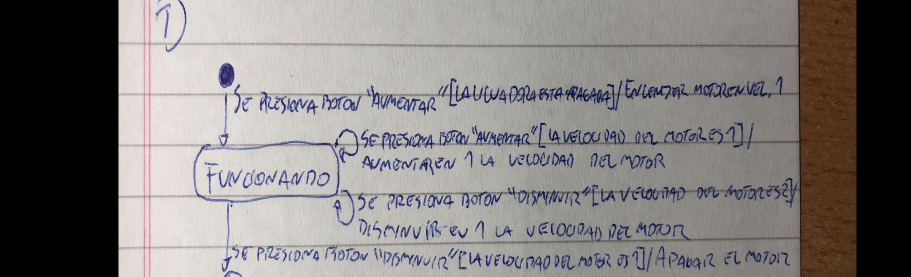
## 2
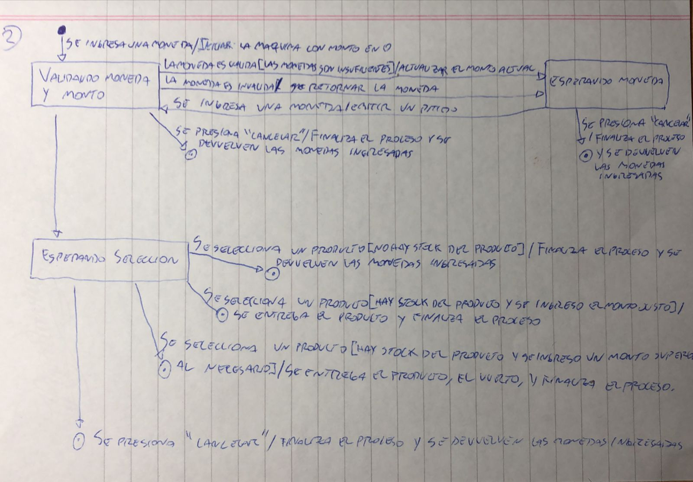
## 3
La diferencia entre los dos diagramas es que en el primero se modela la verificacion del codigo como un estado y en el segundo no.
## 4
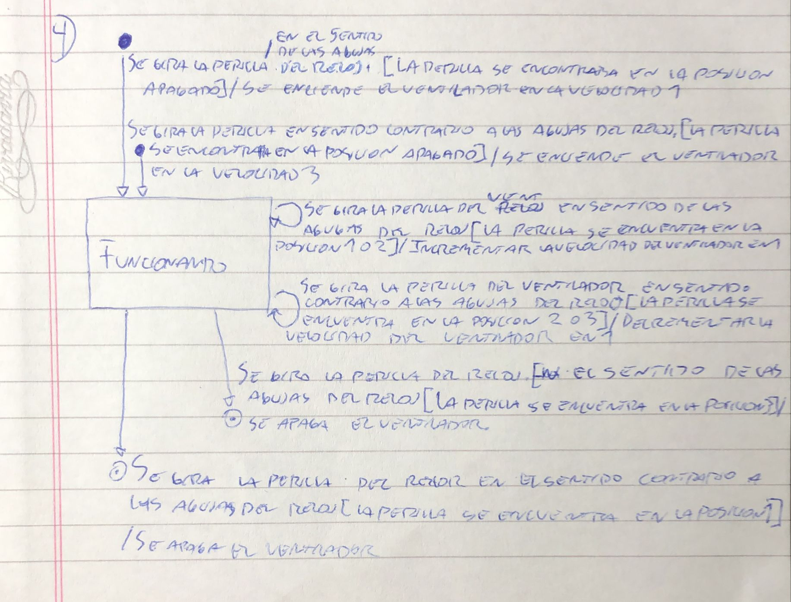
## 5
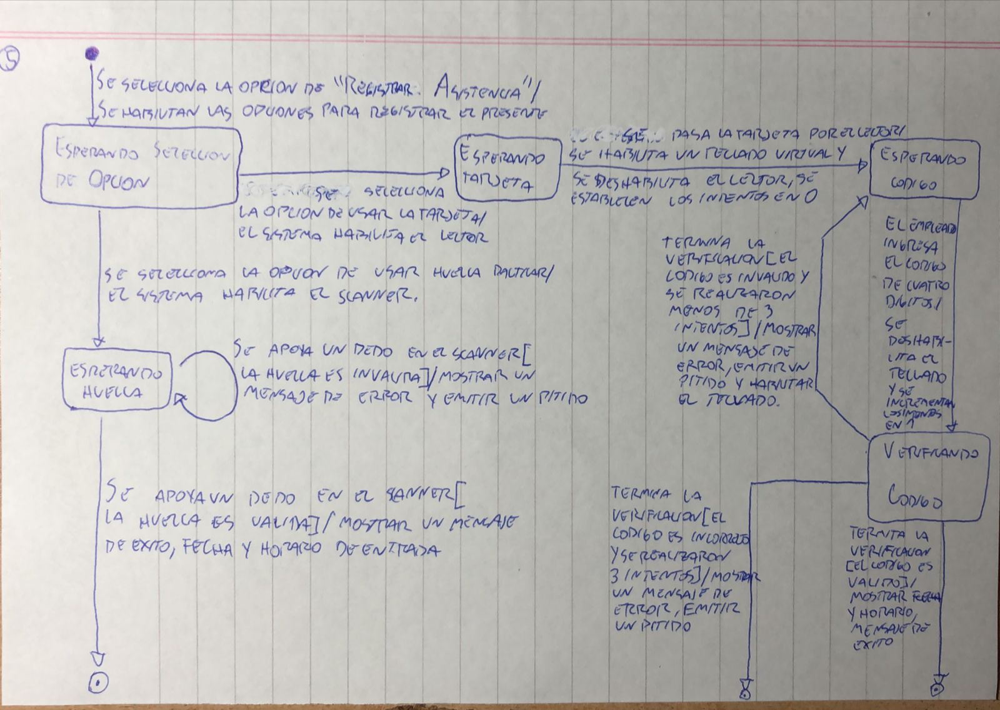
## 6
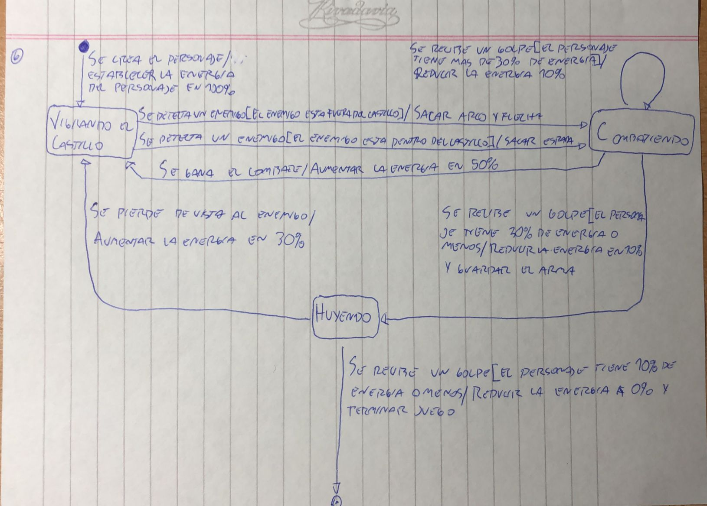
## 7
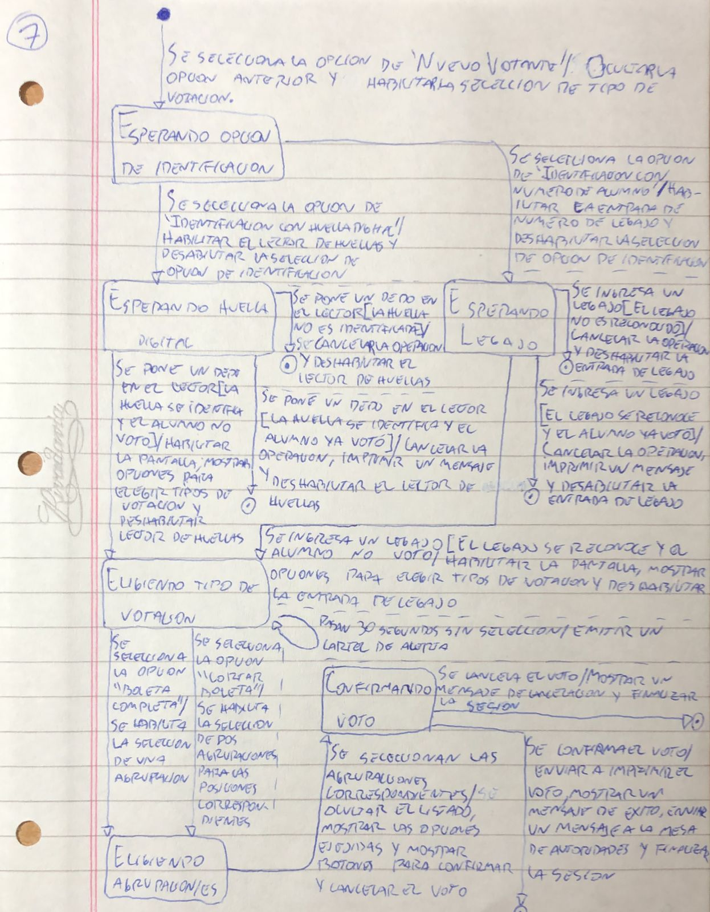
## 8
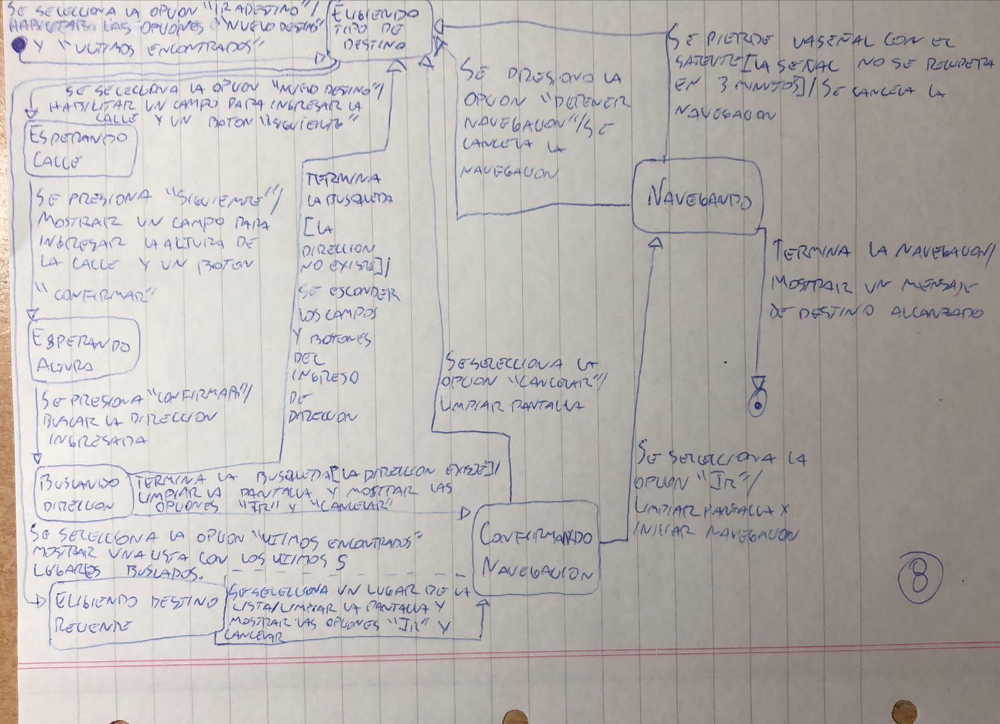
## 9
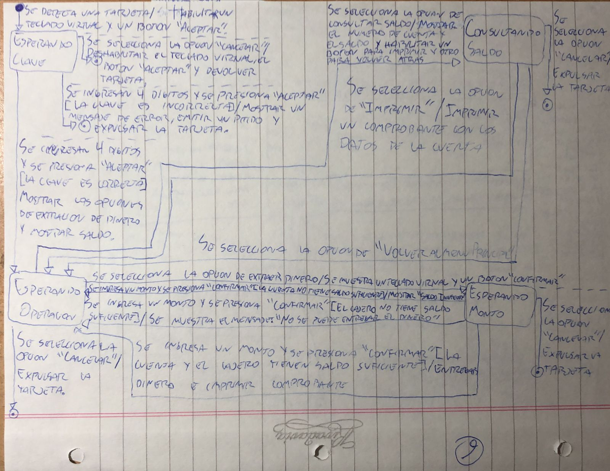
## 10
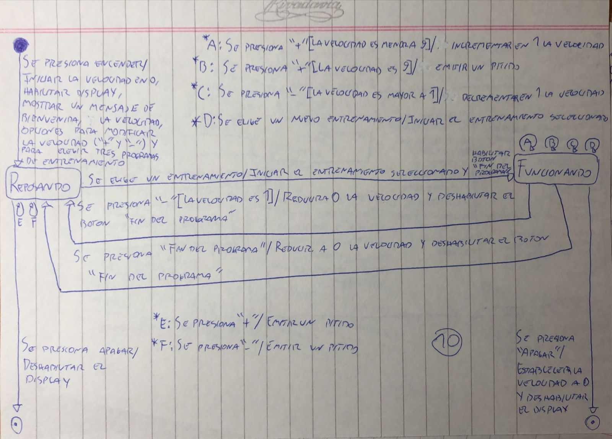
## 11
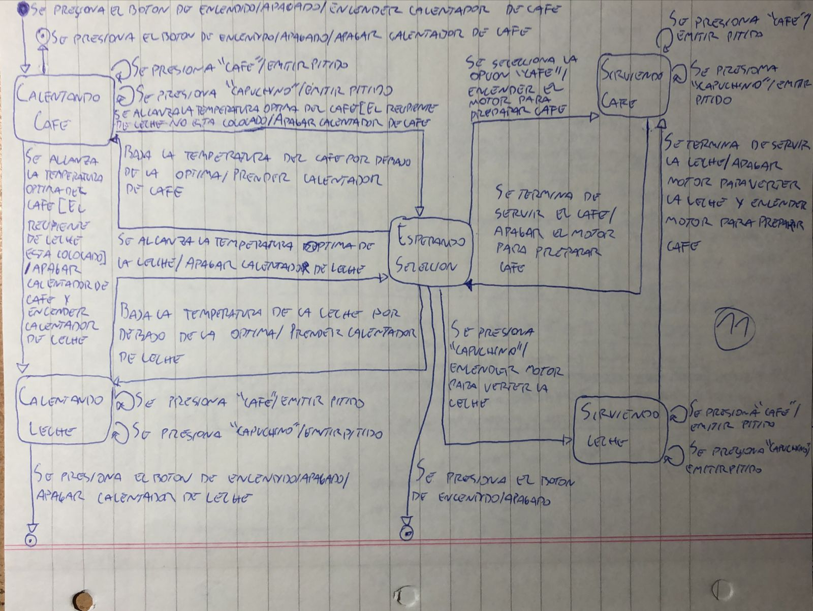
## 12
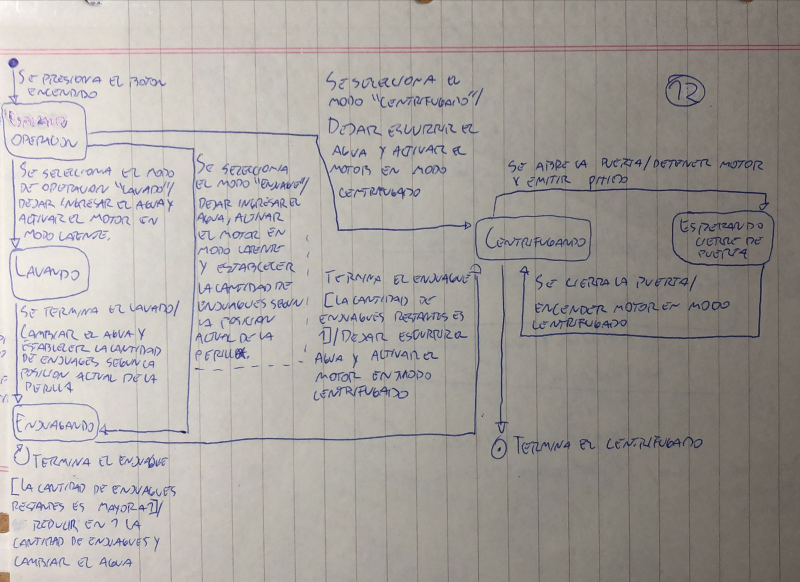
