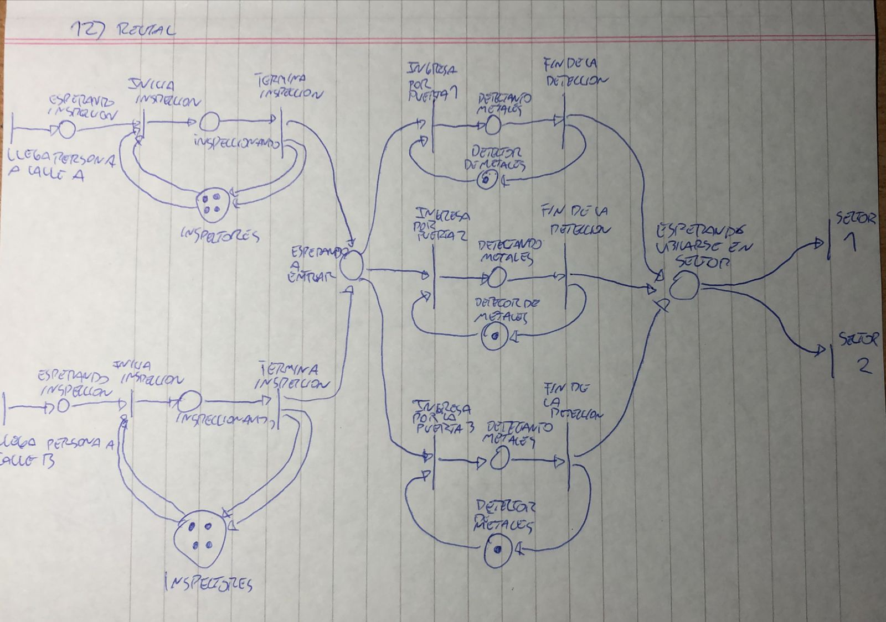

# Parte I: Redes de Petri
### a) Describa qué tipos de problemas se pueden modelar utilizando Redes de Petri.
Las Redes de Petri permiten modelar sistemas dinamicos y concurrentes.
### b) Enumere y explique elementos, vistos en teoría, que se utilizan para modelar las Redes de Petri.
Los elementos que se usan para modelar las redes de petri son:
1. Sitio: Modela un estado o condicion.
2. Transicion: Modela un evento o una accion.
3. Arco: Relaciona un sitio con una transicion. Es unidireccional.
4. Marca: Habilitan o deshabilitan transiciones. Se colocan en los sitios.
### c) Explique que son las marcas o tokens.
Las marcas o tokens son elementos de la Red de Petri que tienen como funcion habilitar o deshabilitar transiciones para controlar la ejecucion de la red. Se colocan de a uno o mas en los sitios.
### d) Explique qué significa una transición que tiene salidas pero no entradas.
Una transicion fuente es una transicion que tiene salidas pero no entradas y sirve para indicar que se pueden generar una cantidad ilimitada de tokens.
### e) Explique qué significa una transición que tiene entradas pero no salidas.
Una transicion final es una transicion que tiene entradas pero no salidas y sirve para eliminar tokens de la red de petri.
# Parte II: Ejercicios
## Ejercicio 1: Fabrica de papas.

## Ejercicio 2: Fabrica de vinos.

## Ejercicio 3: Peluqueria.

## Ejercicio 4: Estacion de servicio.

## Ejercicio 5: Voto Electronico.

## Ejercicio 6: Puente.

## Ejercicio 7: Puesto de trabajo.

## Ejercicio 8: Alfajores.

## Ejercicio 9: Mobiliaria.

## Ejercicio 10: Juego en la Escuela.

## Ejercicio 11: Fabrica de Pastas.

## Ejercicio 12: Recital.

## Ejercicio 13: Aserradero.

## Ejercicio 14: Legalizacion de Documentos.

## Ejercicio 15: VTV:
La solucion correcta es la 2.

En la solucion 1 solo se libera un empleado de evaluacion al terminar la entrega de informes, cuando deberian liberarse 2. En la solucion tres solo se agrega un empleado para en cada puesto de evaluacion, por lo que no puede realizarce ninguna evaluacion.
