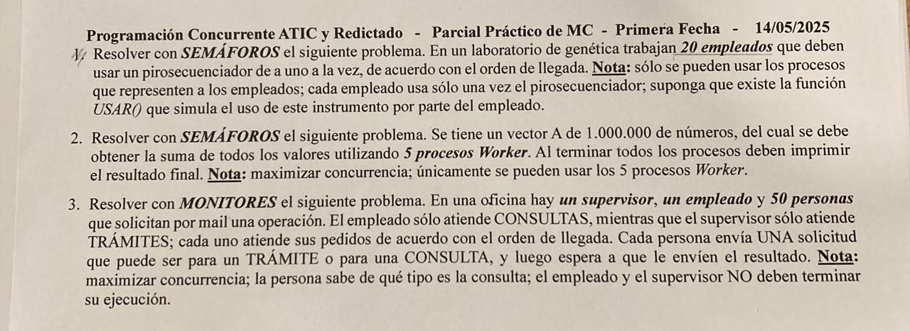

## Parcial MC - Primera Fecha - 14/05/2025


### 1
```
sem emps[20] = {0,0,...,0}; //Para avisar a un empleado que pase
cola turnos;
bool libre = true; //La maquina esta libre o no
sem mutex = 1; //Mutex de la cola

Process Empleado[id: 1..19] {
    P(mutex);
    if (!libre) { //Si alguien esta usando la maquina
        turnos.push(id); //Me encolo
        V(mutex);
        P(emps[id]); //Espero que me avisen
    else {
        libre = false;
        V(mutex);
    }

    USAR();

    P(mutex);
    if (turnos.isEmpty()) { //Si no hay nadie esperando
        libre = true;
    } else { //Si hay alguien esperando
        V(emps[turnos.pop()]); //Le aviso que pase
    }
    V(mutex);
}
```

### 2
```
int sumaTotal = 0;
sem mutex = 1;

int cantFin = 0; //Procesos que terminaron
sem fin = 0; //Para esperar a que todos terminen

Process Worker[id: 0..4] {
    int sumaLocal = 0;
    for int i in (200000*id) .. (200000*(id+1) - 1) {
        sumaLocal+=A[i];
    }
    P(mutex);
    cantFin++;
    sumaTotal += sumaLocal;
    if (cantFin == 5) { //Si soy el ultimo
        V(mutex);
        for int i in 0..3 {
            V(fin); //Les aviso que impriman
        }
        print(sumaTotal); //Imprimo
    } else { //Si no soy el ultimo
        V(mutex);
        P(fin);
        print(sumaTotal); //Imprimo
    }
}
```

### 3
```
Monitor Consulta {
    cond llegada; //Para esperar una consulta
    cond res; //Para esperar el resultado
    cola consultas;
    tipoResultado[] resultados[50];

    Procedure proximo(id: out, consulta: out) { //El empleado pide la proxima consulta
        if (consultas.isEmpty()) { //Si no hay consultas, espero
            await(llegada);
        }
        (id, consulta) = consultas.pop(); //Tomo la proxima consulta
    }

    Procedure entregarResultado(id: in, resultado: in) {
        resultados[id] = resultado; //Guardo los resultados
        signal(res); //Aviso que estan listos los resultados
    }

    Procedure realizar(id: in, consulta: in, resultado: out) { //Una persona realiza una consulta
        consultas.push((id, consulta)); //Me encolo
        signal(llegada); //Aviso que llegue
        await(res); //Espero que este el resultado
        resultado = resultados[id];
    }
}

Monitor Tramite {
    cond llegada; //Para esperar un tramite
    cond res; //Para esperar el resultado
    cola tramites;
    tipoResultado[] resultados[50];

    Procedure proximo(id: out, tramite: out) { //El supervisor pide el proximo tramite
        if (tramite.isEmpty()) { //Si no hay tramites, espero
            await(llegada);
        }
        (id, tramite) = tramites.pop(); //Tomo la proxima tramite
    }

    Procedure entregarResultado(id: in, resultado: in) {
        resultados[id] = resultado; //Guardo los resultados
        signal(res); //Aviso que estan listos los resultados
    }

    Procedure realizar(id: in, tramite: in, resultado: out) { //Una persona realiza un tramite
        tramites.push((id, tramite)); //Me encolo
        signal(llegada); //Aviso que llegue
        await(res); //Espero que este el resultado
        resultado = resultados[id];
    }
}

Process Supervisor[id: 0] {
    tipoTramite tramite;
    int id;
    tipoResultado resultado;
    while (true) {
        Tramite.proximo(id, tramite);
        resultado = ProcesarTramite(tramite);
        Tramite.entregarResultado(id, resultado);
    }
}

Process Empleado[id: 0] {
    tipoConsulta consulta;
    int id;
    tipoResultado resultado;
    while (true) {
        Consulta.proximo(id, consulta);
        resultado = ProcesarConsulta(consulta);
        Consulta.entregarResultado(id, resultado);
    }
}

Process Persona[0..49] {
    tipoResultado resultado;
    if (solicitud.tipo == "tramite") {
        Tramite.realizar(id, solicitud, resultado);
    } else {
        Consulta.realizar(id, solicitud, resultado);
    }
}
```
