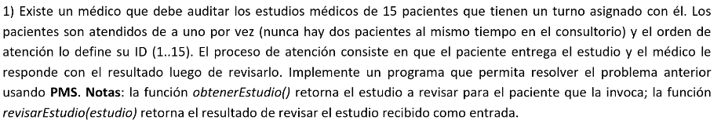
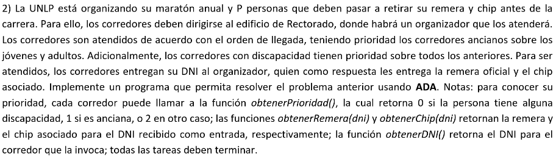

### 1)


```cpp
Process Medico[id: 0] {
    Estudio e;
    Resultado r;

    for i in 1..15 {
        Paciente[i]?estudio(e);
        r = revisarResultado(e);
        Paciente[i]!resultado(r);
    }
}

Process Paciente[id: 1..15] {
    Estudio e = obtenerEstudio();
    Resultado r;

    Medico!estudio(e);
    Medico?resultado(r);
}
```

### 2)

[resolucion](./2.adb)
