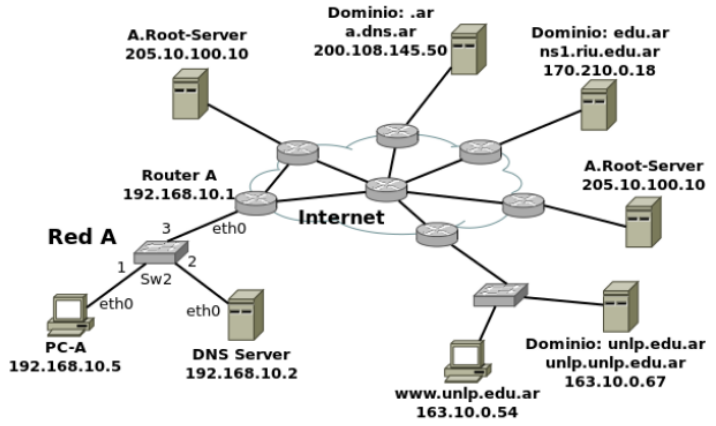

## Práctica 3 - Capa de Aplicación
## DNS (Domain Name Server)

### Introducción
#### 1. Investigue y describa cómo funciona el DNS. ¿Cuál es su objetivo?
El DNS es un sistema distribuido que permite traducir nombres de dominio a direcciones IP. Su funcion principal es traducir los nombres de dominio que son faciles de recordar, a las direcciones IP que las computadoras realmente necesitan lara localizarse.
Funciona de la siguiente manera:
1. El cliente hace una consulta DNS para resolver un nombre.
2. La consulta puede pasar por:
- Servidor DNS Local (Resolver): Revisa si tiene el registro en su cache, caso contrario comienza el proceso de consulta a los servidores DNS superiores.
- Servidor Raiz: El servidor raiz no sabe la IP final de nombres completos (Ej. www.ejemplo.com), pero sabe que servidores manejan los dominios de nivel superor (Ej. .com, .org, etc) y dirige la consulta hacia el servidor TLC apropiado.
- Servidores TLD (Top-Level Domain): Estos servidores gestionan los dominios de nivel superior, como .com, .org, .net, etc. Cuando recibe una consulta indica el servidor de nombres autoritativo que tiene la informacion de zona para ese dominio en particular
- Servidor Autoritativo: Este servidor posee los registros DNS finales. Es el ultimo eslabon de la cadena, cuando es consultado devuelve la direccion IP numerica real del servidor web donde se aloja la pagina. Un servidor autoritativo puede delegar la autoridad de un subdominio a otro servidor.
3. Las respuestas se cachean para acelerar futuras consultas.
#### 2. ¿Qué es un root server? ¿Qué es un generic top-level domain (gtld)?
Root Server: Es el servidor que forma la "cima" del sistema DNS. Son los primeros consultados cuando un nombre no esta en cache. Responden con el TLD adecuado. Hay 13 en el mundo.
gTLD: Son los dominios de nivel superior genericos, como .com, .org, .net, .edu, .gov, .etc. Los servidores gTLD responden con la direccion del servidor autoritativo del dominio solicitado.
#### 3. ¿Qué es una respuesta del tipo autoritativa?
Es una respuesta DNS dada por el servidor que realmente tiene la informacion del dominio.
#### 4. ¿Qué diferencia una consulta DNS recursiva de una iterativa?
Recursiva: El servidor consultado debe obtener la respuesta final. Si no la sabe, consulta el mismo a otros servidores (root, TLD, autoritativo) hasta encontrar la IP y devolverla. El cliente delega todo el trabajo.

Iterativa: Cada servidor responde con la mejor informacion que tiene, es decir, la respuesta final o la direccion de otro servidor DNS que probablemente pueda responder. El cliente es quien debe continuar realizando las consultas sucesivas.
#### 5. ¿Qué es el resolver?
Es responsable de iniciar las consultas que finalmente llevan a la resolucion completa del nombre consultado. Realiza los siguientes pasos:
- Recibe la consulta de un dispositivo.
- Revisa si tiene la direccion IP para ese nombre de dominio almacenada localmente en la cache.
- Si no esta en la cache, comienza a realizar todas las consultas necesarias hasta encontrar la respuesta definitiva.
- Almacena en cache la respuesta y la devuelve.

Generalmente es provisto por el ISP, pero tambien hay publicos como Google DNS o Clouflare. Tambien existen los resolvers locales o stub resolvers que generalmente hacen una consultas recursivas al resolver del ISP.
#### 6. Describa para qué se utilizan los siguientes tipos de registros de DNS:
1. `A` (Address Record): Vincula un nombre de dominio con una direccion IPv4
2. `MX` (Mail Exchange Record): Especifica que servidores estan autorizados a recibir correo para el dominio.
3. `PTR` (Pointer Record): Permite resolver una IP hacia un nombre de dominio. Usados en DNS inverso.
4. `AAAA` (IPv6 Address Record): Equivalente al registro A, pero con direcciones IPv6.
5. `SRV` (Service Record): Describen la ubicacion de un servicio especifico dentro de un dominio.
6. `NS` (Name Server Record): Indican los servidores autoritativos para una zona.
7. `CNAME` (Canonical Name Record): Crean un alias de un nombre, hacia otro nombre.
8. `SOA` (Start Of Authority): Define el inicio de autoridad de una zona DNS.
9. `TXT` (Text Record): Permiten asociar texto arbitratio a un dominio.
#### 7. En Internet, un dominio suele tener más de un servidor DNS, ¿por qué cree que esto es así?
Por redundancia y disponibilidad:
- Si un servidor falla, otro puede responder.
- Mejora tolerancia a fallos.
- Mejora rendimiento por cercania geografica.
#### 8. Cuando un dominio cuenta con más de un servidor, uno de ellos es el primario (o maestro) y todos los demás son secundarios (o esclavos). ¿Cuál es la razón de que sea así?
La razon principal de que un dominio cuente con un servidor primario y uno o mas secundarios es garantizar la redundancia, disponibilidad y coherencia en la informacion de la zona DNS.
#### 9. Explique brevemente en qué consiste el mecanismo de transferencia de zona y cuál es su finalidad.
La transferencia de zona es el mecanismo mediante el cual los servidores DNS secundatios solicitan al primatio una copia total o incremental de la zona para asi sincronizar sus registras y mantenerse actualizados. 

Su finalidad es garantizar que todos los servidores autoritativos de un dominio tengan identica informacion, manteniendo redundancia y coherencia.
#### 10. Imagine que usted es el administrador del dominio de DNS de la UNLP (unlp.edu.ar). A su vez, cada facultad de la UNLP cuenta con un administrador que gestiona su propio dominio (por ejemplo, en el caso de la Facultad de Informática se trata de info.unlp.edu.ar). Suponga que se crea una nueva facultad, Facultad de Redes, cuyo dominio será redes.unlp.edu.ar, y el administrador le indica que quiere poder manejar su propio dominio. ¿Qué debe hacer usted para que el administrador de la Facultad de Redes pueda gestionar el dominio de forma independiente? (Pista: investigue en qué consiste la delegación de dominios). Indicar qué registros de DNS se deberían agregar.
Para que la Facultad de Redes administre `redes.unlp.edu.ar` de forma independiente, el dominio padre `unlp.edu.ar` debe delegar esa subzona. Esto se hace agregando en la zona padre registros `NS` que apunten a los servidores autoritativos que operara la facultad, y, si esos estan dentro de la misma subzona, rambien se agregan los glue records.

Luego, la Facultad de Redes debe crear su propia zona `redes.unlp.edu.ar` con un `SOA`, los mismos `NS`, y los registros necesarios.
#### 11. Responda y justifique los siguientes ejercicios.
##### a. En la VM, utilice el comando dig para obtener la dirección IP del host www.redes.unlp.edu.ar y responda:
###### i. ¿La solicitud fue recursiva? ¿Y la respuesta? ¿Cómo lo sabe?
Si, la solicitud fue recursiva ya que en las respuesta se encontraban los flags `ra` y `rd`.
Otros flags:
- `QR` (Query/Response): 1 si el mensaje es de tipo response, 0 si es de tipo request.
- `AA` (Authoritative Answer): Indica si el server es autoritativo para el recurso consultado.
- `TR` (Truncation): Indica si el mensaje fue truncado.
- `RD` (Recursion Desired): Indica si el cliente pidio una resolucion recursiva.
- `RA` (Recursion Available): Indica si el servidor puede realizar consultar recursivas.
###### ii. ¿Puede indicar si se trata de una respuesta autoritativa? ¿Qué significa que lo sea?
Si, es una respuesta autoritativa ya que se encuentra presente el flag `aa`,

Una respuesta es autoritativa cuando proviene de un servidor que es autoridad para la zona correspondiente al nombre consultado.
###### iii. ¿Cuál es la dirección IP del resolver utilizado? ¿Cómo lo sabe?
La direccion IP es `172.28.0.29`.

Podemos saber esto ya que el comando dig lo indico en la siguiente linea:
```
;; SERVER: 172.28.0.29#53(172.28.0.29)
```
##### b. ¿Cuáles son los servidores de correo del dominio redes.unlp.edu.ar? ¿Por qué hay más de uno y qué significan los números que aparecen entre MX y el nombre? Si se quiere enviar un correo destinado a redes.unlp.edu.ar, ¿a qué servidor se le entregará? ¿En qué situación se le entregará al otro?
```
;; ANSWER SECTION:
redes.unlp.edu.ar.  86400  IN  MX  10 mail2.redes.unlp.edu.ar.
redes.unlp.edu.ar.  86400  IN  MX  5 mail.redes.unlp.edu.ar.
```
Los servidores de correo del dominio `redes.unlp.edu.ar` son:
- `mail.redes.unlp.edu.ar`
- `mail2.reedes.unlp.edu.ar`

Un dominio puede tener multiples `MX` para proporcionar redundancia, tolerancia a fallos y distribucion de carga.

Los numeros que aparecen entre `MX` y el nombre (5 y 10) corresponden a la prioridad. Cuanto menos es el numero, mas alta es la prioridad.

Si se quiere enviar un correo, este se entregara inicialmente a `mail.redes.unlp.edu.ar` (prioridad 5). Si este no responde o indica que temporalmente no puede aceptar correo entonces se usara `mail2.redes.unlp.edu.ar` (prioridad 10).
##### c. ¿Cuáles son los servidores de DNS del dominio redes.unlp.edu.ar?
```
dig NS redes.unlp.edu.ar
...
;; ANSWER SECTION:
redes.unlp.edu.ar.  86400  IN  NS  ns-sv-b.redes.unlp.edu.ar.
redes.unlp.edu.ar.  86400  IN  NS  ns-sv-a.redes.unlp.edu.ar.
```
Los servidores DNS autoritativos del dominio son:
- `ns-sv-a.redes.unlp.edu.ar`
- `ns-sv-b.redes.unlp.edu.ar`

##### d. Repita la consulta anterior cuatro veces más. ¿Qué observa? ¿Puede explicar a qué se debe?
Se puede observar que cambia el orden de los registros NS, esto puede deberse a una estrategia de balanceo, o a que el estandar no obliga a mantener un orden fijo.
##### e. Observe la información que obtuvo al consultar por los servidores de DNS del dominio. En base a la salida, ¿es posible indicar cuál de ellos es el primario?
No, no es posible.
##### f. Consulte por el registro SOA del dominio y responda.
```
dig SOA redes.unlp.edu.ar
---
;; ANSWER SECTION:
redes.unlp.edu.ar.  86400  IN  SOA  ns-sv-b.redes.unlp.edu.ar. root.redes.unlp.edu.ar. 2020031700 604800 86400 2419200 86400
```
###### i. ¿Puede ahora determinar cuál es el servidor de DNS primario?
Si, el servidor DNS primario es el primer campo del registro SOA: `ns-sv-b.redes.unlp.edu.ar`.
###### ii. ¿Cuál es el número de serie, qué convención sigue y en qué casos es importante actualizarlo?
El numero de serie es `2020031700`. Sigue el formato `AAAAMMDDnn` donde:
- `AAAA`: Año.
- `MM`: Mes.
- `DD`: Dia.
- `nn`: Contador de cambios dentro del dia.

Es importante actualizarlo cada vez que se modifica la zona, ya que los servidores secundarios usan este valor para decidir si seben solicutar una transferencia de zona.
###### iii. ¿Qué valor tiene el segundo campo del registro? Investigue para qué se usa y cómo se interpreta el valor.
El segundo campo del registro (`root.redes.unlp.edu.ar`) es el campo RNAME, que representa el correo electronico del administrador de la zona, con el primer punto actuando como "@".
###### iv. ¿Qué valor tiene el TTL de caché negativa y qué significa?
El ultimo campo del SOA (`86400`) es el `Negative Cache TTL`, y indica cuanto tiempo los resolvers pueden cachear respuestas negativas. Durante ese periodo, si alguien vuelve a consultar por un nombre inexistente en la zona, el resolver no volvera a consultar al servidor autoritativo, devolvera la respuesta negativa directamente desde cache.
##### g. Indique qué valor tiene el registro TXT para el nombre saludo.redes.unlp.edu.ar. Investigue para qué es usado este registro.
```
dig TXT saludo.redes.unlp.edu.ar
...
;; ANSWER SECTION:
saludo.redes.unlp.edu.ar. 86400  IN  TXT  "HOLA"
```

Los registros TXT permiten asociar informacion arbitratia en forma de texto a un nombre de dominio.
##### h. Utilizando dig, solicite la transferencia de zona de redes.unlp.edu.ar, analice la salida y responda.
```
$ dig SOA redes.unlp.edu.ar
...
;; ANSWER SECTION:
redes.unlp.edu.ar.  86400  IN  SOA  ns-sv-b.redes.unlp.edu.ar. root.redes.unlp.edu.ar. 2020031700 604800 86400 2419200 86400
$ dig @ns-sv-b.redes.unlp.edu.ar redes.unlp.edu.ar AXFR
...
```
###### i. ¿Qué significan los números que aparecen antes de la palabra IN? ¿Cuál es su finalidad?
Estos numeros corresponden al TTL (Time To Live), que indica cuanto tiempo un resolver puede mantener en cache ese registro antes de tener que renovarlo.
###### ii. ¿Cuántos registros NS observa? Compare la respuesta con los servidores de DNS del dominio redes.unlp.edu.ar que dio anteriormente. ¿Puede explicar a qué se debe la diferencia y qué significa?
```
redes.unlp.edu.ar.  86400  IN  NS  ns-sv-a.redes.unlp.edu.ar.
redes.unlp.edu.ar.  86400  IN  NS  ns-sv-b.redes.unlp.edu.ar.
...
practica.redes.unlp.edu.ar. 86400 IN  NS  ns1.practica.redes.unlp.edu.ar.
practica.redes.unlp.edu.ar. 86400 IN  NS  ns2.practica.redes.unlp.edu.ar.
```
La transferencia de zona AXFR entrega todos los registros, incluyendo registros de subdominios delegados o administrados dentro de la zona.
##### i. Consulte por el registro A de www.redes.unlp.edu.ar y luego por el registro A de www.practica.redes.unlp.edu.ar. Observe los TTL de ambos. Repita la operación y compare el valor de los TTL de cada uno respecto de la respuesta anterior. ¿Puede explicar qué está ocurriendo? (Pista: observar los flags será de ayuda).
En las consultas para la primer URL la respuesta es autoritativa (flag aa), por lo que el TTL se refresca en cada respuesta (300s). Para la segunda URL la respuesta no es autoritativa por lo que el TTL de la primera respuesta es 60s, y se reduce a medida que pasa el tiempo.
##### j. Consulte por el registro A de www.practica2.redes.unlp.edu.ar. ¿Obtuvo alguna respuesta? Investigue sobre los códigos de respuesta de DNS. ¿Para qué son utilizados los mensajes NXDOMAIN y NOERROR?
```
dig A www.practica2.redes.unlp.edu.ar

; <<>> DiG 9.16.27-Debian <<>> A www.practica2.redes.unlp.edu.ar
;; global options: +cmd
;; Got answer:
;; ->>HEADER<<- opcode: QUERY, status: NXDOMAIN, id: 24227
;; flags: qr aa rd ra; QUERY: 1, ANSWER: 0, AUTHORITY: 1, ADDITIONAL: 1
...
```
- `NXDOMAIN`: No existe ningun dominio con ese nombre. Lo emite un servidor autoritativo cuando ha verificado en la zona que no hay tal entrada.
- `NOERROR`: La consulta se proceso correctamente. Si el nombre existe pero no tiene registros del tipo solicitado entonces no se acompaña del apartado `ANSWER`.
#### 12. Investigue los comandos nslookup y host. ¿Para qué sirven? Intente con ambos comandos obtener:
- Dirección IP de www.redes.unlp.edu.ar.
- Servidores de correo del dominio redes.unlp.edu.ar.
- Servidores de DNS del dominio redes.unlp.edu.ar.

`nslookup` (name server lookup): Es una herramienta interactiva que permite enviar consultas DNS a un resolver o servidor especifico.

`host`: Es una herramienta mas simple y directa. Sirve para realizar consultas DNS puntuales y mostrar la respuesta en formato breve y legible.

#### Dirección IP de www.redes.unlp.edu.ar.
```
$ nslookup www.redes.unlp.edu.ar
Server:    172.28.0.29
Address:  172.28.0.29#53

Name:  www.redes.unlp.edu.ar
Address: 172.28.0.50
```
```
$ host www.redes.unlp.edu.ar
www.redes.unlp.edu.ar has address 172.28.0.50

```
#### Servidores de correo del dominio redes.unlp.edu.ar.
```
$ nslookup -query=MX redes.unlp.edu.ar
Server:    172.28.0.29
Address:  172.28.0.29#53

redes.unlp.edu.ar  mail exchanger = 5 mail.redes.unlp.edu.ar.
redes.unlp.edu.ar  mail exchanger = 10 mail2.redes.unlp.edu.ar.
```
```
$ host -t MX redes.unlp.edu.ar
redes.unlp.edu.ar mail is handled by 10 mail2.redes.unlp.edu.ar.
redes.unlp.edu.ar mail is handled by 5 mail.redes.unlp.edu.ar.
```

#### Servidores de DNS del dominio redes.unlp.edu.ar.
```
$ nslookup -query=NS redes.unlp.edu.ar
Server:    172.28.0.29
Address:  172.28.0.29#53

redes.unlp.edu.ar  nameserver = ns-sv-a.redes.unlp.edu.ar.
redes.unlp.edu.ar  nameserver = ns-sv-b.redes.unlp.edu.ar.
```
```
$ host -t NS redes.unlp.edu.ar
redes.unlp.edu.ar name server ns-sv-b.redes.unlp.edu.ar.
redes.unlp.edu.ar name server ns-sv-a.redes.unlp.edu.ar.
```
#### 13. ¿Qué función cumple en Linux/Unix el archivo /etc/hosts o en Windows el archivo \WINDOWS\system32\drivers\etc\hosts?
El archivo `hosts` en ambos sistemas operativos permite mapear manualmente nombres de dominio a direcciones IP. Cuando una aplicacion realiza una consulta de nombre, el sistema primero revisa este archivo y solo si no encuentra el nombre, continua con la resolucion por DNS.

#### 14. Abra el programa Wireshark para comenzar a capturar el tráfico de red en la interfaz con IP 172.28.0.1. Una vez abierto realice una consulta DNS con el comando dig para averiguar el registro MX de redes.unlp.edu.ar y luego, otra para averiguar los registros NS correspondientes al dominio redes.unlp.edu.ar. Analice la información proporcionada por dig y compárelo con la captura.
En ambos casos la informacion provista por dig se condice con la informacion vista en la captura de wireshark.

#### 15. Dada la siguiente situación: “Una PC en una red determinada, con acceso a Internet, utiliza los servicios de DNS de un servidor de la red”. Analice:
##### a. ¿Qué tipo de consultas (iterativas o recursivas) realiza la PC a su servidor de DNS?
La PC realiza consultas recursivas a su servidor DNS local.
##### b. ¿Qué tipo de consultas (iterativas o recursivas) realiza el servidor de DNS para resolver requerimientos de usuario como el anterior? ¿A quién le realiza estas consultas?
El servidor DNS local realiza consultas iterativas hacia la jerarquia DNS:
- Root server
- TLD
- Autoritativo

#### 16. Relacione DNS con HTTP. ¿Se puede navegar si no hay servicio de DNS?
DNS y HTTP estan estrechamente relacionados ya que:
- HTTP funciona sobre TCP/IP, y para iniciar una nueva conexion se requiere de la direccion IP del servidor.
- Para los usuarios es mas sencillo manipular nombres de dominio que direcciones IP.
- DNS es el sistema que traduce esos nombres a direcciones IP.

En principio no se puede navegar sin servicio DNS, ya que los nombres de dominio deben resolverse a direcciones IP. Sin embargo, si se conocen las direcciones IP de los sitios a visitar, es posible acceder directamente a ellos, aunque los enlaces dentro de esas páginas dejarán de funcionar porque requieren nuevas resoluciones DNS.

Además, si se conoce la dirección IP de un servidor DoH (DNS over HTTPS), seria posible realizar consultas DNS a través de ese servidor sin depender del DNS tradicional, permitiendo así la navegación normal.

#### 17. Observar el siguiente gráfico y contestar:

##### a. Si la PC-A, que usa como servidor de DNS a "DNS Server", desea obtener la IP de www.unlp.edu.ar, cuáles serían, y en qué orden, los pasos que se ejecutarán para obtener la respuesta.
1. PC-A -> DNS Server (192.168.10.2): PC envia una consulta `recursiva` pidiendo la direccion A de `ww.unlp.edu.ar`.
2. DNS Server revisa su cache, si encuentra un registro valido responde directamente.
3. DNS Server -> A.Root-Server (205.10.100.10): El resolver consulta el root server, este no conoce la IP final, asi que responde con un referral apuntando al servidor TLD para `.ar`.
4. DNS Server -> Dominio: .ar (200.108.145.50): Responde con una delegacion a `edu.ar`.
5. DNS Server -> Dominio: .edu.ar (170.210.0.18): Responde con la delegacion a `unlp.edu.ar`.
6. DNS Server -> Dominio: unlp.edu.ar (163.10.0.67): Repuesta final `www.unlp.edul.ar A 163.10.0.54`.
7. DNS Server almacena la respuesta en su cache.
8. DNS Server -> PC-A: El resolver entrela la respuesta definitiva: `163.10.0.54`.
##### b. ¿Dónde es recursiva la consulta? ¿Y dónde iterativa?
La consulta es recursiva de PC-A a su resolver (DNS Server) e iterativa entre el resolver y los demas servidores DNS.

#### 18. ¿A quién debería consultar para que la respuesta sobre www.google.com sea autoritativa?
Para obtener una respuesta autoritativa la consulta debe realizarse directamente a un servidor autoritativo del dominio `www.google.com`.

Obtenemos el nombre del servidor:
```
$ dig NS www.google.com
; <<>> DiG 9.20.15 <<>> NS www.google.com
...
;; ->>HEADER<<- opcode: QUERY, status: NOERROR, id: 27872
;; flags: qr rd ra; QUERY: 1, ANSWER: 0, AUTHORITY: 1, ADDITIONAL: 1
;; AUTHORITY SECTION:
google.com.    18  IN  SOA  ns1.google.com. dns-admin.google.com. 836591759 900 900 1800 60`
```
Como `www.google.com` no posee registros NS, no retorna una seccion ANSWER, en cambio retorna el SOA de la zona `google.com`.

Haciendo la consulta por `www.google.com` al servidor autoritativo para `google.com` recibimos una respuesta autoritativa:
```
dig @ns1.google.com www.google.com
...
;; flags: qr aa rd; QUERY: 1, ANSWER: 1, AUTHORITY: 0, ADDITIONAL: 1
;; WARNING: recursion requested but not available
...
;; ANSWER SECTION:
www.google.com.    300  IN  A  142.251.128.100
```
#### 19. ¿Qué sucede si al servidor elegido en el paso anterior se lo consulta por www.info.unlp.edu.ar? ¿Y si la consulta es al servidor 8.8.8.8?
Si se consulta al servidor anterior, este la rechaza:
```
$ dig @ns1.google.com www.info.unlp.edu.ar

; <<>> DiG 9.20.15 <<>> @ns1.google.com www.info.unlp.edu.ar
; (2 servers found)
;; global options: +cmd
;; Got answer:
;; ->>HEADER<<- opcode: QUERY, status: REFUSED, id: 42875
;; flags: qr rd; QUERY: 1, ANSWER: 0, AUTHORITY: 0, ADDITIONAL: 1
;; WARNING: recursion requested but not available
```

Si se consulta a `8.8.8.8`, este resuelve el nombre de manera iterativa:
```
$ dig @8.8.8.8 www.info.unlp.edu.ar
...
;; ->>HEADER<<- opcode: QUERY, status: NOERROR, id: 60266
;; flags: qr rd ra; QUERY: 1, ANSWER: 1, AUTHORITY: 0, ADDITIONAL: 1
...
;; ANSWER SECTION:
www.info.unlp.edu.ar.  300  IN  A  163.10.5.71
```

#### Ejercicio de parcial
#### 20. En base a la siguiente salida de dig, conteste las consignas. Justifique en todos los casos.
```
;; flags: qr rd ra; QUERY: 1, ANSWER: 2, AUTHORITY: 4, ADDITIONAL: 4

;; QUESTION SECTION:
;ejemplo.com. IN __

;; ANSWER SECTION:
ejemplo.com. 1634 IN __ 10 srv01.ejemplo.com. (1)
ejemplo.com. 1634 IN __ 5 srv00.ejemplo.com. (2)

;; AUTHORITY SECTION:
ejemplo.com. 92354 IN __ ss00.ejemplo.com.
ejemplo.com. 92354 IN __ ss02.ejemplo.com.
ejemplo.com. 92354 IN __ ss01.ejemplo.com.
ejemplo.com. 92354 IN __ ss03.ejemplo.com.

;; ADDITIONAL SECTION:
srv01.ejemplo.com. 272 IN __ 64.233.186.26
srv01.ejemplo.com. 240 IN __ 2800:3f0:4003:c00::1a
srv00.ejemplo.com. 272 IN __ 74.125.133.26
srv00.ejemplo.com. 240 IN __ 2a00:1450:400c:c07::1b
```
##### a. Complete las líneas donde aparece __ con el registro correcto.
- `MX`: La ANSWER SECTION contiene `MX`, entonces la consulta fue por registros `MX`.
<br />
<br />
- `MX`: La sintaxis `MX` \<prioridad> \<mail-server> es unica de `MX`.
- `MX`
<br />
<br />
- `NS`: La AUTHORITY SECTION siempre contiene los servidores `NS` que controlan la zona consultada.
- `NS`
- `NS`
- `NS`
<br />
<br />
- `A`: La presencia de una direccion IPv4 solo es valida para registros `A`.
- `AAAA`: La presencia de una direccion IPv6 solo es valida para registros `AAAA`.
- `A`
- `AAAA`
##### b. ¿Es una respuesta autoritativa? En caso de no serlo, ¿a qué servidor le preguntaría para obtener una respuesta autoritativa?
No, no es autoritativa ya que en los flags no aparece `aa`. Para obtener una, consultaria a uno de los servidores listados en la seccion AUTHORITY, por ejemplo `ss00.ejemplo.com`.
##### c. ¿La consulta fue recursiva? ¿Y la respuesta?
La consulta fue recursiva ya que se encuentra la flag `rd` (recursion desired), y la respuesta tambien, ya que se encuentra la flag `ra` (recursion available).
##### d. ¿Qué representan los valores 10 y 5 en las líneas (1) y (2).
Son los valores de prioridad de los registros MX, un menor numero implica una mayor prioridad. Al entregar correo SMTP se deben usar primero los nombres con mayor prioridad.
