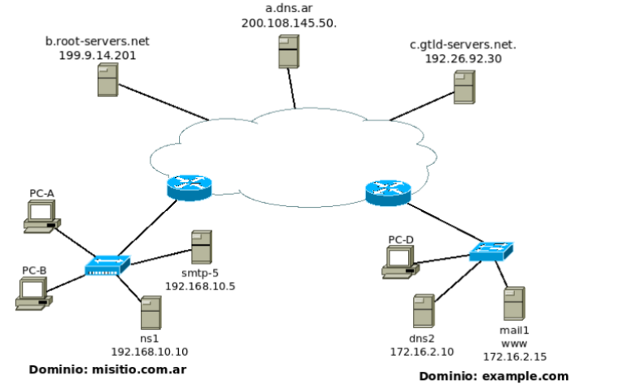

## Práctica 4 - Capa de Aplicación
## Correo Electrónico

#### 1. ¿Qué protocolos se utilizan para el envío de mails entre el cliente y su servidor de correo? ¿Y entre servidores de correo?
En ambos casos el protocolo usado es SMTP (Simple Mail Transfer Protocol).
#### 2. ¿Qué protocolos se utilizan para la recepción de mails? Enumere y explique características y diferencias entre las alternativas posibles.
`POP3`:
- Protocolo simple basado en texto.
- El cliente se conecta, descarga los mensajes y, por defecto, los borra del servidor.
- No mantiene sincronizacion, lo que se hace en un cliente no se refreja en otros.

`IMAP`:
- Mucho mas completo que `POP3`.
- Los mensajes permanecen en el servidor.
- Mantiene carpetas, estados de lectura, indicadores, etc.
- Es el protocolo moderno preferido.

#### 3. Utilizando la VM y teniendo en cuenta los siguientes datos, abra el cliente de correo (Thunderbird) y configure dos cuentas de correo.

##### a. Verificar el correcto funcionamiento enviando un email desde el cliente de una cuenta a la otra y luego desde la otra responder el mail hacia la primera.
`-`

##### b. Análisis del protocolo SMTP
###### i. Utilizando Wireshark, capture el tráfico de red contra el servidor de correo mientras desde la cuenta alumnopop@redes.unlp.edu.ar envía un correo a alumnoimap@redes.unlp.edu.ar
```
220 mail.redes.unlp.edu.ar ESMTP Postfix (Lihuen-4.01/GNU)
EHLO [172.28.0.1]
250-mail.redes.unlp.edu.ar
250-PIPELINING
250-SIZE 10240000
250-VRFY
250-ETRN
250-STARTTLS
250-ENHANCEDSTATUSCODES
250-8BITMIME
250-DSN
250 CHUNKING
MAIL FROM:<alumnopop@redes.unlp.edu.ar> BODY=8BITMIME SIZE=434
250 2.1.0 Ok
RCPT TO:<alumnoimap@redes.unlp.edu.ar>
250 2.1.5 Ok
DATA
354 End data with <CR><LF>.<CR><LF>
Message-ID: <decc5f93-323c-eefc-08ce-5dfdd3d1e63e@redes.unlp.edu.ar>
Date: Wed, 26 Nov 2025 16:53:21 -0300
MIME-Version: 1.0
User-Agent: Mozilla/5.0 (X11; Linux x86_64; rv:91.0) Gecko/20100101
 Thunderbird/91.12.0
Content-Language: en-US
To: alumnoimap@redes.unlp.edu.ar
From: alumnopop <alumnopop@redes.unlp.edu.ar>
Subject: test2
Content-Type: text/plain; charset=UTF-8; format=flowed
Content-Transfer-Encoding: 7bit


.
250 2.0.0 Ok: queued as 3B12E600D8
QUIT
221 2.0.0 Bye
```
###### ii. Utilice el filtro SMTP para observar los paquetes del protocolo SMTP en la captura generada y analice el intercambio de dicho protocolo entre el cliente y el servidor para observar los distintos comandos utilizados y su correspondiente respuesta. Ayuda: filtre por protocolo SMTP y sobre alguna de las líneas del intercambio haga click derecho y seleccione Follow TCP Stream. . .
1. `220`: El servidor envía el banner inicial anunciando que está listo para recibir comandos (ESMTP Postfix).

2. `EHLO`: El cliente se identifica y solicita capacidades extendidas.

3. `250-...`: El servidor responde con la lista de extensiones soportadas (PIPELINING, SIZE, VRFY, STARTTLS, 8BITMIME, etc.).

4. `MAIL FROM`: El cliente indica el remitente del mensaje.

5. `250 2.1.0 Ok`: El servidor acepta el remitente.

6. `RCPT TO`: El cliente indica el destinatario (alumnoimap@redes.unlp.edu.ar).

7. `250 2.1.5 Ok`: El servidor acepta el destinatario.

8. `DATA`: El cliente solicita comenzar a enviar el contenido del mensaje.

9. `354`: El servidor indica que puede comenzar la transferencia del cuerpo del mail.

10. `(cuerpo del mensaje + encabezados MIME)`: El cliente envía todo el mensaje.

11. `<CR><LF>.<CR><LF>`: El cliente finaliza el envío del mensaje.

12. `250 2.0.0 Ok: queued as ...`: El servidor confirma que el mensaje fue recibido y puesto en cola.

13. `QUIT`: El cliente finaliza la sesión.

14. `221 2.0.0 Bye`: El servidor cierra la conexión.
##### c. Usando el cliente de correo Thunderbird del usuario alumnopop@redes.unlp.edu.ar envíe un correo electrónico alumnoimap@redes.unlp.edu.ar el cual debe tener: un asunto, datos en el body y una imagen adjunta.
```
220 mail.redes.unlp.edu.ar ESMTP Postfix (Lihuen-4.01/GNU)
EHLO [172.28.0.1]
250-mail.redes.unlp.edu.ar
250-PIPELINING
250-SIZE 10240000
250-VRFY
250-ETRN
250-STARTTLS
250-ENHANCEDSTATUSCODES
250-8BITMIME
250-DSN
250 CHUNKING
MAIL FROM:<alumnopop@redes.unlp.edu.ar> BODY=8BITMIME SIZE=177533
250 2.1.0 Ok
RCPT TO:<alumnoimap@redes.unlp.edu.ar>
250 2.1.5 Ok
DATA
354 End data with <CR><LF>.<CR><LF>
Content-Type: multipart/mixed; boundary="------------nsCptD6qJoE3rJgYSPE0yaxl"
Message-ID: <b0531c9a-8dfc-9fc3-ac0b-8b626fce3961@redes.unlp.edu.ar>
Date: Wed, 26 Nov 2025 17:47:34 -0300
MIME-Version: 1.0
User-Agent: Mozilla/5.0 (X11; Linux x86_64; rv:91.0) Gecko/20100101
 Thunderbird/91.12.0
Content-Language: en-US
To: alumnoimap@redes.unlp.edu.ar
From: alumnopop <alumnopop@redes.unlp.edu.ar>
Subject: asunto 2

This is a multi-part message in MIME format.
--------------nsCptD6qJoE3rJgYSPE0yaxl
Content-Type: text/plain; charset=UTF-8; format=flowed
Content-Transfer-Encoding: 7bit

Hola este es el cuerpo del email

--------------nsCptD6qJoE3rJgYSPE0yaxl
Content-Type: image/jpeg; name="fin.jpeg"
Content-Disposition: attachment; filename="fin.jpeg"
Content-Transfer-Encoding: base64

/9j/4AAQSkZJRgABAQAAAQABAAD/2wBDAAEBAQEBAQEBAQEBAQEBAQEBAQEBAQEBAQEBAQEB
-- Imagen --
igDzvx9/zCf+3/8A9s687oooAKKKKAP/2Q==

--------------nsCptD6qJoE3rJgYSPE0yaxl--
.
250 2.0.0 Ok: queued as 9F1E4600D8
QUIT
221 2.0.0 Bye
```

##### i. Verifique las fuentes del correo recibido para entender cómo se utiliza el header “Content-Type: multipart/mixed“ para poder realizar el envío de distintos archivos adjuntos.
En la anterior captura se puede observar lo siguiente:
```
Content-Type: multipart/mixed; boundary="------------nsCptD6qJoE3rJgYSPE0yaxl"
```
Un mensaje `multiplart/mixed` se usa cuando el correo incluye dos o mas partes independientes. En este caso hay dos partes:

Parte de texto:
```
Content-Type: text/plain; charset=UTF-8; format=flowed
Content-Transfer-Encoding: 7bit

Hola este es el cuerpo del email

--------------nsCptD6qJoE3rJgYSPE0yaxl
```

Parte de la imagen:
```
Content-Type: image/jpeg; name="fin.jpeg"
Content-Disposition: attachment; filename="fin.jpeg"
Content-Transfer-Encoding: base64

--Contenido de la imagen--

--------------nsCptD6qJoE3rJgYSPE0yaxl--
```

##### ii. Extraiga la imagen adjunta del mismo modo que lo hace el cliente de correo a partir de los fuentes del mensaje.
1. Copiar el contenido de la imagen.
```
/9j/4AAQSkZJRgABAQAAAQABAAD/2wBDAAEBAQEBAQEBAQEBAQEBAQEBAQEBAQEBAQEBAQEB
--- 2000 lineas ---
igDzvx9/zCf+3/8A9s687oooAKKKKAP/2Q==
```
2. Pegar el contenido en un archivo de texto (Ej. `imagen.b64`).
3. Decodificar la imagen:
```bash
$ base64 -d imagen.b64 > imagen.jpeg
```

#### 4. Análisis del protocolo POP
##### a. Utilizando Wireshark, capture el tráfico de red contra el servidor de correo mientras desde la cuenta alumnoimap@redes.unlp.edu.ar le envía una correo a alumnopop@redes.unlp.edu.ar y mientras alumnopop@redes.unlp.edu.ar recepciona dicho correo.
Captura al recibir el mensaje, usando filtro pop:
```
+OK Dovecot ready.
CAPA
+OK
CAPA
TOP
UIDL
RESP-CODES
PIPELINING
AUTH-RESP-CODE
STLS
USER
SASL PLAIN
.
AUTH PLAIN
+ 
AGFsdW1ub3BvcEByZWRlcy51bmxwLmVkdS5hcgBhbHVtbm9wb3BwYXNz
+OK Logged in.
STAT
+OK 3 2355
LIST
+OK 3 messages:
1 778
2 784
3 793
.
UIDL
+OK
1 0000000656eaa394
2 0000000756eaa394
3 0000000856eaa394
.
RETR 3
+OK 793 octets
Return-Path: <alumnoimap@redes.unlp.edu.ar>
X-Original-To: alumnopop@redes.unlp.edu.ar
Delivered-To: alumnopop@redes.unlp.edu.ar
Received: from [172.28.0.1] (unknown [172.28.0.1])
  by mail.redes.unlp.edu.ar (Postfix) with ESMTP id 5F3EB600ED
  for <alumnopop@redes.unlp.edu.ar>; Thu, 27 Nov 2025 01:09:07 +0000 (UTC)
Message-ID: <e0f5cb2a-9168-bd36-9f80-b097cd801214@redes.unlp.edu.ar>
Date: Wed, 26 Nov 2025 22:09:02 -0300
MIME-Version: 1.0
User-Agent: Mozilla/5.0 (X11; Linux x86_64; rv:91.0) Gecko/20100101
 Thunderbird/91.12.0
Content-Language: en-US
To: alumnopop <alumnopop@redes.unlp.edu.ar>
From: alumnoimap <alumnoimap@redes.unlp.edu.ar>
Subject: hola pop 3
Content-Type: text/plain; charset=UTF-8; format=flowed
Content-Transfer-Encoding: 7bit

Hola pop soy imap

.
QUIT
+OK Logging out.
```
##### b. Utilice el filtro POP para observar los paquetes del protocolo POP en la captura generada y analice el intercambio de dicho protocolo entre el cliente y el servidor para observar los distintos comandos utilizados y su correspondiente respuesta.
1. `+OK Dovecot ready`: El servidor POP3 (Dovecot) abre la sesion enviado un saludo.
2. `CAPA`: El cliente consulta las capacidades del servidor.
3. `+OK...`: El servidor responde con las capacidades.
4. `AUTH PLAIN`: El cliente autentica usando SALS PLAIN.
5. `+`: El servidor pide las credenciales.
6. `AGFsdW...Nz`: El cliente envia las credenciales en base64.
7. `OK Logged in.`: El servidor confirma el exito de la autenticacion.
8. `STAT`: El cliente consulta el estado del buzon.
9. `OK 3 2355`: El buzon tiene 3 mensajes, 2355 bytes totales.
10. `LIST`: El cliente solicita un listado de los mensajes.
11. `+OK 3 messages:`: El servidor lista el numero y tamaño de los mensajes.
12. `UIDL`: Listar identificadores unicos de los mensajes.
13. `+OK`: Devuelve el listado con los identificadores.
14. `RETR 3`: El cliente solicita el tercer mensaje.
15. `+OK 793 octets`: El servidor retorna el mensaje completo.
16. `QUIT`: El cliente cierra la sesion.
17. `+OK Logging out.`: El servidor cierra la sesion.

#### 5. Análisis del protocolo IMAP
##### a. Utilizando Wireshark, capture el tráfico de red contra el servidor de correo mientras desde la cuenta alumnopop@redes.unlp.edu.ar le envía un correo a alumnoimap@redes.unlp.edu.ar y mientras alumnoimap@redes.unlp.edu.ar recepciona dicho correo.
Captura al recibir el mensaje, usando filtro imap:
```
* 7 EXISTS
* 3 RECENT
DONE
486 OK Idle completed (36.049 + 36.048 + 36.048 secs).
487 noop
487 OK NOOP completed (0.001 + 0.000 secs).
488 UID fetch 10:* (FLAGS)
* 7 FETCH (UID 10 FLAGS (\Recent))
488 OK Fetch completed (0.001 + 0.000 secs).
489 UID fetch 10 (UID RFC822.SIZE FLAGS BODY.PEEK[HEADER.FIELDS (From To Cc Bcc Subject Date Message-ID Priority X-Priority References Newsgroups In-Reply-To Content-Type Reply-To)])
* 7 FETCH (UID 10 RFC822.SIZE 777 FLAGS (\Recent) BODY[HEADER.FIELDS (FROM TO CC BCC SUBJECT DATE MESSAGE-ID PRIORITY X-PRIORITY REFERENCES NEWSGROUPS IN-REPLY-TO CONTENT-TYPE REPLY-TO)] {270}
Message-ID: <5a437290-91f6-d801-f406-2743cc01d953@redes.unlp.edu.ar>
Date: Wed, 26 Nov 2025 22:39:54 -0300
To: alumnoimap@redes.unlp.edu.ar
From: alumnopop <alumnopop@redes.unlp.edu.ar>
Subject: hola imap 2
Content-Type: text/plain; charset=UTF-8; format=flowed

)
489 OK Fetch completed (0.001 + 0.000 secs).
490 UID fetch 10 (UID RFC822.SIZE BODY.PEEK[])
* 7 FETCH (UID 10 RFC822.SIZE 777 BODY[] {777}
Return-Path: <alumnopop@redes.unlp.edu.ar>
X-Original-To: alumnoimap@redes.unlp.edu.ar
Delivered-To: alumnoimap@redes.unlp.edu.ar
Received: from [172.28.0.1] (unknown [172.28.0.1])
  by mail.redes.unlp.edu.ar (Postfix) with ESMTP id A1D4F600ED
  for <alumnoimap@redes.unlp.edu.ar>; Thu, 27 Nov 2025 01:39:59 +0000 (UTC)
Message-ID: <5a437290-91f6-d801-f406-2743cc01d953@redes.unlp.edu.ar>
Date: Wed, 26 Nov 2025 22:39:54 -0300
MIME-Version: 1.0
User-Agent: Mozilla/5.0 (X11; Linux x86_64; rv:91.0) Gecko/20100101
 Thunderbird/91.12.0
Content-Language: en-US
To: alumnoimap@redes.unlp.edu.ar
From: alumnopop <alumnopop@redes.unlp.edu.ar>
Subject: hola imap 2
Content-Type: text/plain; charset=UTF-8; format=flowed
Content-Transfer-Encoding: 7bit

hola imap 2

)
490 OK Fetch completed (0.001 + 0.000 secs).
491 IDLE
+ idling
```
##### b. Utilice el filtro IMAP para observar los paquetes del protocolo IMAP en la captura generada y analice el intercambio de dicho protocolo entre el cliente y el servidor para observar los distintos comandos utilizados y su correspondiente respuesta.
1. `*7 EXISTS`: El servidor informa cambios sin que el cliente lo solicite.
2. `DONE`: El cliente estaba en estado IDLE (escuchando notificaciones). Finaliza el estado.
3. `486 OK Idle completed ...`: El servidor confirma el fin del estado.
4. `487 noop`: No hace nada, pero fuerza al servidor a devolver respuestas pendientes.
5. `487 OK NOOP completed`: El servidor confirma.
6. `488 UID fetch 10:* (FLAGS)`: Solicita los FLAGS para los mensajes con UID 10 en adelante.
7. `* 7 FETCH (UID 10 FLAGS (\Recent))`: Informa que el mensaje 10 tiene flag de reciente.
8. `489 UID fetch 10 ... BODY.PEEK[HEADER.FIELDS...`: Solicita algunas cabeceras del mensaje.
9. `* 7 FETCH ... BODY[HEADER.FIELDS...`: Devuelve las cabeceras solicitadas.
10. `490 UID fetch 10 (... BODY.PEEK[])`: Pide todo el mensaje. Usa PEEK para no marcarlo como leido.
11. `* 7 FETCH (UID 10 ... BODY[]...`: Devuelve el cuerpo completo y las cabeceras del mensaje.
12. `491 IDLE`: Vuelve a estado IDLE.
13. `+ idling`: Confirma.

#### 6. IMAP vs POP
#### a. Marque como leídos todos los correos que tenga en el buzón de entrada de alumnopop y de alumnoimap. Luego, cree una carpeta llamada POP en la cuenta de alumnopop y una llamada IMAP en la cuenta de alumnoimap. Asegúrese que tiene mails en el inbox y en la carpeta recientemente creada en cada una de las cuentas.
:thumbsup:
#### b. Cierre la sesión de la máquina virtual del usuario redes e ingrese nuevamente identificándose como usuario root y password packer, ejecute el cliente de correos. De esta forma, iniciará el cliente de correo con el perfil del superusuario (diferente del usuario con el que ya configuró las cuentas antes mencionadas). Luego configure las cuentas POP e IMAP de los usuarios alumnopop y alumnoimap como se describió anteriormente pero desde el cliente de correos ejecutado con el usuario root. Responda:
:thumbsup:
##### i. ¿Qué correos ve en el buzón de entrada de ambas cuentas? ¿Están marcados como leídos o como no leídos? ¿Por qué?
`POP`: Se descargan todos los mensajes en el servidor. Como `POP` no sincroniza estados, todos los mensajes aparecen como no leidos.

`IMAP`: Se sincroniza el estado del buzon con el servidor, por lo que aparecen todos los mensajes como leidos.

##### ii. ¿Qué pasó con las carpetas POP e IMAP que creó en el paso anterior?
`POP`: Las carpetas son del cliente, no del servidor. Por esto las carpetas desaparecen.

`IMAP`: Las carpetas aparecen, ya que estas se guardan en el servidor.
#### c. En base a lo observado. ¿Qué protocolo le parece mejor? ¿POP o IMAP? ¿Por qué? ¿Qué protocolo considera que utiliza más recursos del servidor? ¿Por qué?
`IMAP` es superior ya que:
- Sincroniza multiples dispositivos
- Mantiene carpetas, flags, borradores, etc
- Permite ver mails sin descargarlos por completo
- Permite busquedas en el servidor
- Notifica cambios en tiempo real

`IMAP` es el que utiliza mas recursos:
- Mantiene todo el estado en el servidor
- Conexiones mas largas (IDLE) para notificaciones
- Sincronizacion constante entre dispositivos

#### 7. ¿En algún caso es posible enviar más de un correo durante una misma conexión TCP?
Si, STMP permite transmitir multiples mensajes sobre la misma conexion TCP.

##### NOTA:
`MUA` (Mail User Agent): Es el cliente del correo utilizado por el usuario final. Se comunica con el servidor usando `IMAP`/`POP` para recibir y `SMTP` para enviar.

`MSA` (Mail Submission Agent): Es el servidor encargado de recibir el correo enviado por el `MUA`. Valida al usuario, aplica reglas de envia y luego entrega el mensaje al `MTA`. Usa SMTP en el puerto 587.

`MTA` (Mail Transfer Agent): Es el agente que transfiere correo estre servidores. Se encarga de enrutar el correo hacia el dominio destino consultado el DNS. Usa `SMTP` en el puerto 25.

`MDA` (Mail Delivery Agent): Se encarga de entregar el correo en el buzon del usuario dentro del servidor de correo. Recibe los mensajes del `MTA` y los deposita en el almacenamiento local del usuario.
##### Considere:
##### - Destinatarios múltiples del mismo dominio entre MUA-MSA y entre MTA-MTA
`MUA-MSA` (cliente -> servidor de envio): El cliente abre una conexion TCP y puede enviar varios mensajes secuencialmente usando la secuencia SMTP (MAIL FROM / RCPT TO / DATA / ... /QUIT).

`MTA-MTA` (servidor -> servidor): Un MTA establece una conexion TCP hacia el MTA destino y entrega multiples mensajes en la misma conexion.
##### - Destinatarios múltiples de diferentes dominios entre MUA-MSA y entre MTA-MTA
`MUA-MSA` (cliente -> servidor de envio): El cliente puede indicar varios RCPT TO para direcciones en dominios distintos en la misma transaccion; el MSA aceptara o rechazara cada uno segun su configuracion y se ocupara luego de entregarlos.

`MTA-MTA` (servidor -> servidor): El remitente abrira o reutilizara conexiones separadas hacia cada MTA autoritativo, ya que no hay forma de que un unico MTA remoto acepte destinatarios para dominios distintos si no es responsable por ellos.
#### 8. Indique sí es posible que el MSA escuche en un puerto TCP diferente a los convencionales y qué implicancias tendría.
Si, es posible, pero los clientes deberian ser configurados explicitamente con ese puerto. Los clientes automaticos que usan valores por defecto no se conectara.

#### 9. Indique sí es posible que el MTA escuche en un puerto TCP diferente a los convencionales y qué implicancias tendría.
Si, es posible, pero probablemente genere problemas ya que los otros MTA intentaran usar el puerto 25.

#### 10. Ejercicio integrador HTTP, DNS y MAIL
##### Suponga que registró bajo su propiedad el dominio redes2024.com.ar y dispone de 4 servidores:
- Un servidor DNS instalado configurado como primario de la zona redes2024.com.ar. (hostname: ns1 - IP: 203.0.113.65).
- Un servidor DNS instalado configurado como secundario de la zona redes2024.com.ar. (hostname: ns2 - IP: 203.0.113.66).
- Un servidor de correo electrónico (hostname: mail - IP: 203.0.113.111). Permitirá a los usuarios envíar y recibir correos a cualquier dominio de Internet.
- Un servidor WEB para el acceso a un webmail (hostname: correo - IP: 203.0.113.8). Permitirá a los usuarios gestionar vía web sus correos electrónicos a través de la URL https://webmail.redes2024.com.ar
#### a. ¿Qué información debería informar al momento del registro para hacer visible a Internet el dominio registrado?
Deberia informarle al servidor autoritativo de `.com.ar`:
- Nombres de los name server: `ns1.redes.2024.com.ar`, `ns1.redes.2024.com.ar`.
- Si ns1/ns2 residen en el mismo dominio tambien deberia enviar glue records con sus IPs correspondientes.

#### b. ¿Qué registros sería necesario configurar en el servidor de nombres? Indique toda la información necesaria del archivo de zona. Puede utilizar la siguiente tabla de referencia (evalúe la necesidad de usar cada caso los siguientes campos): Nombre del registro, Tipo de registro, Prioridad, TTL, Valor del registro.
```
redes2024.com.ar 60 IN SOA  ns1.redes2024.com.ar. admin.redes2024.com.ar. (
        20251127 ; serial YYYYMMDDnn
        3600     ; refresh
        900      ; retry
        604800   ; expire
        86400 )  ; negative TTL

redes2024.com.ar     IN NS   ns1.redes2024.com.ar.
redes2024.com.ar     IN NS   ns2.redes2024.com.ar.

redes2024.com.ar 85145 IN MX   10 mail.redes2024.com.ar.

ns1     85145        IN A    203.0.113.65
ns2     85145        IN A    203.0.113.66
mail                  IN A    203.0.113.111
correo                IN A    203.0.113.8

webmail               IN CNAME correo.redes2024.com.ar.
```
#### c. ¿Es necesario que el servidor de DNS acepte consultas recursivas? Justifique.
No, al ser un servidor autoritativo es recomendable que solo responda autoritativamente y que no acepte consultas recursivas.
#### d. ¿Qué servicios/protocolos de capa de aplicación configuraría en cada servidor?
`ns1`: `DNS`.

`ns2`: `DNS`.

`mail`: `SMTP`, `IMAP` y `MSA`.

`correo`: `HTTPS`.
#### e. Para cada servidor, ¿qué puertos considera necesarios dejar abiertos a Internet?. A modo de referencia, para cada puerto indique: servidor, protocolo de transporte y número de puerto.
`ns1`: UDP/TCP 53.

`ns2`: UDP/TCP 53.

`mail`: TCP 25 (SMTP), 587 (MSA), 143 (IMAP).

`correo`: TCP 443, 80

#### f. ¿Cómo cree que se conectaría el webmail del servidor web con el servidor de correo? ¿Qué protocolos usaría y para qué?
El webmail actuaria como MUA, conectandose con el MSA usando el protocolo SMTP para pasarle el mail y que este se lo pase al MTA responsable de conectarse con el MTA receptor (usando el protocolo SMTP).

Para recibir correos, el webmail utilizaria los protocolos IMAP o POP3 para recuperar los mensajes del servidor de correo. El cliente se conectaria al webmail haciendo uso del protocolo HTTP.
#### g. ¿Cómo se podría hacer para que cualquier MTA reconozca como válidos los mails provenientes del dominio redes2024.com.ar solamente a los que llegan de la dirección 203.0.113.111? ¿Afectaría esto a los mails enviados desde el Webmail? Justifique.
Se deberia configurar un registro TXT (SPF, Sender Policy Framework) para indicar que solo el IP `203.0.113.111` esta autorizado a enviar en nombre de `redes2024.com.ar`. No es una medida infalible pero los `MTA`s que aplican SPF rechazaran los mensajes que fallen el SPF.
```
redes2024.com.ar IN TXT "v=spf1 ip4:203.0.113.111 -all"
```
#### h. ¿Qué característica propia de SMTP, IMAP y POP hace que al adjuntar una imagen o un ejecutable sea necesario aplicar un encoding (ej. base64)?
`SMTP` fue diseñado para usar ASCII de 7-bits. Al adjuntar una imagen o archivo binario es necesario usar base64 u otro encoding para evitar que el archivo se interprese erroneamente.
#### i. ¿Se podría enviar un mail a un usuario de modo que el receptor vea que el remitente es un usuario distinto? En caso afirmativo, ¿Cómo? ¿Es una indicación de una estafa? Justifique
Si, es posible: el cuerpo del mensaje (cabecera `From:`) es solo texto y puede ser puesto por cualquiera. Ademas, el envelope `MAIL FROM` (el remitente SMTP) tambien puede ser falsificado si el emisor envia directamente a un MTA que no verifica.
#### j. ¿Se podría enviar un mail a un usuario de modo que el receptor vea que el destinatario es un usuario distinto? En caso afirmativo, ¿Cómo? ¿Por qué no le llegaría al destinatario que el receptor ve? ¿Es esto una indicación de una estafa? Justifique
Si, se puede diferenciar entre la cabecera `To:` y el envelope `RCPT TO`. EL primero es parte del mensaje y puede contener cualquier direccion; la entrega efectivamente ocurre segun el envelope. Por ejemplo, el mensaje podria tener `To: alice@example.com` en la cabecera pero ser enviado con `RCPT TO: bob@example.net`. El receptor bob recibira el mensaje aunque la cabecera mencione a Alice.

Nuevamente no es prueba concluyende de que se trata de una estafa, pero es sospechoso.
#### k. ¿Qué protocolo usará nuestro MUA para enviar un correo con remitente redes@info.unlp.edu.ar? ¿Con quién se conectará? ¿Qué información será necesaria y cómo la obtendría?
- Protocolo: `SMTP` (submission) para subir el mensaje al servidor (MSA), normalmente en el puerto 587.
- Con quien se conecta: Se conecta con el MSA configurado (mail.redes2024.com.ar).
- Informacion necesaria: nombre del servidor, puerto, autenticacion, metodo de cifrado.
- Como la obtiene: El usuario o administrador configura al cliente con esos parametros; el cliente resuelve el nombre del servidor usando DNS.
#### l. Dado que solo disponemos de un servidor de correo, ¿qué sucederá con los mails que intenten ingresar durante un reinicio del servidor?
Los MTAs remitentes intentaran conectar a nuestro servidor y si la conexion falla la mayoria encolara el mensaje y reintentara tras intervalos.
#### m. Suponga que contratamos un servidor de correo electrónico en la nube para integrarlo con nuestra arquitectura de servicios.
##### i. ¿Cómo configuraría el DNS para que ambos servidores de correo se comporten de manera de dar un servicio de correo tolerante a fallos?
Agregaria un registro MX para el nuevo servidor, con menor prioridad. Ademas agregaria un glue record con la IP del nuevo servidor.

11. Utilizando la herramienta Swaks envíe un correo electrónico con las siguientes
características:
- Dirección destino: Dirección de correo de alumnoimap@redes.unlp.edu.ar
- Dirección origen: redesycomunicaciones@redes.unlp.edu.ar
- Asunto: SMTP-Práctica4
- Archivo adjunto: PDF del enunciado de la práctica
- Cuerpo del mensaje: Esto es una prueba del protocolo SMTP
```
$ swaks \
  --to alumnoimap@redes.unlp.edu.ar \
  --from redesycomunicaciones@redes.unlp.edu.ar \
  --server mail.redes.unlp.edu.ar \
  --header "Subject: SMTP-Práctica4" \
  --body "Esto es una prueba del protocolo SMTP" \
  --attach @Practica4.pdf
=== Trying mail.redes.unlp.edu.ar:25...
=== Connected to mail.redes.unlp.edu.ar.
<-  220 mail.redes.unlp.edu.ar ESMTP Postfix (Lihuen-4.01/GNU)
 -> EHLO debian
<-  250-mail.redes.unlp.edu.ar
<-  250-PIPELINING
<-  250-SIZE 10240000
<-  250-VRFY
<-  250-ETRN
<-  250-STARTTLS
<-  250-ENHANCEDSTATUSCODES
<-  250-8BITMIME
<-  250-DSN
<-  250 CHUNKING
 -> MAIL FROM:<redesycomunicaciones@redes.unlp.edu.ar>
<-  250 2.1.0 Ok
 -> RCPT TO:<alumnoimap@redes.unlp.edu.ar>
<-  250 2.1.5 Ok
 -> DATA
<-  354 End data with <CR><LF>.<CR><LF>
 -> Date: Thu, 27 Nov 2025 09:43:31 -0300
 -> To: alumnoimap@redes.unlp.edu.ar
 -> From: redesycomunicaciones@redes.unlp.edu.ar
 -> Subject: SMTP-Práctica4
 -> Message-Id: <20251127094331.005872@debian>
 -> X-Mailer: swaks v20201014.0 jetmore.org/john/code/swaks/
 -> MIME-Version: 1.0
 -> Content-Type: multipart/mixed; boundary="----=_MIME_BOUNDARY_000_5872"
 -> 
 -> ------=_MIME_BOUNDARY_000_5872
 -> Content-Type: text/plain
 -> 
 -> Esto es una prueba del protocolo SMTP
 -> ------=_MIME_BOUNDARY_000_5872
 -> Content-Type: application/octet-stream; name="@Practica4.pdf"
 -> Content-Description: @Practica4.pdf
 -> Content-Disposition: attachment; filename="@Practica4.pdf"
 -> Content-Transfer-Encoding: BASE64
 -> 
 -> JVBERi0xLjYKJcOkw7zDtsOfCjIgMCBvYmoKPDwvTGVuZ3RoIDMgMCBSL0ZpbHRlci9GbGF0ZURl
 -> -- Envio del archivo (+200 Lineas) --
 -> QjM4MEYzMTJCQTUzODZDQzA0RUExCj4+CnN0YXJ0eHJlZgoxNDU1MQolJUVPRgo=
 -> 
 -> ------=_MIME_BOUNDARY_000_5872--
 -> 
 -> 
 -> .
<-  250 2.0.0 Ok: queued as 2853560141
 -> QUIT
<-  221 2.0.0 Bye
=== Connection closed with remote host.

```
#### a. Analice tanto la salida del comando swaks como los fuentes del mensaje recibido para responder las siguientes preguntas:
##### i. ¿A qué corresponde la información enviada por el servidor destino como respuesta al comando EHLO? Elija dos de las opciones del listado e investigue la funcionalidad de la misma.
Cuando se envia `EHLO`, el servidor responde con una lista de extenciones SMTP que soporta.

`STARTTLS`: Permite iniciar una conexion cifrada mediante TLS dentro de la sesion SMTP.

`SIZE 10240000`: Indica el tamaño maximo del mensaje que el servidor acepta (en bytes).
##### ii. Indicar cuáles cabeceras fueron agregadas por la herramienta swaks.
- `Date:`
- `To:`
- `From:`
- `Subject:`
- `Message-Id:`
- `X-Mailer:`
- `MIME-Version:`
- `Content-Type:`
##### iii. ¿Cuál es el message-id del correo enviado? ¿Quién asigna dicho valor?
El message-id del correo es:
```
Message-Id: <20251127094331.005872@debian>
```
Y lo asigna el cliente SMTP (Swaks).
##### iv. ¿Cuál es el software utilizado como servidor de correo electrónico?
El servidor es Postfix:
```
<-  220 mail.redes.unlp.edu.ar ESMTP Postfix (Lihuen-4.01/GNU)
```
##### v. Adjunte la salida del comando swaks y los fuentes del correo electrónico.
:thumbsup:
#### b. Descargue de la plataforma la captura de tráfico smtp.pcap y la salida del comando swaks smtp.swaks para responder y justificar los siguientes ejercicios.
##### i. ¿Por qué el contenido del mail no puede ser leído en la captura de tráfico?
Debido a que se usa STARTTLS, que cifra la sesion SMTP.
#### c. Realice una consulta de DNS por registros TXT al dominio info.unlp.edu.ar y entre dichos registros evalúe la información del registro SPF. ¿Por qué cree que aparecen muchos servidores autorizados?
```
$ dig TXT info.unlp.edu.ar
...
;; ANSWER SECTION:
info.unlp.edu.ar.  300  IN  TXT  "MS=ms66506008"
info.unlp.edu.ar.  300  IN  TXT  "google-site-verification=GQLud3qGeuqjRPOn-2INvgU0D-dkJUjvGrXICDqACgQ"
info.unlp.edu.ar.  300  IN  TXT  "google-site-verification=_KuE_Fg0H37zv4e7OVJVyl_qGpamol5t_pMisXadMRU"
info.unlp.edu.ar.  300  IN  TXT  "google-site-verification=S5DXBH0Y_JiAEZ0VYUsukCNH35qBwL7KV1jwzZawRsE"
info.unlp.edu.ar.  300  IN  TXT  "v=spf1 mx a:smtp.info.unlp.edu.ar a:mailsecure.info.unlp.edu.ar a:mail3.info.unlp.edu.ar a:listas.extension.info.unlp.edu.ar a:mail-app.info.unlp.edu.ar a:biblioteca.info.unlp.edu.ar a:catedras.info.unlp.edu.ar a:moodle.linti.unlp.edu.ar ~all"
```
Aparecen muchos servidores autorizados porque la universidad utiliza multiples servicios para enviar correos.
#### d. Realice una consulta de DNS por registros TXT al dominio outlook.com y analice el registro correspondiente a SPF. ¿Cuáles son los bloques de red autorizados para enviar mails?. Investigue para qué se utiliza la directiva "~all"
```
$ dig TXT outlook.com
...
;; ANSWER SECTION:
outlook.com.    300  IN  TXT  "google-site-verification=DC2uC-T8kD33lINhNzfo0bNBrw-vrCXs5BPF5BXY56g"
outlook.com.    300  IN  TXT  "google-site-verification=0iLWhIMhXEkeWwWfFU4ursTn-_OvoOjaA0Lr7Pg1sEM"
outlook.com.    300  IN  TXT  "_ofl74f250a84g188pro5arwqa23zle2"
outlook.com.    300  IN  TXT  "google-site-verification=u61khn2j2qt8IdrjskRMSZ0p_HaFURXKrSsu-uXKyNA"
outlook.com.    300  IN  TXT  "v=spf1 ip4:157.55.9.128/25 include:spf-a.outlook.com include:spf-b.outlook.com include:spf2.outlook.com include:_spf-ssg-b.microsoft.com include:_spf-ssg-c.microsoft.com ~all"
```
Autoriza al bloque `ip4:157.55.9.128/25`, incluye otros registros SPF (`include:`) y usa `~all` (solft fail) para que los servidores que no esten listados tambien puedan enviar mensajes, pero podrian ser marcados como sospechosos.

#### 12. Observar el gráfico a continuación y teniendo en cuenta lo siguiente , responder:

- El usuario juan@misitio.com.ar en PC-A desea enviar un mail al usuario alicia@example.com
- Cada organización tiene su propios servidores de DNS y Mail
- El servidor ns1 de misitio.com.ar no tiene la recursión habilitada
- Los hosts del dominio misitio.com.ar utilizan como servidor recursivo el 8.8.8.8 (DNS de Google)
#### a. El servidor de mail, mail1, y de HTTP, www, de example.com tienen la misma IP, ¿es posible esto? Si lo es, ¿cómo lo resolvería?
Si, es posible. Se puede resolver de mediante el uso de distintos puertos o virtual hosts.
#### b. Al enviar el mail, ¿por cuál registro de DNS consultará el MUA?
Consulta A/AAAA del servidor SMTP configurado. Si ya tiene configurada la IP no es necesario.
#### c. Una vez que el mail fue recibido por el servidor smtp-5, ¿por qué registro de DNS consultará?
Consultara al registro `MX` de `example.com` para saber a que servidor entregar el correo.
#### d. Si en el punto anterior smtp-5 recibiese un listado de nombres de servidores de correo, ¿será necesario realizar una consulta de DNS adicional? Si es afirmativo, ¿por qué tipo de registro y de cuál servidor preguntaría?
Si. Los registros `MX` devuelven nombres; Para resolverlos `smtp-5` hara consultas A/AAAA para cada nombre `MX` recibido. Si existen varios `MX` con prioridades, se intentaran en orden.
#### e. Indicar todo el proceso que deberá realizar el servidor ns1 de misitio.com.ar para obtener los servidores de mail de example.com.
`ns1` no tiene recursion habilitada por lo que este envia su consulta al resolver recursivo configurado (`8.8.8.8`), este realiza la resolucion completa y devuelve la respuesta (`MX`) y los `A/AAAA` correspondientes.
#### f. Teniendo en cuenta el proceso de encapsulación/desencapsulación y definición de protocolos, responder V o F y justificar:
- Los datos de la cabecera de SMTP deben ser analizados por el servidor DNS para responder a la consulta de los registros MX

Falso: DNS no analiza cabeceras SMTP.

- Al ser recibidos por el servidor smtp-5 los datos agregados por el protocolo SMTP serán analizados por cada una de las capas inferiores

Falso: Las capas inferiores no interpretan el contenido especifico de SMTP.

- Cada protocolo de la capa de aplicación agrega una cabecera con información propia de ese protocolo

Verdadero: SMTP tiene sus comandos y cabeceras; HTTP tiene request/responde headers; DNS añade su propia estructura.

- Como son todos protocolos de la capa de aplicación, las cabeceras agregadas por el protocolo de DNS puede ser analizadas y comprendidas por el protocolo SMTP o HTTP

Falso: Cada aplicacion interpreta su propio formato.

- Para que los cliente en misitio.com.ar puedan acceder el servidor HTTP www.example.com y mostrar correctamente su contenido deben tener el mismo sistema operativo.

Falso: HTTP es independiente del sistema operativo.
#### g. Un cliente web que desea acceder al servidor www.example.com y que no pertenece a ninguno de estos dos dominios puede usar a ns1 de misitio.com.ar como servidor de DNS para resolver la consulta?
No, `ns1` no ofrece recursion a clientes externos. `ns1` es autoritativo para `misitio.com.ar` pero no para `example.com`.
#### h. Cuando Alicia quiera ver sus mails desde PC-D, ¿qué registro de DNS deberá consultarse?
Para acceder a su buzon, el cliente IMAP/POP3 en PC-D debe resolver el nombre del servidor al que conectarse, consultando su registro A/AAAA.
#### i. Indicar todos los protocolos de mail involucrados, puerto y si usan TCP o UDP, en el envío y recepción de dicho mail
`SMTP`: TCP; Puerto 25 para transferencia entre servidores, 587 para envio. 

`POP3`: TCP; Puerto 110.

`IMAP`: TCP; Puerto 143.
