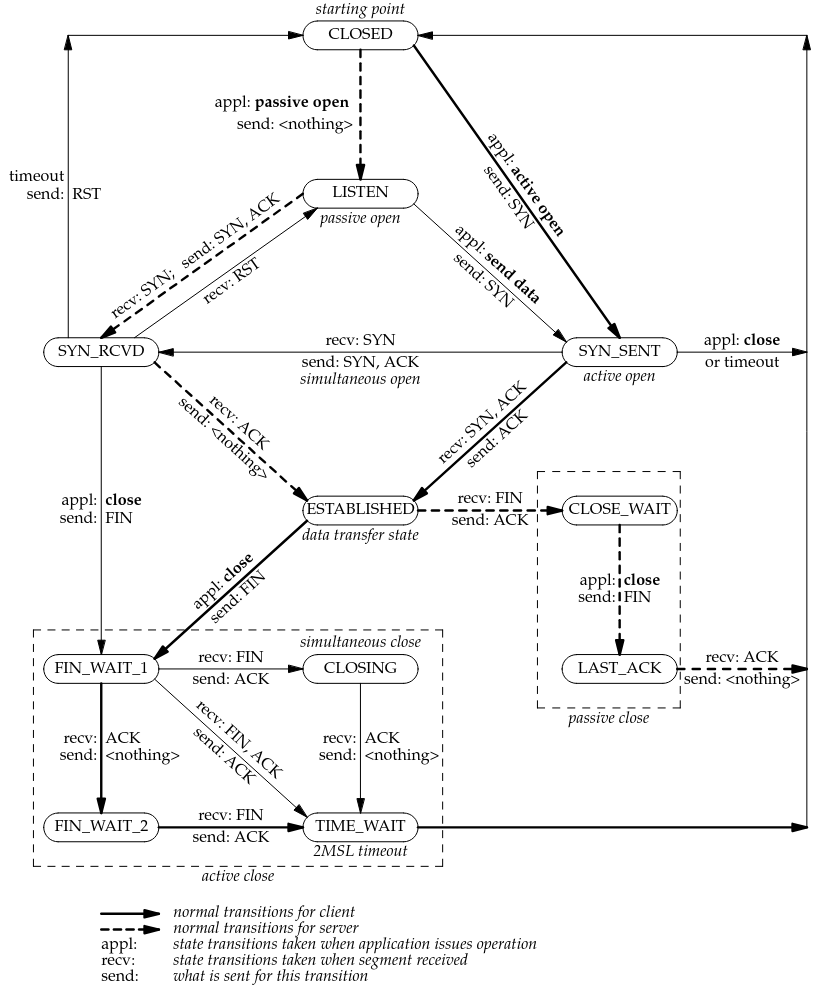

## Práctica 5
## Capa de Transporte - Parte I

#### 1. ¿Cuál es la función de la capa de transporte?
La capa de transporte se encarga de ofrecer comunicacion logica entre procesos de aplicacion que se ejecutan dispositivos diferentes dentro de una red.

Los protocolos de la capa de transporte se implementan en los sistemas terminales (hosts). En el lado emisor, la capa de transporte convierte los mensajes de la aplicacion en segmentos, que luego se encapsulan en paquetes de capa de red y se envian a destino. En el lado receptor la capa de transporte extrae el paquete y lo entrega a la aplicacion receptora.
#### 2. Describa la estructura del segmento TCP y UDP.
TCP incluye (entre otros campos):
- Puerto de origen (16 bits)
- Puerto de destino (16 bits)
- Número de secuencia (32 bits)
- Número de acuse/ack (32 bits)
- Offset de datos
- Flags (SYN, ACK, FIN, RST, PSH, URG)
- Ventana
- Checksum
- Urgent Pointer
- Opciones (ej. MSS, ventana escalada)
- Datos

TPC tiene una cabecera variable, minimo 20 bytes.

UDP:
- Puerto de origen (16 bits)
- Puerto de destino (16 bits)
- Longitud (16 bits)
- Checksum (16 bits)
- Datos
Cabecera fija de 8 bytes.

#### 3. ¿Cuál es el objetivo del uso de puertos en el modelo TCP/IP?
- Multiplexar/demultiplexar conexiones.
- Identificar procesos o aplicaciones dentro de un host.
- Permitir que multiples aplicaciones usen la red simultaneamente.
#### 4. Compare TCP y UDP en cuanto a:
##### a. Confiabilidad
TCP: Confiable. Implementa retransmisiones, ACKs, numeros de secuencia y control de errores.

UDP: No confiable. Solo entrega. Best effort.
##### b. Multiplexación.
Ambos usan puertos.
##### c. Orientado a la conexión.
TCP: Si. Utiliza el 3-way handshake (SYN, SYN-ACK, ACK).

UDP: No. Envia datagramas sin establecer conexion.
##### d. Controles de congestión.
TCP: Implementa control de congestion.

UDP: No tiene control de congestion.
##### e. Utilización de puertos.
Ambos usan puertos de la misma numeracion.
#### 5. La PDU de la capa de transporte es el segmento. Sin embargo, en algunos contextos suele utilizarse el término datagrama. Indique cuando.
El termino datagrama se usa cuando la comunicacion es sin conexion y no confiable, es decir, cuando se utiliza UDP, ya que envia unidades independientes sin establecer conexion. Cuando se usa TCP hablamos de segmento.

#### 6. Describa el saludo de tres vías de TCP. ¿UDP tiene esta característica?
TCP es orientado a la conexion, por lo que antes de enviar datos necesita establecer una conexion confiable. Esto se hace en tres pasos:

1. SYN (SYNcronize):
    - El cliente envia un segmento con el flag SYN=1.
    - Indica el deseo de iniciar una conexion y propone su ISN (Initial Sequence Number)
2. SYN + ACK (ACKnowledge):
    - El servidor responde con SYN=1 y ACK=1
    - Acepta la conexion y envia su propio ISN.
    - Confirma (ACK) el SYN del cliente.
3. ACK:
    - El cliente envia un segmento final ACK=1 confirmando el SYN del servidor.

La conexion queda establecida y se pueden enviar datos.

UDP no es orientado a la conexion, por lo que no establece conexion previa, solo envia datagramas sin garantia.
#### 7. Investigue qué es el ISN (Initial Sequence Number). Relaciónelo con el saludo de tres vías.
Es el numero de secuencia inicial que cada extremo elige al comenzar una conexion TCP.

Caracteristicas:
- Cada lado elige su propio ISN.
- Es un numero de 32 bits.
- Se elige de manera pseudoaleatoria para mejorar la seguridad.
- Aumenta con el tiempo, en general cada 4ms.

El numero de secuencia de un segmento enviado es igual al numero de secuencia del anterior segmento enviado, mas los bytes que se enviaron en ese segmento, mas 1 si el segmento tenia la flag SYN y mas 1 se tenia la flag FIN.

El numero ack es el numero de secuencia del ultimo segmento recibido, mas los bytes recibidos, mas uno si dicho paquete tenia SYN y mas uno si tenia FIN.
```
SEQ(nuevo) = SEQ(anterior) + bytes_enviados(anterior) + (1 si tenia SYN) + (1 si tenia FIN)
```
```
ACK = SEQ_último_segmento_recibido + bytes_recibidos + (1 si incluía SYN) + (1 si incluía FIN)
```

Ayuda a identificar, controlar el origen y mantener el orden de los segmentos de datos transmitidos entre el cliente y el servidor.
#### 8. Investigue qué es el MSS. ¿Cuándo y cómo se negocia?
MSS (Maximum Segment Size) es el tamaño maximo de datos utiles (payload) que un segmento TCP puede transportar, sin fragmentacion a nivel IP. Se negocia durante el handshake, cada lado informa su propio MSS y luego cada extremo usa el MSS recibido del otro lado para limitar el tamaño de los datos que envia.

Esta dado por la siguiente formula:
```
MSS = MTU - (encabezado TCP + encabezado IP)
```
MTU (Maximum Transmission Unit) es un termino que expresa el tamaño maximo en bytes que puede enviarse en la capa de red.

#### 9. Utilice el comando ss (reemplazo de netstat) para obtener la siguiente información de su PC:
##### a. Para listar las comunicaciones TCP establecidas.
```bash
ss -t state established
```
##### b. Para listar las comunicaciones UDP establecidas.
```bash
# Sockets UDP conectados
ss -u state connected
```
##### c. Obtener sólo los servicios TCP que están esperando comunicaciones
```bash
ss -tl
```
##### d. Obtener sólo los servicios UDP que están esperando comunicaciones.
```bash
# Sockets UDP esperando datagramas
ss -ul
```
##### e. Repetir los anteriores para visualizar el proceso del sistema asociado a la conexión.
```
# Agregar el flag -p
ss -t state established -p
```
##### f. Obtenga la misma información planteada en los items anteriores usando el comando netstat.
```bash
# TCP establecidas
netstat -tan | grep ESTABLISHED

# UDP activas
netstat -uan

# Servicios TCP en LISTEN
netstat -lt

# Servicios UDP en LISTEN
netstat -lu

# TCP establecidas con proceso
netstat -tanp | grep ESTABLISHED
```

#### 10. ¿Qué sucede si llega un segmento TCP con el flag SYN activo a un host que no tiene ningún proceso esperando en el puerto destino de dicho segmento (es decir, el puerto destino no está en estado LISTEN)?
El host rechaza la conexion. Responde con un segmento RST=1 (reset) y ACK = 1, para indicarle al emisor que no puede establecerse una conexion en ese puerto.
##### a. Utilice hping3 para enviar paquetes TCP al puerto destino 22 de la máquina virtual con el flag SYN activado.
```bash
# -S set SYN flag
hping3 -S -p 22 localhost
```
```
HPING localhost (lo 127.0.0.1): S set, 40 headers + 0 data bytes
len=44 ip=127.0.0.1 ttl=64 DF id=0 sport=22 flags=SA seq=0 win=65495 rtt=15.0 ms
len=44 ip=127.0.0.1 ttl=64 DF id=0 sport=22 flags=SA seq=1 win=65495 rtt=1.4 ms
```
##### b. Utilice hping3 para enviar paquetes TCP al puerto destino 40 de la máquina virtual con el flag SYN activado.

```bash
hping3 -S -p 40 localhost
```
```
HPING localhost (lo 127.0.0.1): S set, 40 headers + 0 data bytes
len=40 ip=127.0.0.1 ttl=64 DF id=0 sport=40 flags=RA seq=0 win=0 rtt=11.9 ms
len=40 ip=127.0.0.1 ttl=64 DF id=0 sport=40 flags=RA seq=1 win=0 rtt=7.4 ms
```

##### c. ¿Qué diferencias nota en las respuestas obtenidas en los dos casos anteriores? ¿Puede explicar a qué se debe? (Ayuda: utilice el comando ss visto anteriormente).
La principal diferencia es que al enviar el paquete al puerto 22 el servidor responde con los flags SYN y ACK (flags=SA), mientras que al enviarlo al puerto 40 el servidor responde con RST + ACK (flags=RA).

Esto quiere decir que el puerto 22 esta abierto y hay un proceso escuchando; mientras que el puerto 40 esta cerrado y no hay ningun proceso escuchando.

#### 11. ¿Qué sucede si llega un datagrama UDP a un host que no tiene ningún proceso esperando en el puerto destino de dicho datagrama (es decir, que dicho puerto no está en estado LISTEN)?
Cuando un host recibe un datagrama UDP cuyo puerto destino NO esta en estado LISTEN, el comportamiento estandar es que descarte el mensaje y responda con un mensaje ICMP (Internet Control Message Protocol) "Port Unreachable" (Tipo 3, Codigo 3) al emisor.
##### a. Utilice hping3 para enviar datagramas UDP al puerto destino 5353 de la máquina virtual.
```bash
hping3 --udp -p 5353 localhost
```
```
HPING localhost (lo 127.0.0.1): udp mode set, 28 headers + 0 data bytes
```
##### b. Utilice hping3 para enviar datagramas UDP al puerto destino 40 de la máquina virtual.
```bash
hping3 --udp -p 40 localhost
```
```
HPING localhost (lo 127.0.0.1): udp mode set, 28 headers + 0 data bytes
ICMP Port Unreachable from ip=127.0.0.1 name=localhost 
status=0 port=2732 seq=0
ICMP Port Unreachable from ip=127.0.0.1 name=localhost 
status=0 port=2733 seq=1
```
##### c. ¿Qué diferencias nota en las respuestas obtenidas en los dos casos anteriores? ¿Puede explicar a qué se debe? (Ayuda: utilice el comando ss visto anteriormente).
En el primer caso el servidor no responde con error lo cual significa que hay un socket en LISTEN para UDP en el puerto 5353. En el segundo caso el servidor responde con ICMP "Port Unreachable", esto quiere decir que no hay ningun proceso escuchando en el puerto 40/udp, por lo tanto el datagrama es descartado y el host envia el mensaje de error.

Usando `ss` podemos confirmar que hay un proceso escuchando en el puerto 5353/dns, pero ninguno en el 40/dns:
```
ss -lu
State  Recv-Q Send-Q Local Address:Port  Peer Address:PortProcess
UNCONN 0      0            0.0.0.0:mdns       0.0.0.0:*
UNCONN 0      0            0.0.0.0:58750      0.0.0.0:*
UNCONN 0      0          127.0.0.1:4038       0.0.0.0:*
UNCONN 0      0            0.0.0.0:631        0.0.0.0:*
UNCONN 0      0               [::]:mdns          [::]:*
UNCONN 0      0               [::]:50997         [::]:*

# mdns -> 5353/udp
# /etc/services mapea nombres de servicios a puertos y protocolos
cat /etc/services | grep mdns
mdns      5353/udp
```

#### 12. Investigue los distintos tipos de estado que puede tener una conexión TCP.
Una conexion TCP para por una serie de estados definidos por la maquina de estados TCP. Estos estados representan en que punto del proceso de establecimiento, transferencia de datos o finalizacion se encuentra la conexion.



1. `LISTEN`: El servidor esta esperando conexiones entrantes.
2. `SYN-SENT`: Estado del cliente luego de enviar un segmento SYN para iniciar una conexion.
3. `SYN-RECEIVED`: Estado del servidor que recibio un SYN, respondio SYN+ACK y espera el ACK del cliente.
4. `ESTABLISHED`: La conexion esta abierta. Se pueden enviar y recibir datos. Es el estado normal.
5. `FIN-WAIT-1`: Una de las partes inicio el cierre enviando un FIN, espera un FIN o un ACK del FIN.
6. `FIN-WAIT-2`: Se recibio el ACK del FIN enviado. Espera el FIN del otro extremo.
7. `CLOSE-WAIT`: Se recibio un FIN. Se respondio con ACK. Ahora debe enviar el FIN propio.
8. `CLOSING`: Ambos extremos enviaron FIN casi al mismo tiempo. Espera a el ACK del FIN enviado.
9. `LAST-ACK`: Se envio el FIN propio luego de estar en `CLOSE-WAIT`. Espera al ACK para completar el cierre.
10. `TIME-WAIT`: Se espera un tiempo para asegurarse de que no queden segmentos circulando.
11. `CLOSED`: No existe conexion en absoluto.

#### 13. Dada la siguiente salida del comando ss, responda:
```
Netid State Recv-Q Send-Q Local Address:Port Peer Address:Port Process
tcp LISTEN 0 128 *:22 *:* users:(("sshd",pid=468,fd=29))
tcp LISTEN 0 128 *:80 *:* users:(("apache2",pid=991,fd=95))
udp LISTEN 0 128 163.10.5.222:53 *:* users:(("named",pid=452,fd=10))
tcp ESTAB 0 0 163.10.5.222:59736 64.233.163.120:443 users:(("x-www-browser",pid=1079,fd=51))
tcp CLOSE-WAIT 0 0 163.10.5.222:41654 200.115.89.30:443 users:(("x-www-browser",pid=1079,fd=50))
tcp ESTAB 0 0 163.10.5.222:59737 64.233.163.120:443 users:(("x-www-browser",pid=1079,fd=55))
tcp ESTAB 0 0 163.10.5.222:33583 200.115.89.15:443 users:(("x-www-browser",pid=1079,fd=53))
tcp ESTAB 0 0 163.10.5.222:45293 64.233.190.99:443 users:(("x-www-browser",pid=1079,fd=59))
tcp LISTEN 0 128 *:25 *:* users:(("postfix",pid=627,fd=3))
tcp ESTAB 0 0 127.0.0.1:22 127.0.0.1:41220 users:(("sshd",pid=1418,fd=3), ("sshd",pid=1416,fd=3))
tcp ESTAB 0 0 163.10.5.222:52952 64.233.190.94:443 users:(("x-www-browser",pid=1079,fd=29))
tcp TIME-WAIT 0 0 163.10.5.222:36676 54.149.207.17:443 users:(("x-www-browser",pid=1079,fd=3))
tcp ESTAB 0 0 163.10.5.222:52960 64.233.190.94:443 users:(("x-www-browser",pid=1079,fd=67))
tcp ESTAB 0 0 163.10.5.222:50521 200.115.89.57:443 users:(("x-www-browser",pid=1079,fd=69))
tcp SYN-SENT 0 0 163.10.5.222:52132 43.232.2.2:9500 users:(("x-www-browser",pid=1079,fd=70))
tcp ESTAB 0 0 127.0.0.1:41220 127.0.0.1:22 users:(("ssh",pid=1415,fd=3))
udp LISTEN 0 128 127.0.0.1:53 *:* users:(("named",pid=452,fd=9))
```
##### a. ¿Cuántas conexiones hay establecidas?
Hay 9 sockets ESTABLISHED, pero dos (5 y 9) corresponden al mismo enlace SSH, en total hay 8 conexiones unicas.
##### b. ¿Cuántos puertos hay abiertos a la espera de posibles nuevas conexiones?
Hay 3 sockets tcp en LISTEN.
##### c. El cliente y el servidor de las comunicaciones HTTPS (puerto 443), ¿residen en la misma máquina?
No, porque como local address aparece `163.10.5.222:XXXXX` pero como peer address aparecen direcciones distintas.
##### d. El cliente y el servidor de la comunicación SSH (puerto 22), ¿residen en la misma máquina?
Si, ya que ambos usan la IP `127.0.0.1:XXXXX`.
##### e. Liste los nombres de todos los procesos asociados con cada comunicación. Indique para cada uno si se trata de un proceso cliente o uno servidor.
- `sshd`: Servidor.
- `apache2`: Servidor.
- `named`: Servidor.
- `x-www-browser`: Cliente.
- `postfix`: Servidor.
- `ssh`: Cliente.
##### f. ¿Cuáles conexiones tuvieron el cierre iniciado por el host local y cuáles por el remoto?
`CLOSE-WAIT`: El host remoto inicio el cierre.

`TIME-WAIT`: El host local inicio el cierre.
##### g. ¿Cuántas conexiones están aún pendientes por establecerse?
Hay una conexion pendiente (`SYN-SENT`), a la espera de una respuesta `SYN-ACK`.

#### 14. Dadas las salidas de los siguientes comandos ejecutados en el cliente y el servidor, responder:
```
servidor# ss -natu | grep 110
tcp LISTEN 0 0 *:110 *:*
tcp SYN-RECV 0 0 157.0.0.1:110 157.0.11.1:52843

cliente# ss -natu | grep 110
tcp SYN-SENT 0 1 157.0.11.1:52843 157.0.0.1:110
```
##### a. ¿Qué segmentos llegaron y cuáles se están perdiendo en la red?
El cliente envio un `SYN` y quedo en `SYN-SENT`, el servidor recibio el segmento enviado y esta en `SYN-RECV`, es decir, ya envio un `SYN-ACK`, este ultimo es el segmento perdido, ya que de haberle llegado al cliente este estaria en `ESTABLISHED`.
##### b. ¿A qué protocolo de capa de aplicación y de transporte se está intentando conectar el cliente?
El protocolo de transporte es tcp (indicado por el estado `tcp`) y el de aplicacion es POP3 (indicado por el puerto 110).
##### c. ¿Qué flags tendría seteado el segmento perdido?
SYN=1, ACK=1
