## Práctica 6
## Capa de Transporte - Parte II

#### 1. ¿Cuál es el puerto por defecto que se utiliza en los siguientes servicios? Web / SSH / DNS / Web Seguro / POP3 / IMAP / SMTP Investigue en qué lugar en Linux y en Windows está descrita la asociación utilizada por defecto para cada servicio.
- `HTTP`: 80/tcp
- `SSH`: 22/tcp
- `DNS`: 53/udp 53/tcp
- `HTTPS`: 443/tcp
- `POP3`: 110/tcp
- `IMAP`: 143/tcp
- `SMTP`: 25/tcp

En linux los puertos estandar estan descritos en `/etc/services`. En windows la tabla equivalente esta en `C:\Windows\System32\drivers\etc\services`.

#### 2. Investigue qué es multicast. ¿Sobre cuál de los protocolos de capa de transporte funciona? ¿Se podría adaptar para que funcione sobre el otro protocolo de capa de transporte? ¿Por qué?
Multicast es un mecanismo de red para enviar un unico paquete a un grupo de receptores interesados.

Utiliza direcciones especiales:
- IPv4: 224.0.0.0 - 239.255.255.255
- IPv6: FF00::/8

Multicast funciona exclusivamente en UDP. No seria adaptable a TCP ya que este establece una conexion punto a punto entre un unico emisor y receptor.

#### 3. Investigue cómo funciona el protocolo de aplicación FTP teniendo en cuenta las diferencias en su funcionamiento cuando se utiliza el modo activo de cuando se utiliza el modo pasivo ¿En qué se diferencian estos tipos de comunicaciones del resto de los protocolos de aplicación vistos?
FTP (File Transfer Protocol) es un protocolo de aplicacion que permite transferir archivos entre un cliente y un servidor a traves de una red TCP/IP.

Es muy distinto a otros protocolos de aplicacion porque usa dos conexiones TCP separadas:
1. Canal de control:
    - Se abre al iniciar la sesion
    - Se usa para enviar comandos
    - Permanece abierto toda la sesion
    - Usa el puerto 21/tcp
2. Canal de datos
    - Se usa solo cuando se tranfiere informacion.
    - Puede abrirse en dos modos diferentes: activo o pasivo.

Modo Activo:
- El cliente abre el canal de control hacia el puerto 21 del servidor.
- Luego el cliente abre un puerto aleatorio >1024 y le dice al servidor que se conecte ahi para transferir datos,
- El servidor inicia la conexion de datos desde su puerto 20 hacia ese puerto del cliente.

Modo Pasivo:
- El cliente abre el canal de control hacia el servidor.
- El cliente le pide al servidor que use modo pasivo.
- El servidor abre un puerto aleatorio > 1024 y le dice al cliente cual es.
- El cliente inicia la conexion de datos hacia ese puerto del servidor.

#### 4. Suponiendo Selective Repeat; tamaño de ventana 4 y sabiendo que E indica que el mensaje llegó con errores. Indique en el siguiente gráfico, la numeración de los ACK que el host B envía al Host A.
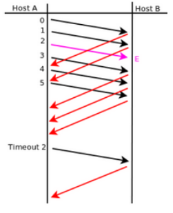
En Selective Repeat el receptor ACKea cada segmento correcto indivudualmente y almacena los que llegan fuera de orden hasta recibir el que falta. El tamaño de ventana indica cuantos segmentos puede enviar el emisor sin recibir ACK, y cuantos segmentos puede aceptar el host fuera de orden.

1. B recibe el segmento 0 correctamente -> ACK 0
2. B recibe el segmento 1 correctamente -> ACK 1
3. B recibe el segmento 2 con error, no responde con ACK
4. B recibe el segmento 3 correctamente -> ACK 3 y lo guarda en buffer
5. B recibe el segmento 4 correctamente -> ACK 4 y lo guarda en buffer
6. B recibe el segmento 5 correctamente -> ACK 5 y lo guarda en buffer
7. Trans el timeout en A, A retransmite el segmento 2, B lo recibe -> ACK 2

#### 5. ¿Qué restricción existe sobre el tamaño de ventanas en el protocolo Selective Repeat?
La ventana ded transmision y la ventana de recepcion deben ser como maximo N/2 donde N es el tamaño del espacio de numeros de secuencia. Esto es para evitar la posibilidad de que un numero de secuencia se reutilice antes de que el ACK correspondiente haya llegado.

#### 6. De acuerdo a la captura TCP de la siguiente figura, indique los valores de los campos borroneados.
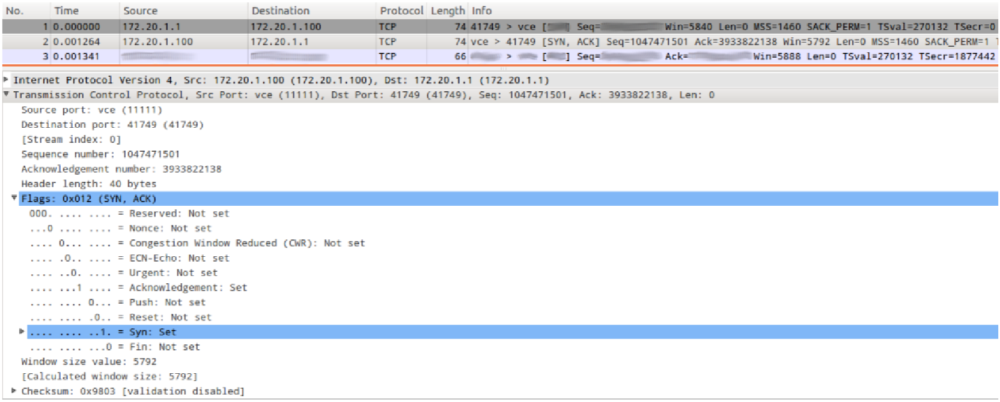
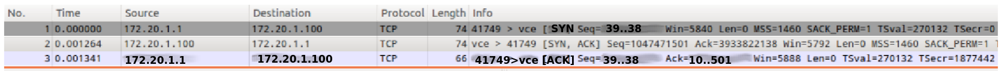

#### 7. Dada la sesión TCP de la figura, completar los valores marcados con un signo de interrogación.
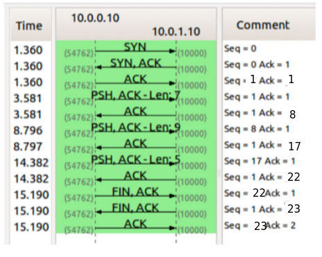

#### 8. ¿Qué es el RTT y cómo se calcula? Investigue la opción TCP timestamp y los campos TSval y TSecr.
RTT (Round Trip Time) es el tiempo total que transcurre entre que un host envia un segmento a un destino, y el host recibe el ACK correspondiente de dicho destino. Se mide en milisegundos.

Cuando un host envia un segmento TCP, anota el tiempo del envio. Cuando llega el ACK de ese segmento compara el tiempo actual con el tiempo de envia y a partir de eso calcula el RTT.

La opcion TCP Timestamp se agrega en la cabecera TCP. Agrega la medicion precisa del RTT y PAWS (Protection Against Wrapped Sequence Numbers). Cuando se activa en cada segmento aparecen dos campos:

`TSval` (Timestamp Value):
- Es un numero generado por el emisor.
- Usualmente es un contador creciente (Ej. ticks del reloj).
- No es tiempo real, solo un valor que siempre aumenta.

`TSecr` (Timestamp Echo Reply):
- Es un reflejo del TSval recibido.
- El host destino copia el TSval recibido en el campo TSecr del ACK de vuelta.

Esto permite medir el RTT aun cuando hay retransmisiones o segmentos perdidos.

#### 9. Para la captura tcp-captura.pcap, responder las siguientes preguntas.
##### a. ¿Cuántos intentos de conexiones TCP hay?
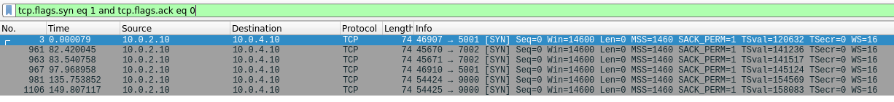
##### b. ¿Cuáles son la fuente y el destino (IP:port) para c/u?
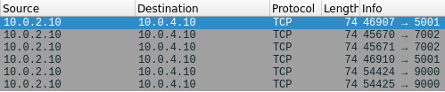
##### c. ¿Cuántas conexiones TCP exitosas hay en la captura? ¿Cómo diferencia las exitosas de las que no lo son? ¿Cuáles flags encuentra en cada una?
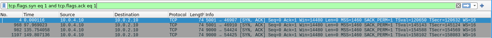
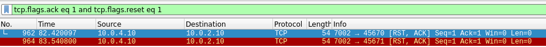
##### d. Dada la primera conexión exitosa responder:
###### i. ¿Quién inicia la conexión?
`10.0.2.10:46907`
###### ii. ¿Quién es el servidor y quién el cliente?
Cliente: `10.0.2.10:46907`


Servidor: `10.0.4.10:5001`
###### iii. ¿En qué segmentos se ve el 3-way handshake?
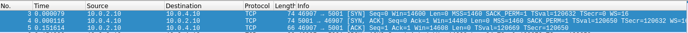
###### iv. ¿Cuáles ISNs se intercambian?
Sequence Number (raw): 2218428254

Sequence Number (raw): 1292618479
###### v. ¿Cuál MSS se negoció?
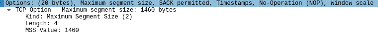
###### vi. ¿Cuál de los dos hosts envía la mayor cantidad de datos (IP:port)?
El cliente (`10.0.2.10:46907`) ya que al terminar la conexion su numero de secuencia relativo es mucho mayor al del otro host.

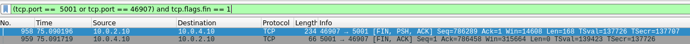
##### e. Identificar primer segmento de datos (origen, destino, tiempo, número de fila y número de secuencia TCP).
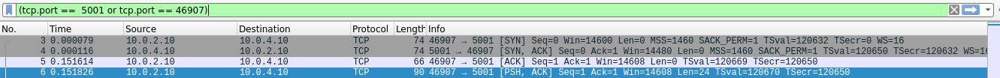
###### i. ¿Cuántos datos lleva?
24 bytes.
###### ii. ¿Cuándo es confirmado (tiempo, número de fila y número de secuencia TCP)?

###### iii. La confirmación, ¿qué cantidad de bytes confirma?
24
##### f. ¿Quién inicia el cierre de la conexión? ¿Qué flags se utilizan? ¿En cuáles segmentos se ve (tiempo, número de fila y número de secuencia TCP)?
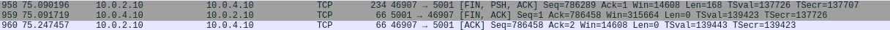

#### 10. Responda las siguientes preguntas respecto del mecanismo de control de flujo.
##### a. ¿Quién lo activa? ¿De qué forma lo hace?
Lo activa el receptor mediante el campo Window Size del encabezado.
##### b. ¿Qué problema resuelve?
Evita que el emisor envie mas datos de los que el receptor puede procesar. Si el receptor tiene espacio en el buffer anuncia un rwnd (Receiver Window) grande, caso contrario anuncia uno chico o 0.
##### c. ¿Cuánto tiempo dura activo y qué situación lo desactiva?
El control de flujo esta activo durante toda la conexion TCP, pero varia su intensidad. El emisor envia probes periodicos (window probes) para saber cuando el receptor vuelve a tener espacio.
#### 11. Responda las siguientes preguntas respecto del mecanismo de control de congestión.
##### a. ¿Quién activa el mecanismo de control de congestión? ¿Cuáles son los posibles disparadores?
El control de congestion es activado por el emisor. El emisor ajusta su cwnd (Congestion Window) segun detacta congestion en la red. Disparadores tipicos:
- Timeout (RTO)
- Recepcion de tres ACK duplicados
##### b. ¿Qué problema resuelve?
El control de congestion busca evitar que la red se sobrecargue ajustando la tasa de transmision de datos del emisor para que sea compatible con la capacidad de la red.
##### c. Diferencie slow start de congestion-avoidance.
Slow Start:
- Se usa al comienzo de una conexion, o despues de un timeout.
- Aumenta la ventana de congestion de forma exponencial.
- Descubre rapidamente la capacidad disponible de la red.

Congestion Avoidance:
- Inicia cuando se alcanza un umbral.
- Aumenta la ventana de congestion de forma lineal.
- Evita la congestion una vez que se encontro un ritmo estable.

#### 12. Para la captura udp-captura.pcap, responder las siguientes preguntas.
##### a. ¿Cuántas comunicaciones (srcIP,srcPort,dstIP,dstPort) UDP hay en la captura?
```
Statistics >> Conversations >> UDP
```
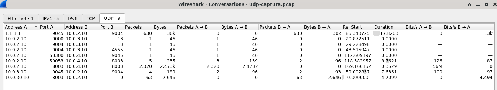
##### b. ¿Cómo se podrían identificar las exitosas de las que no lo son?
Con los mensajes ICMP.
##### c. ¿UDP puede utilizar el modelo cliente/servidor?
Si, un ejemplo es DNS.
##### d. ¿Qué servicios o aplicaciones suelen utilizar este protocolo?¿Qué requerimientos tienen?
Servicios que necesitan:
- Baja latencia
- Rapidez
- No requieren confiabilidad absoluta

Ejemplos:
- DNS
- DHCP
- Streaming
##### e. ¿Qué hace el protocolo UDP en relación al control de errores?
UDP detecta errores pero no los corrige. Se usa un checksum opcional, si este checksum falla el datagrama se descarta. UDP no reenvia, confirma entrega, controla flujo ni congestion.
##### f. Con respecto a los puertos vistos en las capturas, ¿observa algo particular que lo diferencie de TCP?
No.
##### g. Dada la primera comunicación en la cual se ven datos en ambos sentidos (identificar el primer datagrama):
###### i. ¿Cuál es la dirección IP que envía el primer datagrama?,¿desde cuál puerto?
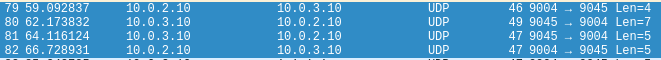
###### ii. ¿Cuántos datos se envían en un sentido y en el otro?
9 y 12 bytes.

#### 13. Dada la salida que se muestra en la imagen, responda los ítems debajo.
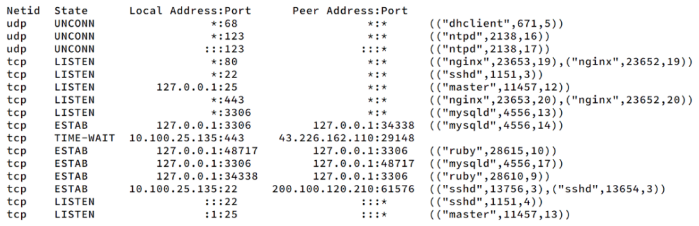
##### Suponga que ejecuta los siguientes comandos desde un host con la IP 10.100.25.90. Responda qué devuelve la ejecución de los siguientes comandos y, en caso que corresponda, especifique los flags.
##### a. hping3 -p 3306 –udp 10.100.25.135
ICMP Port Unreachable: no hay nadie escuchando en 3306/udp.
##### b. hping3 -S -p 25 10.100.25.135
El puerto 25/tcp esta ligado a `127.0.0.1:25`, respondera con RST/ACK o no respondera.
##### c. hping3 -S -p 22 10.100.25.135
Responde con SYN/ACK.
##### d. hping3 -S -p 110 10.100.25.135
RST/ACK
##### ¿Cuántas conexiones distintas hay establecidas? Justifique.
5, son las que estan denotadas como `ESTAB`.
