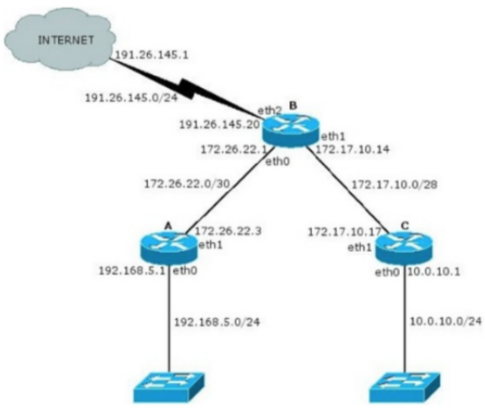
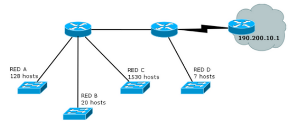

## Práctica 7
## Capa de Red - Direccionamiento
### Introducción
#### 1. ¿Qué servicios presta la capa de red? ¿Cuál es la PDU en esta capa? ¿Qué dispositivo es considerado sólo de la capa de red?
Servicios:
- Direccionamiento logico (IPs).
- Encaminado / routing entre redes.
- Conmutacion de paquetes (forwarding).
- Fragmentacion y reensamblado IP.

PDU: Paquete (IP Packet).

El dispositivo que opera exclusivamente en la capa de red es el Router.

#### 2. ¿Por qué se lo considera un protocolo de mejor esfuerzo?
Porque IP no garantiza nada:
- No asegura entrega.
- No asegura orden.
- No evita duplicados.
- No detecta si el receptor recibio los datos.

IP simplemente hace el mejor esfuerzo para enviar el paquete usando las rutas disponibles.
#### 3. ¿Cuántas redes clase A, B y C hay? ¿Cuántos hosts como máximo pueden tener cada una?
RED: Conjunto de dispositivos (hosts) que estan conectados entre si dentro del mismo segmento IP.

HOST: Dispositivo individual dentro de una red.

Las clases A, B y C son formas antiguas de dividir el espacio de direcciones. Se usaban para saber cuantas redes habia y cuantos hosts podia tener cada una.

Clase A: 0XXX.XXXX.XXXX.XXXX
- Cantidad de redes 2⁷ = 128
- Hosts por red 2²⁴ − 2 = 16 777 214

Clase B: 10XX.XXXX.XXXX.XXXX
- Cantidad de redes 2¹⁴ = 16 384
- Hosts por red 2¹⁶ − 2 = 65 534

Clase C: 110X.XXXX.XXXX.XXXX
- Cantidad de redes 2²¹ = 2 097 152
- Hosts por red 2⁸ − 2 = 254
#### 4. ¿Qué son las subredes? ¿Por qué es importante siempre especificar la máscara de subred asociada?
Una subred es una division logica de una red mayor. Permite:
- Organizar redes internas
- Reducir broadcast
- Mejorar seguridad y gestion
- Optimizar el uso de direcciones IP

La mascara define donde termina la parte de red y empieza la parte del host. Sin la mascara:
- No se sabe si una IP esta dentro de la misma red o no.
- No se puede enrutar correctamente.
- No se puede distinguir red/subred/host.

La mascara es un numero de 32 bits (en IPv4) donde:
- Los bits en 1 indican la parte de RED
- Los bits en 0 indican la parte de HOST
```
IP:      192.168.1.14      → 11000000.10101000.00000001.00001110
Máscara: 255.255.255.0     → 11111111.11111111.11111111.00000000
CIDR:    192.168.1.14/24
```

Partiendo de una red dada, para obtener dos subredes será necesario un único bit, ya que con él pueden representarse dos números. Si fueran necesarias tres subredes ya se necesitaría un bit más, que daría como resultado la posibilidad de obtener cuatro subredes. Lógicamente, al utilizar bits de hosts para crear subredes, cuantas más subredes se necesiten menos hosts podrá albergar cada una.

Cada subred tiene (2^n - 2, n = bits de host) direcciones asignables a los hosts puesto que la primera direccion (Con todos los bits de hosts a 0) indica la subred y la ultima direccion de cada subred (todos los bits de host a 1) se reserva para el broadcast.
#### 5. ¿Cuál es la finalidad del campo Protocol en la cabecera IP? ¿A qué campos de la capa de transporte se asemeja en su funcionalidad?
Indica a que protocolo de capa superior deben entregarse los datos contenidos en el paquete IP. Se asemeja a el puerto en la capa de transporte.

### División en subredes
#### 6. Para cada una de las siguientes direcciones IP (172.16.58.223/26, 163.10.5.49/27, 128.10.1.0/23, 10.1.0.0/24, 8.40.11.179/12) determine:
##### a. ¿De qué clase de red es la dirección dada (Clase A, B o C)?
##### b. ¿Cuál es la dirección de subred?
##### c. ¿Cuál es la cantidad máxima de hosts que pueden estar en esa subred?
##### d. ¿Cuál es la dirección de broadcast de esa subred?
##### e. ¿Cuál es el rango de direcciones IP válidas dentro de la subred?
`172.16.58.223/26`:
- 172 = 10101100 -> Clase B
- Subred: 172.16.58.192
- Hosts maximos: 2^6 - 2 = 63
- Broadcast: 172.16.58.255
- IP validas: `172.16.58.193`-`172.16.58.254`

`8.40.11.179/12`
- 8 = 00000111 -> Clase A
- Subred: 8.32.0.0
- Hosts maximos: 2^20 - 2
- Broadcast: 8.47.255.255
- IP validas: `8.32.0.1`-`8.47.255.254`

#### 7. Su organización cuenta con la dirección 128.50.10.0. Indique:
##### a. ¿Es una dirección de red o de host?
La mascara por defecto es de 16 bits. La parte de host no es nula por lo tanto es una diraccion de host.
##### b. Clase a la que pertenece y máscara de clase.
Clase B, mascara /16 = 255.255.0.0
##### c. Cantidad de hosts posibles.
2^16 - 2
##### d. Se necesitan crear, al menos, 513 subredes. Indique:
###### i. Máscara necesaria.
/16+10 = /26
###### ii. Cantidad de redes asignables.
2^10 = 1024
###### iii. Cantidad de hosts por subred.
2^6 - 2 = 62
###### iv. Dirección de la subred 710.
La subred 710 corresponde a la 709 ya que se arranca a contar desde 0:


128.50.177.64
###### v. Dirección de broadcast de la subred 710.
128.50.177.127

#### 8. Si usted estuviese a cargo de la administración del bloque IP 195.200.45.0/24
##### a. ¿Qué máscara utilizaría si necesita definir al menos 9 subredes?
2^3 = 8, 2^4 = 16

/24+4 = /28
##### b. Indique la dirección de subred de las primeras 9 subredes.
195.200.45.0
195.200.45.16
195.200.45.32
195.200.45.48
195.200.45.64
195.200.45.80
195.200.45.96
195.200.45.112
195.200.45.128
##### c. Seleccione una e indique dirección de broadcast y rango de direcciones asignables en esa subred.
195.200.45.0

Broadcast: 195.200.45.15

Rango: 195.200.45.1 - 195.200.45.13

#### 9. Dado el siguiente gráfico:

##### a. Verifique si es correcta la asignación de direcciones IP y, en caso de no serlo, modifique la misma para que lo sea.
Enlace B-A: A (eth1): 172.26.22.3 = broadcast. Usar 172.26.22.2

Encalse B-C: C (eth1): 172.17.10.17 = 17 pertenece a la siguiente subred. Usar 172.17.10.13

##### b. ¿Cuántos bits se tomaron para hacer subredes en la red 10.0.10.0/24? ¿Cuántas subredes se podrían generar?
Ningun bit. Una subred.
##### c. Para cada una de las redes utilizadas indique si son públicas o privadas.
| Red                 | Tipo        | Motivo                                 |
| ------------------- | ----------- | -------------------------------------- |
| **191.26.145.0/24** | **Pública** | No pertenece a rangos privados RFC1918 |
| **172.26.22.0/30**  | **Privada** | Rango 172.16.0.0 – 172.31.255.255      |
| **172.17.10.0/28**  | **Privada** | Rango 172.16.0.0 – 172.31.255.255      |
| **192.168.5.0/24**  | **Privada** | Rango privado 192.168.0.0/16           |
| **10.0.10.0/24**    | **Privada** | Rango privado 10.0.0.0/8               |

### CIDR
#### 10. ¿Qué es CIDR (Class Interdomain routing)? ¿Por qué resulta útil?
CIDR (Classless Inter-Domain Rounting) es un metodo para representar y agrupar direcciones IP sin usar las clases tradicionales (A, B, C). Permite mascaras de subred variables.

Un bloque CIDR esta formado por una direccion base y un prefijo:
```
direccion_ip/prefijo
```
Donde /prefijo indica cuantos bits del inicio se usan para la red.

¿Por qué resulta util?:
- Permite crear redes del tamaño que se necesita
- Reduce la cantidad de rutas en internet
- Mejor aprovechamiento del espacio de direcciones
#### 11. ¿Cómo publicaría un router las siguientes redes si se aplica CIDR?
Si un router tiene acceso a las cuatro redes listadas y se le aplica la agregacion de rutas o CIDR, las publicara al exterior como una unica red resumida o superred.

El objetivo es encontrar el prefijo CIDR mas corto que cubra todas las redes.
##### a. 198.10.1.0/24
##### b. 198.10.0.0/24
##### c. 198.10.3.0/24
##### d. 198.10.2.0/24
El bloque seria 198.10.0.0/22, que cubre el anterior conjunto de redes.

#### 12. Listar las redes involucradas en los siguientes bloques CIDR:
##### 200.56.168.0/21:
Clase C. Mascara Default /24

24-21 = 3 bits de subred:

- 200.56.168.0/24
- 200.56.169.0/24
- 200.56.170.0/24
- 200.56.171.0/24
- 200.56.172.0/24
- 200.56.173.0/24
- 200.56.174.0/24
- 200.56.175.0/24
##### 195.24.0.0/13:
Clase C. Mascara Default /24

24 - 13 = 9 bits de subred:
- Inicial: 195.24.0.0/16
- Ultima: 195.31.255.0/16
##### 195.24/13:
Es la misma direccion que la anterior.
#### 13. El bloque CIDR 128.0.0.0/2 o 128/2, ¿Equivale a listar todas las direcciones de red de clase B? ¿Cuál sería el bloque CIDR que agrupa todas las redes de clase A?
128/2 define todas las direcciones cuyos primeros dos bits son `10`, que es la definicion clasica de la Clase B.

El bloque CIDR que agrupe a la Clase A seria 1/1.

### VLSM
#### 14. ¿Qué es y para qué se usa VLSM?
VSLM (variable-length subnet masking) consiste en realizar divisiones en subredes con mascaras de longitud variable y es otra de las tecnicas surgidas para frenar el agotamiento de direcciones IPv4. Basicamente, VLSM sugiere hacer varios niveles de division en redes para lograr mascaras mas optimas para cada una de las subredes que se necesiten.
#### 15. Describa, con sus palabras, el mecanismo para dividir subredes utilizando VLSM.
1. Ordenar las necesidades de las subredes de mayor a menor hosts.
2. Para cada necesidad se elige la potencia de 2 mas pequeña que cubra `host_requeridos + 2`. Eso define la nueva mascara.
3. Asignar el primer bloque disponible con esa mascara y reservarlo.
4. Repetir con la siguiente subred mas grande, usando siempre el primer bloque libre restante.
5. Resumir el espacio
#### 16. Suponga que trabaja en una organización que tiene la red que se ve en el gráfico y debe armar el direccionamiento para la misma, minimizando el desperdicio de direcciones IP. Dicha organización posee la red 205.10.192.0/19, que es la que usted deberá utilizar.

##### a. ¿Es posible asignar las subredes correspondientes a la topología utilizando subnetting sin VLSM? Indique la cantidad de hosts que se desperdicia en cada subred.
1530 hosts -> 2^11 = 2048

4 subredes para las redes y 2 para comunicar a las redes -> 3 bits.

Para la red C no se tienen los bits suficientes en la parte del host 13 < 11+3

##### b. Asigne direcciones a todas las redes de la topología. Tome siempre en cada paso la primera dirección de red posible.
1. RED C 1530 Hosts
    - Necesita >=1532 direcciones -> elegir 2048 -> /21
    - Primer bloque posible dentro de 205.10.192.0/19 es 205.10.192.0/21
    - Rango:
##### c. Para mantener el orden y el inventario de direcciones disponibles, haga un listado de todas las direcciones libres que le quedaron, agrupándolas utilizando CIDR.
##### d. Asigne direcciones IP a todas las interfaces de la topología que sea posible.

#### 17. Utilizando la siguiente topología y el bloque asignado, arme el plan de direccionamiento IPv4 teniendo en cuenta las siguientes restricciones:

##### a. Utilizar el bloque IPv4 200.100.8.0/22.
##### b. La red A tiene 125 hosts y se espera un crecimiento máximo de 20 hosts.
##### c. La red X tiene 63 hosts.
##### d. La red B cuenta con 60 hosts
##### e. La red Y tiene 46 hosts y se espera un crecimiento máximo de 18 hosts.
##### f. En cada red, se debe desperdiciar la menor cantidad de direcciones IP posibles. En este sentido, las redes utilizadas para conectar los routers deberán utilizar segmentos de red /30 de modo de desperdiciar la menor cantidad posible de direcciones IP.

#### 18. Asigne direcciones IP en los equipos de la topología según el plan anterior.

### ICMP y Configuraciones IP
#### 19. Describa qué es y para qué sirve el protocolo ICMP.
ICMP (Internet Control Message Protocol) es un protocolo de nivel de red usado para enviar mensajes de control, diganostico y error entre routers y hosts. No transporta datos de aplicaciones sino informacion sobre el estado de la red.

Se utiliza para:
- Indicar errores (host unreachable, network unreachable, TTL exceeded...)
- Diagnostico
- Informar congestion
- Indicar redirecciones de ruta
#### a. Analice cómo funciona el comando ping.
`ping` envia ICMP Echo Request a un destino y espera ICMP Echo Reply. Mide:
- conectividad
- latencia
- perdida de paquetes
##### i. Indique el tipo y código ICMP que usa el ping.
##### ii. Indique el tipo y código ICMP que usa la respuesta de un ping.
| Paquete          | Tipo  | Código | Significado                |
| ---------------- | ----- | ------ | -------------------------- |
| **Echo Request** | **8** | **0**  | Mensaje enviado por *ping* |
| **Echo Reply** | **0** | **0**  | Respuesta del destino |
#### b. Analice cómo funcionan comandos como traceroute/tracert de Linux/Windows y cómo manipulan el campo TTL de los paquetes IP.
`traceroute` permite ver cada router intermedio entre origen y destino.

Mecanismo con TTL:
- EL TTL de los paquetes IP se inicializa en 1, luego 2, luego 3, etc.
- Cada router que recibe el paquete reduce el TTL: TTl = TTL - 1.
- Cuando TTL llega a 0, el router descarta el paquete y envia un mensaje ICMP Time Exceeded
- Este mensaje ICMP vuelve al origen y revela la IP del router
- Cuando finalmente llega al destino con TTL suficiente, este responde con ICMP Port Unreachable porque traceroute usa UDP
#### c. Indique la cantidad de saltos realizados desde su computadora hasta el sitio www.nasa.gov. Analice:
##### i. Cómo hacer para que no muestre el nombre del dominio asociado a la IP de cada salto.
Con el flag `-n`.
##### ii. La razón de la aparición de * en parte o toda la respuesta de un salto.
Significa que no se recibio una respuesta ICMP a tiempo.
#### d. Verifique el recorrido hacia los servidores de nombre del dominio unlp.edu.ar. En base al recorrido realizado, ¿podría confirmar cuál de ellos toma un camino distinto?

#### 20. ¿Para que se usa el bloque 127.0.0.0/8? ¿Qué PC responde a los siguientes comandos?
El bloque 127.0.0.0/8 esta reservado para loopback. Loopback es un rango de direcciones que siempre apuntan a la misma maquina que envia el paquete. Los paquetes nunca salen de la red, no pasan por ninguna interfaz fisica y son procesados internamente por el SO.
##### a. ping 127.0.0.1
##### b. ping 127.0.54.43
En ambos casos responde la PC donde se ejecuta el comando.

#### 21. Investigue para qué sirven los comandos ifconfig y route. ¿Qué comandos podría utilizar en su reemplazo? Inicie una topología con CORE, cree una máquina y utilice en ella los comandos anteriores para practicar sus diferentes opciones, mínimamente:
`ifconfig` permite:
- Ver interfaces de red
- Configurar direcciones IP
- Activar/desactivar interfaces

`route` permite:
- Ver la tabla de ruteo
- Agregar rutas
- Borrar rutas

La tabla de ruteo es una estructura que mantiene cada host o router y que indica como deben enviarse los paquetes IP hacia diferentes redes.
##### - Configurar y quitar una dirección IP en una interfaz.
##### - Ver la tabla de ruteo de la máquina.
