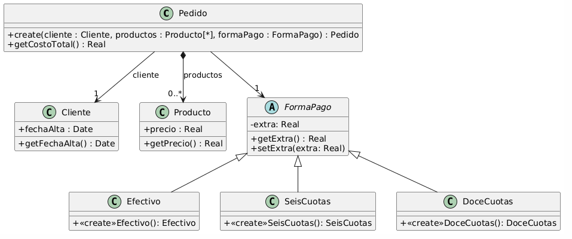

# Refactoring

### Ejercicio 1.1
Los nombres son poco descriptivos, aplico Rename Method (Cual es el bad smell?):
- lmtCrdt -> getLimiteDeCredito
- mtFcE -> getMontoFacturado
- mtCbE -> getMontoCobrado

Los nombres de los argumentos son pocos descriptivos, aplico Rename Variable (En el libro dice que se deben renombrar variables y clases, pero que no se agregaron como refactoring por ser simples. Hago de cuenta que existe el refactoring Rename Variable/Rename parameter? cual seria el bad smell?).

LocalDate f1, LocalDate f2 -> LocalDate desde, LocalDate hasta

### Ejercicio 1.2
El diseño inicial tiene el bad smell de Feature Envy ya que en el metodo participaEnProyecto de Persona se le pide a la clase Proyecto los participantes, cuando seria mas eficiente que la busqueda se de directamente en la clase Proyecto que conoce los participantes. Para solucionarlo entonces se aplica el refactoring Move Method y ademas se aplica Rename Method para cambiar el nombre a uno mas corto e igualmente descriptivo.

### Ejercicio 1.3
1. El loop se puede remplazar con el uso de pipelines para mejorar la legibilidad. Replace Loop with Pipeline. Cual es el bad smell?
2. El metodo no solo imprime valores sino que tambien los calcula. Long Method -> Extract Method. Extraigo la funcionalidad del calculo a un nuevo metodo llamado calcularValores().

### Ejercicio 2.1
i) Duplicated Code

ii) Extract Superclass

iii)
1. Crear clase abstracta Empleado
2. Pull Up Field de nombre, apellido y sueldoBasico
3. Pull Up Method de sueldo()

i) Data Class

ii) Encapsulate Field

iii)
1. Hacer privadas las variables de instancia de las 4 clases

Codigo resultante:
```java
public abstract class Empleado {
    private String nombre;
    private String apellido;
    private double sueldoBasico = 0;

    public double sueldo() {
        return this.sueldoBasico - (this.sueldoBasico * 0.13);
    }
}


public class EmpleadoTemporario extends Empleado{
    private double horasTrabajadas = 0;
    private int cantidadHijos = 0;

    public double sueldo() {
        return super().sueldo() +
            (this.horasTrabajadas * 500) +
            (this.cantidadHijos * 1000);
    }
}


public class EmpleadoPlanta extends Empleado{
    private int cantidadHijos = 0;

    public double sueldo() {
        return super.sueldo() +
            (this.cantidadHijos * 2000);
    }
}

public class EmpleadoPasante extends Empleado{
}
```

### Ejercicio 2.2
i) Data Class (Jugador)

ii) Encalsulate Field

iii) Hacer privados todos los campos de la clase Jugador

i) Lazy Class (Juego)

ii) Inline Class (Juego -> Jugador)

iii)
1. Crear los metodos a pasar (incrementar, decrementar) en la clase recipiente (Jugador), y delegar la funcionalidad a los metodos en la clase donadora (Juego)
2. Remplazar las referencias a los metodos de la clase donadora, con los de la clase recipiente
3. Hacer Move Method de incrementar() y decrementar() de Juego a Jugador
4. Eliminar la clase Jugador

Codigo final:
```java
public class Jugador {
    private String nombre;
    private String apellido;
    private int puntuacion = 0;

    public void incrementar() {
        this.puntuacion = this.puntuacion + 100;
    }
    public void decrementar() {
        this.puntuacion = this.puntuacion - 50;
    }
}
```

### Ejercicio 2.3
i) Long Method (ultimosPosts)

ii) Replace Loop with Pipeline

iii)
1. Tomar cada comportamiento del loop y remplazarlo con operaciones del pipeline (filtro de usuario, orden y filtro de cantidad)
2. Eliminar el loop

Codigo final:
```java
/**
* Retorna los últimos N posts que no pertenecen al usuario user
*/
public List<Post> ultimosPosts(Usuario user, int cantidad) {
    return this.posts.stream().filter(post->!post.getUsuario().equals(user))
        .sorted((p1, p2) -> p1.getFecha().compereTo(p2.getFecha()))
        .limit(cantidad)
        .collect(Collectors.toList());
}
```

### Ejercicio 2.4
i) Message Chain (item.getProducto().getPrecio())

ii) Hide Delegate

iii)
1. Crear un metodo en la clase servidor (ItemCarrito) por cada metodo de la clase delegado (Producto) a la que llama el cliente (Carrito) -> itemCarrito.getPrecio()
2. Modificar el codigo para que el cliente use los nuevos metodos en la clase servidor.
3. Si el cliente ya no necesita a la clase delegado (Producto), remover los metodos en la clase servidor con los que el cliente accedia a la clase delegado (ItemCarrito.getProducto())

Codigo Final:
```java
public class Producto {
    private String nombre;
    private double precio;

    public double getPrecio() {
        return this.precio;
    }
}

public class ItemCarrito {
    private Producto producto;
    private int cantidad;

    public Producto getPrecio() {
        return this.producto.getPrecio() * this.cantidad;
    }

    public int getCantidad() {
        return this.cantidad;
    }
}

public class Carrito {
    private List<ItemCarrito> items;

    public double total() {
        return this.items.stream()
            .mapToDouble(item -> item.getPrecio())
            .sum();
    }
}
```

### Ejercicio 2.5
i) Feature Envy (Cliente.getDireccionFormateada())

ii) Move Method (-> Direccion.getDireccionFormateada())

iii)
1. Declarar el nuevo metodo en la clase recipiente.
2. Copiar el codigo al nuevo metodo y ajustarlo para que funcione.
3. Remplazar menciones al viejo metodo por el nuevo.

i) Lazy Class (Cliente)

ii) Inline Class

iii) Borrar clase Cliente

i) Data Class (Direccion)

ii) Encapsulate Field

iii) 
1. Hacer privados los campos de Direccion

Codigo Final:
```java
public class Supermercado {
   public void notificarPedido(long nroPedido, Direccion direccion) {
     String notificacion = MessageFormat.format(“Estimado cliente, se le informa que hemos recibido su pedido con número {0}, el cual será enviado a la dirección {1}”, new Object[] { nroPedido, direccion.getDireccionFormateada() });

     // lo imprimimos en pantalla, podría ser un mail, SMS, etc..
    System.out.println(notificacion);
  }
}

public class Direccion {
    private String localidad;
    private String calle;
    private String numero;
    private String departamento;

    public String getDireccionFormateada() {
        return
            this.localidad() + “, ” +
            this.calle() + “, ” +
            this.numero() + “, ” +
            this.departamento();
        }
}
```

### Ejercicio 2.6
i) Switch Statement

ii) Replace Conditional with Polymorphism

iii)
1. Crear la jerarqua que contendra los comportamientos alternativos (TipoSuscipcion, Basico, Familia, Plus, Premium)
2. En cada subclase de la jerarquia, redefinir el metodo que contiene el condicional y copiar en este el codigo de la rama correspondiente del condicional, luego borrar dicha rama.
3. Declarar el metodo como abstracto

Codigo Final:
```java
public class Usuario {
    TipoSuscripcion tipoSubscripcion;
    // ...

    public void setTipoSubscripcion(String unTipo) {
        this.tipoSubscripcion = unTipo;
    }

    public double calcularCostoPelicula(Pelicula pelicula) {
        return tipoSubscripcion.calcularCostoPelicula(pelicula);
    }
}

public class TipoSuscripcion {
    public abstract double calcularCostoPelicula(Pelicula pelicula);
}

public class Basico extends TipoSuscripcion {
    public abstract double calcularCostoPelicula(Pelicula pelicula) {
        return pelicula.getCosto() + pelicula.calcularCargoExtraPorEstreno();
    }
}

public class Familia extends TipoSuscripcion {
    public abstract double calcularCostoPelicula(Pelicula pelicula) {
        return (pelicula.getCosto() + pelicula.calcularCargoExtraPorEstreno()) * 0.90;
    }
}

public class Plus extends TipoSuscripcion {
    public abstract double calcularCostoPelicula(Pelicula pelicula) {
        return pelicula.getCosto();
    }
}

public class Plus extends TipoSuscripcion {
    public abstract double calcularCostoPelicula(Pelicula pelicula) {
        return pelicula.getCosto() * 0.75;
    }
}

public class Pelicula {
    LocalDate fechaEstreno;
    // ...

    public double getCosto() {
        return this.costo;
    }

    public double calcularCargoExtraPorEstreno(){
        // Si la Película se estrenó 30 días antes de la fecha actual, retorna un cargo de 0$, caso contrario, retorna un cargo extra de 300$
        return (ChronoUnit.DAYS.between(this.fechaEstreno, LocalDate.now()) ) > 30 ? 0 : 300;
    }
}
```

### Ejercicio 3
1. Codigo repetido (calculateAvg() no aprovecha characterCount()), aplico Replace Temp with Query
2. Remplazo la suma de caracteres en calculateAvg() por una llamada a characterCount.
3. El problema que existe es que si el documento esta vacio, en calculateAvg() se divide por 0. El error sigue presente luego del refactoring.

Codigo final:
```java
public class Document {
    List<String> words;

    public long characterCount() {
        long count = this.words
            .stream()
            .mapToLong(w -> w.length())
            .sum();
        return count;
    }

    public long calculateAvg() {
        long avgLength = this.characterCount() / this.words.size();
        return avgLength;
    }
// Resto del código que no importa
}
```

### Ejercicio 4

```java
public class Pedido {
    private Cliente cliente;
    private List<Producto> productos;
    private FormaPago formaPago;

    public Pedido(Cliente cliente, List<Producto> productos, String formaPago) {
        this.cliente = cliente;
        this.productos = productos;
        this.formaPago = formaPago;
    }

    public double getCostoTotal() {
        double costoProductos = this.productos.stream()
            .mapToDouble(producto -> producto.getPrecio()).sum();

        // Aplicar descuento del 10% si el cliente tiene más de 5 años de antiguedad
        if (this.getAñosAntiguedad > 5) {
            return (costoProductos + extraFormaPago) * 0.9;
        }
        return costoProductos + formaPago.getExtra();
    }

    public LocalDate getAñosAntiguedad() {
        return  Period.between(this.cliente.getFechaAlta(), LocalDate.now()).getYears();
    }
}
public class Cliente {
  private LocalDate fechaAlta;
  public LocalDate getFechaAlta() {
    return this.fechaAlta;
  }
}
public class Producto {
  private double precio;
  public double getPrecio() {
    return this.precio;
  }
}

public abstract class FormaPago {
    private double extra = 0;

    public double getExtra() {
        return extra;
    }

    public void setExtra(double extra) {
        this.extra = extra;
    }
}

public class Efectivo extends FormaPago {
    public Efectivo() {
        this.setExtra(0.0);
    }
}

public class SeisCuotas extends FormaPago {
    public SeisCuotas() {
        this.setExtra(0.2);
    }
}

public class DoceCuotas extends FormaPago {
    public DoceCuotas() {
        this.setExtra(0.5);
    }
}
```
